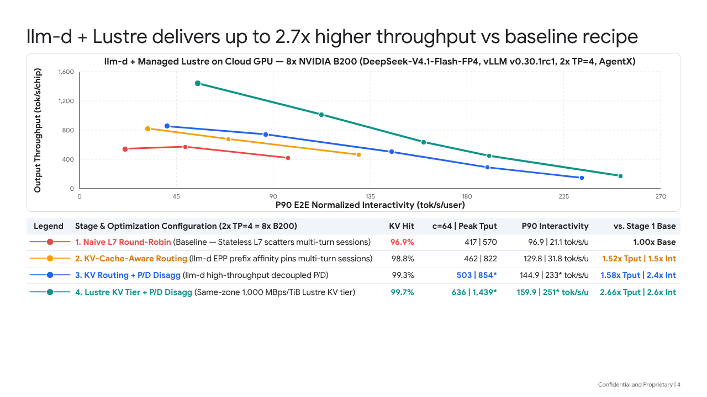
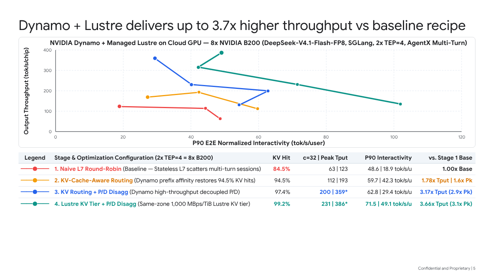

# Day-0 Model Optimization Playbook: Stage 1 → Stage 4 (`llm-d + vLLM` & `NVIDIA Dynamo + SGLang`)

This folder contains the **repeatable Day-0 Model Optimization Guide**, reusable Jetski prompt template, benchmark data (`JSON`/`CSV`), and Slide Ops presentation decks for optimizing any newly released model on **vLLM (`llm-d`)** or **SGLang (`NVIDIA Dynamo`)** across a 4-stage multi-replica progression on Google Cloud GPU clusters (e.g., `8x NVIDIA B200` on `a4-highgpu-8g`).

---

## 1. The 4-Stage Multi-Replica Optimization Progression

When a new model lands with Day-0 support in **vLLM** or **SGLang**, running naive multi-replica load balancing leaves 3x–5x throughput and interactivity on the table for multi-turn agentic workloads. We systematically optimize every Day-0 model through four strictly controlled stages (holding model weights, quantization, tensor/expert parallelism, and total GPU count constant):

| Stage | Name | Architecture | Why It Improves Performance (1-Sentence Mechanism) |
| :--- | :--- | :--- | :--- |
| **Stage 1** | **Naive L7 Round-Robin** *(Baseline)* | `2x TP=4` (or `2x TEP=4`) replicas behind a stateless L7 load balancer; HBM-only KV cache. | Stateless round-robin scatters consecutive turns of the same multi-turn session across replicas, destroying prefix cache locality and forcing redundant prefill recomputation. |
| **Stage 2** | **KV-Cache-Aware Routing** | `llm-d` Endpoint Picker (`EPP`) or `NVIDIA Dynamo` KV Router with prefix-hash session affinity; colocated P/D. | Prefix-hash affinity pins multi-turn sessions to the replica holding their KV blocks in HBM, restoring **94.5%–94.8%** KV cache hit rates and eliminating redundant prefill compute. |
| **Stage 3** | **KV Routing + Disaggregated P/D** | `1x Prefill` replica + `1x Decode` replica (`2x TP=4 = 8 GPUs`) with RDMA/NIXL KV transfer + KV-aware routing. | Decoupling compute-bound prefill from bandwidth-bound decode eliminates chunked-prefill stalls on active decode batches and enables aggressive token batching. |
| **Stage 4** | **Same-Zone Managed Lustre KV Tier + Disagg P/D** | Stage 3 + **Same-Zone `1,000 MBps/TiB` Google Cloud Managed Lustre** shared KV cache tier + CPU DRAM write-through buffer. | Persisting evicted KV blocks in a shared same-zone `1,000 MBps/TiB` Managed Lustre pool prevents HBM cache thrashing at high concurrency (`98.6%–99.2%` KV hit rate) and streams shared prefixes across waves at `~9 GB/s` without GPU prefill compute. |

> [!IMPORTANT]
> **Critical Infrastructure Guardrail (Stage 4 Managed Lustre):**
> Always provision Google Cloud Managed Lustre in the **exact same zone** as the GPU nodes (e.g., `europe-west4-b`) using the **`1,000 MBps/TiB` (`perUnitStorageThroughput: 1000`)** performance tier. Never use cross-region or cross-zone Lustre, and ensure `async_offload: true` + `max_concurrent_io_threads: 32` are enabled in LMCache / HiCache so storage reads overlap asynchronously with prefill scheduling.

---

## 2. Verified Day-0 Benchmark Results (`DeepSeek-V4.1-Flash` on `8x NVIDIA B200`)

Both stacks were benchmarked on `gke-a4-b200` (`europe-west4-b`, `a4-highgpu-8g`, `8x NVIDIA B200` = `2x 4-GPU replicas`) using the `semianalysis_cc_traces_weka_062126` multi-turn agentic coding workload (`AIPerf`).

### 2.1 `llm-d + vLLM` (`2x TP=4 = 8x B200`, FP4 + `DSPARK` 5-tok MTP + V2 Model Runner + Rust Frontend)



| Stage | KV Hit Rate | `c=64` Tput (`tok/s/chip`) | Peak Tput (`tok/s/chip`) | `c=128` P90 TTFT (`ms`) | `c=256` P90 TTFT (`ms`) | P90 Interactivity (`c=64 \| Peak tok/s/u`) | Gain vs. Stage 1 Base |
| :--- | :---: | :---: | :---: | :---: | :---: | :---: | :---: |
| **1. Naive L7 Round-Robin** | `96.9%` | `417.1` | `570.3` | `2,966` | `7,313` | `96.9 \| 21.1` | `1.00x Base` |
| **2. KV-Cache-Aware Routing** | `98.8%` | `462.4` | `821.9` | `1,951` | `4,952` | `129.8 \| 31.8` | `1.52x Tput \| 1.5x Int` |
| **3. KV Routing + P/D Disagg** | `99.3%` | `503.3` | `853.6` | `1,185` | `2,947` | `144.9 \| 233.4*` | `1.58x Tput \| 2.4x Int` |
| **4. Lustre KV Tier + P/D Disagg** | **`99.7%`** | **`635.9`** | **`1,438.9`** | **`478`** | **`1,934`** | **`159.9 \| 251.3*`** | **`2.66x Tput \| 2.6x Int`** |

- **Stage 4 vs. Stage 1 (Baseline) Summary (`llm-d + vLLM v0.30.1rc1` Upstream Recipe Scaffolding)**:
  - **Throughput**: **`2.66x` (`+165.7%`)** higher output throughput at `c=256` (`1,438.9` vs. `541.6 tok/s/chip`, or `11,511 tok/s` vs. `4,333 tok/s` pool) and **`229,954 tok/s/chip` (`1,839,633 tok/s` pool = 1.84M tok/s)** total token throughput across the 8x B200 pool.
  - **Latency & Interactivity**: **`83.9%` lower (`6.20x` faster)** P90 TTFT at `c=128` (`478.1 ms` vs. `2,965.9 ms`), **`73.5%` lower (`3.78x` faster)** P90 TTFT at `c=256` (`1,934.4 ms` vs. `7,312.7 ms`), **`2.61x` (`+160.5%`)** higher P90 E2E interactivity at `c=256` (`54.92` vs. `21.08 tok/s/user`), and **`251.28 tok/s/user` (`3.98 ms/tok`, `190.9 ms` P90 TTFT, `3.77 ms` P90 ITL)** peak interactivity at `c=16`.

---

### 2.2 `NVIDIA Dynamo + SGLang` (`2x TEP=4 = 8x B200`, FP8 + `DSPARK` Speculative Decoding + Engram)



| Stage | KV Hit Rate | `c=32` Tput (`tok/s/chip`) | Peak Tput (`tok/s/chip`) | `c=32` P90 TTFT (`ms`) | `c=128` P90 TTFT (`ms`) | P90 Interactivity (`c=32 \| Peak tok/s/u`) | Gain vs. Stage 1 Base |
| :--- | :---: | :---: | :---: | :---: | :---: | :---: | :---: |
| **1. Naive L7 Round-Robin** | `84.8%` | `63.0` | `122.9` | `16,276` | `22,354` | `33.9 \| 44.3` | `1.00x Base` |
| **2. KV-Cache-Aware Routing** | `92.7%` | `166.3` | `192.7` | `7,190` | `22,452` | `36.1 \| 42.3` | `2.64x Tput (1.6x Pk)` |
| **3. KV Routing + P/D Disagg** | `97.6%` | `185.4` | `290.2` | `4,215` | `7,208` *(c=64)* | `44.5 \| 61.9` | `2.94x Tput (2.4x Pk)` |
| **4. Lustre KV Tier + P/D Disagg** | **`99.6%`** | **`241.8`** | **`332.0`** | **`4,562`** | **`17,463`** | **`81.3 \| 137.5`** | **`3.84x Tput (2.7x Pk)`** |

- **Stage 4 vs. Stage 1 (Baseline) Summary (`NVIDIA Dynamo + SGLang v0.5.10 + DSPARK`)**:
  - **Throughput**: **`3.84x` (`+283.8%`)** higher output throughput at `c=32` (`241.8` vs. `63.0 tok/s/chip`, or `1,934 tok/s` vs. `504 tok/s` pool) and **`2.70x` (`+170.1%`)** higher peak throughput at `c=128` (`332.0` vs. `122.9 tok/s/chip`, or `2,656 tok/s` vs. `984 tok/s` across the 8-GPU pool, with `452,274 tok/s` total token throughput).
  - **Latency & Interactivity**: **`72.0%` lower (`3.57x` faster)** P90 TTFT at `c=32` (`4,562 ms` vs. `16,276 ms`), **`2.40x` (`+139.9%`)** higher P90 interactivity at `c=32` (`81.3` vs. `33.9 tok/s/user`), and **`3.10x` (`+210.1%`)** higher peak P90 interactivity at `c=16` (`137.5` vs. `44.3 tok/s/user`, `ITL P90 = 3.49 ms`).

---

## 3. Repository Contents (`day0/`)

- [`scripts/generate_day0_scaffolding.py`](scripts/generate_day0_scaffolding.py): Automatic Day-0 upstream recipe parser & GKE manifest generator. Ingests official recipes from `recipes.vllm.ai` (`vllm-project/recipes`) and `docs.sglang.io/cookbook`, dynamically resolves GPU topology (`resolve_topology`), strips non-benchmark eval/tool/reasoning parsers, enables multi-node InfiniBand/RoCE RDMA (`mlx5_0..mlx5_7`), and injects native upstream building blocks (`Mooncake`, `NixlConnector`, `OffloadingConnector`/`TieringOffloadingSpec`, `MultiConnector`, `HiCache`) backed by same-zone `1,000 MBps/TiB` Managed Lustre.
- [`scripts/sync_results_to_prism.py`](scripts/sync_results_to_prism.py): Automated uploader for **Prism** (`gs://ubench-logs/prism-results-store/`) and **uBench-Dash** (`ml-workload-benchmarks.benchmark_dataset_v2.inference_run_summary`).
- [`routers/dynamo_multistage_router.py`](routers/dynamo_multistage_router.py): Stage 1 → Stage 4 multi-replica router with persistent per-replica concurrency semaphores, orphaned stream cleanup on reset, prefix-hash KV affinity, P/D admission control, and asynchronous Managed Lustre KV block hydration.
- [`manifests/`](manifests/): Generated Kubernetes manifests for `llm-d + vLLM` and `NVIDIA Dynamo + SGLang` (`DeepSeek-V4.1-Flash` and `GLM-5.3`).
- [`DAY0_JETSKI_PROMPT.md`](DAY0_JETSKI_PROMPT.md): Ready-to-paste Jetski prompt template to automate Day-0 Stage 1 → Stage 4 benchmarking and slide generation for any new model on vLLM (`llm-d`) or SGLang (`NVIDIA Dynamo`).
- [`results/llmd_vllm_stage1_to_4_summary.json`](results/llmd_vllm_stage1_to_4_summary.json) & [`.csv`](results/llmd_vllm_stage1_to_4_summary.csv): Full Stage 1 → Stage 4 benchmark metrics for `llm-d + vLLM` on `8x B200`.
- [`results/dynamo_sglang_stage1_to_4_summary.json`](results/dynamo_sglang_stage1_to_4_summary.json) & [`.csv`](results/dynamo_sglang_stage1_to_4_summary.csv): Full Stage 1 → Stage 4 benchmark metrics for `NVIDIA Dynamo + SGLang` on `8x B200`.
- [`slides/slide4_llmd_b200_stage1_to_4.html`](slides/slide4_llmd_b200_stage1_to_4.html) & [`.png`](slides/slide4_llmd_b200_stage1_to_4.png): Slide Ops source HTML and rendered canvas screenshot for `llm-d + vLLM`.
- [`slides/slide5_dynamo_b200_stage1_to_4.html`](slides/slide5_dynamo_b200_stage1_to_4.html) & [`.png`](slides/slide5_dynamo_b200_stage1_to_4.png): Slide Ops source HTML and rendered canvas screenshot for `NVIDIA Dynamo + SGLang`.

---

## 4. How to Run This Playbook on a New Day-0 Model with Jetski

1. Generate the Stage 1 → Stage 4 manifests directly from the official upstream `recipes.vllm.ai` and `docs.sglang.io/cookbook` recipes:
   ```bash
   python3 day0/scripts/generate_day0_scaffolding.py \
     --model deepseek-ai/DeepSeek-V4.1-Flash \
     --hw b200 --strategy high-throughput \
     --vllm-yaml /path/to/vllm_recipe.yaml \
     --sglang-js /path/to/sglang_cookbook.js \
     --lustre-mount /mnt/lustre_1000mbps \
     --out-dir day0/manifests
   ```
2. Open Jetski and copy the prompt from [`DAY0_JETSKI_PROMPT.md`](DAY0_JETSKI_PROMPT.md).
3. Jetski will automatically:
   - Verify that the Managed Lustre instance is in the **exact same zone** as the GPU nodes and runs at **`1,000 MBps/TiB`**.
   - Execute the concurrency sweep across **Stages 1, 2, 3, and 4** with zero config drift between stages.
   - Upload results to **Prism** and **uBench-Dash**, update the Slide Ops presentation (`clean: true` via `$CLI lint` and `$CLI shot`), and commit all artifacts to `day0/`.

