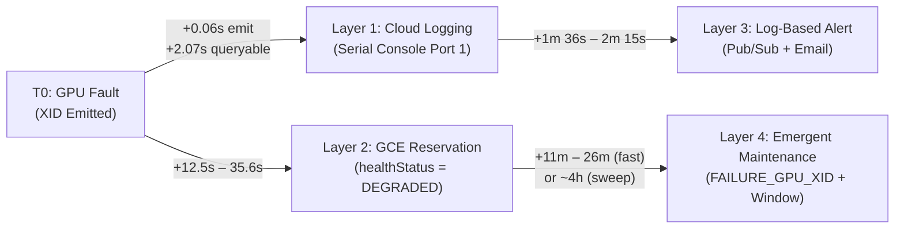

# From 16 Hours to 78 Minutes: How to Slash MTTD and MTTR on GKE B200 Training Clusters

When Meta trained Llama 3 405B across 16,384 H100 GPUs for 54 days, the job suffered **466 interruptions**—419 of them unexpected, and **~78% caused by hardware faults** (GPU faults, HBM3/SRAM ECC errors, and interconnect drops). Yet only **three** of those 466 incidents required manual human intervention; automation handled the rest, sustaining **>90% effective training time**.

Across the industry—from ByteDance’s 9,600-GPU ByteRobust study (55,235 incidents) to Shanghai AI Lab’s Acme trace—large-scale GPU failure is not a vendor anomaly; it is routine physics at scale.

| Failure Class | ByteRobust (% Incidents) | Acme (% GPU-Hours Lost) | Llama 3 (% Interruptions) | Failure Type |
| :--- | :---: | :---: | :---: | :---: |
| **CUDA Runtime / Symptom Error** | **36.1%** | 15.77% | — | Hard (Symptom) |
| **GPU Hardware / Bus Fault** | — | 14.30% | **30.1%** | Hard |
| **GPU Memory / ECC (HBM3, SRAM)** | — | 11.00% | **21.7%** (17.2% HBM + 4.5% SRAM) | Hard |
| **Interconnect (NVLink / RDMA)** | 2.9% | **30.25% (NVLink)** + 4.53% | 8.4% | Hard |
| **Silent Job Hang / Collective Stall** | **9.9%** | — | — | Hard (Highest MTTD) |
| **Performance Degradation / Straggler** | 0.8% | — | — | **Soft** (Slowdown) |

> [!IMPORTANT]
> **Occurrence $\neq$ Cost.** ByteRobust ranks CUDA errors #1 by *incident count* (36.1%), because a low-level hardware failure almost always surfaces to PyTorch as a generic CUDA/NCCL exception. Acme ranks hardware and interconnect failures first by *GPU-hours lost*. Alerting on job exit codes tells you *that* your job died; cutting Mean Time to Detect (**MTTD**) and Mean Time to Remediate (**MTTR**) requires detective tools that immediately reveal *which hardware primitive broke* and *what action to take*.

In this post, we share empirical measurements from **11 end-to-end fault-injection and hardware-reset runs** on a live **GKE NVIDIA B200 (`a4-highgpu-8g`)** cluster running multi-node **NeMo-RL (DAPO/GRPO) fine-tuning on Gemma 3 27B IT**. We show how we cut end-to-end recovery from **16 hours 04 minutes** (naive manual operations) down to **1 hour 18 minutes 18 seconds**—including a **35-minute in-place physical host repair**—by combining Google Cloud detective tooling with XID-specific remediation playbooks.

---

## 1. The Economics of MTTR: Why Every Minute Costs \$96+

To understand why detective and corrective tooling matter, translate MTTD and MTTR directly into **ML Productivity Goodput**. Google Cloud defines **Runtime Goodput** as the fraction of available cluster time spent making forward training progress:

$$\text{Runtime Goodput} = \frac{T_{\text{ckpt}} - t_{\text{ch}}}{T_{\text{ckpt}} + t_{\text{re}} + t_{\text{rm}}}$$

* $T_{\text{ckpt}}$: Checkpointing interval
* $t_{\text{ch}}$: Wasted progress since the last checkpoint when a fault hits (shrunk by **proactive draining** via Emergent Maintenance)
* $t_{\text{re}}$: Infrastructure recovery time—detecting the fault, draining, and repairing/replacing the node (**$\text{MTTD} + \text{MTTR}_{\text{infra}}$**)
* $t_{\text{rm}}$: Job resume time—container initialization, weight loading, and NCCL/Ray rendezvous (**$\text{MTTR}_{\text{job}}$**)

Consider the baseline cost using Dynamic Workload Scheduler (DWS) Calendar Mode list pricing for `a4-highgpu-8g` (8 × NVIDIA B200 GPUs per node):

* **1 × `a4-highgpu-8g` node-hour:** \$90.22 (\$11.28 / GPU-hour)
* **Our 2-node (16 × B200) testbed:** **\$180.44 / hour** (billed whether nodes are stepping, idle, or repairing)
* **A 64-node (512 × B200) production cluster:** **\$5,774.08 / hour** (**\$96.23 / minute**, or **\$4,157,338** over a 30-day run)

At 512 GPUs, **every single percentage point of Goodput is worth \$41,573 per month**. Waiting 10 hours overnight for an engineer to notice a degraded node and manually trigger host maintenance burns **\$57,740** on a 64-node cluster (and burned **\$1,940** on our 2-node testbed in Run 7).

---

## 2. Our Testbed & Baseline Constants

We ran all experiments on a 2-node GKE cluster (`ikwak-reliability` in `europe-west4-b`) backed by a dedicated 2-node reservation (`nvidia-b200-6bsoymep8ylww`) with Google gIB RDMA (`eth2`–`eth9`):

* **Workload:** NeMo-RL v0.6.0 DAPO reinforcement learning on `google/gemma-3-27b-it` (FSDP2 across 16 × B200 GPUs via KubeRay).
* **Steady-State Step Time:** **116.39 s (~1m 56s)** per step (p50: `118.08s`, stdev: `8.02s`).
* **Job Resume Overhead ($t_{\text{rm}}$):** **721.5 s (12m 01s)** warm (vLLM rollout engine init `428.9s` + FSDP2 policy init `93.7s` + setup `195.9s`), plus **450 s** if pulling the 20.1 GB container image cold.

---

## 3. Reducing MTTD: Why Default Dashboards Are Blind (and How to Fix Them)

In **Run 11**, we triggered a genuine hardware fault on GPU 7 (`PCI:0000:cc:00.0`) of worker node `-34t3` by asserting a PCIe Secondary Bus Reset (SBR) on its upstream PCIe switch port (`0000:ca:01.0`). The GPU vanished from the PCIe bus immediately (`VENDOR_ID = ffff`), killing the distributed training job in **9.4 seconds**.

**What did default Kubernetes and GPU utilization dashboards see?**
1. **Kubernetes Node Status:** The node remained `Ready=True` with `nvidia.com/gpu: 8` allocatable for **40 minutes and 45 seconds** after the GPU died (until GCE initiated the repair drain). No `GPUUnhealthy` node condition or health-check label appeared.
2. **Default GKE Managed DCGM Exporter:** Exposes 168 metric series across 21 families (`DCGM_FI_DEV_GPU_UTIL`, `SM_CLOCK`, `POWER_USAGE`, `NVLINK_TX_BYTES`), but **omits** `DCGM_FI_DEV_XID_ERRORS` (field 319), ECC uncorrectable counters, row-remap counters, and NVLink error counters. A `GPU_UTIL` chart drops to `0%` because the job died—it cannot tell you *why* or *which node* is poisoned.
3. **Ray / PyTorch Job Logs:** The job failed with `ActorUnavailableError: RpcError: Socket closed rpc_code: 14` (`Worker exit type: SYSTEM_ERROR`) in `8.1–11.4 seconds`—faster than any NCCL collective timeout.

If you reschedule your job onto the same "Ready" Kubernetes node without host-level detective tools, it will crash in an infinite loop.

### The 4-Layer Detective Stack (Measured Latencies)

Across Runs 3, 6, 7, 8, 10, and 11, we instrumented every Google Cloud detection surface against a synchronized clock from fault injection ($T_0$):



| Detective Tool | Surface / API | Measured Latency ($T_0 \to \text{Signal}$) | Information Density | Best Used For |
| :--- | :--- | :---: | :--- | :--- |
| **1. Cloud Logging (Serial Console)** | `serialconsole.googleapis.com/serial_port_1_output` | **0.06 s** (emitted)<br>**2.07 s** (queryable) | **Highest:** Exact node, PCIe bus ID (`0000:cc:00`), XID number (`79`, `63`, `154`), and driver message | Root-cause triage, automated node cordoning (`kubectl cordon`) |
| **2. GCE Reservation Health** | `reservations.get` $\to$ `resourceStatus.healthInfo` | **12.5 s – 35.6 s** | **Coarse (1-bit):** Flips `HEALTHY` $\to$ `DEGRADED` on the reservation and block | Fast fleet-level health indicator |
| **3. Cloud Monitoring Log Alert** | Alert policy on `"NVRM: Xid"` $\to$ Pub/Sub & Email | **1m 36s – 2m 15s** | **High:** Pushes log match payload to operator inbox & webhook | Paging on-call / triggering automated triage workflows |
| **4. Emergent Maintenance** | `instances.get` $\to$ `upcomingMaintenance` & k8s node annotation | **11m 03s – 26m 12s** *(fast)*<br>*(up to ~4h on sweep)* | **Actionable Infra:** `FAILURE_GPU_XID`, `canReschedule: true`, 7-day maintenance window | Unlocking self-service host repair (`perform-maintenance=true`) |

### Detective Tool #1: Cloud Logging Serial Console (and the Filter Trap)

When the NVIDIA kernel driver (`NVRM`) encounters a hardware fault, it writes an XID message to `/dev/kmsg`, which Google Cloud streams to the instance's serial console.

> [!CAUTION]
> **Two Cloud Logging Traps That Break Detection:**
> 1. **Wrong `log_id`:** XID messages from GKE GPU nodes do **not** land under `compute.googleapis.com/serial_port_1_output`. They are ingested under **`serialconsole.googleapis.com/serial_port_1_output`**.
> 2. **Substring False Positives:** Never query bare `Xid`—it substring-matches `containerBoxID` across thousands of routine GKE container logs. Always match `"NVRM: Xid"`.

Use this exact Cloud Logging query to pinpoint any GPU XID across your cluster in **~2 seconds**:

```text
resource.type="gce_instance"
log_id("serialconsole.googleapis.com/serial_port_1_output")
"NVRM: Xid"
```

In **Run 11**, querying this filter 2 seconds after the PCIe bus reset immediately revealed not just the root-cause GPU (`0000:cc:00`), but the cascading blast radius across the node:
* `T0 + 1.0s`: `NVRM: Xid (PCI:0000:cc:00): 79, GPU has fallen off the bus.`
* `T0 + 1.7s`: `NVRM: Xid (PCI:0000:04:00 .. cc:00): 154, GPU recovery action changed from 0x0 (None) to 0x1 (Node Reboot Required)` on **all 8 GPUs**.
* `T0 + 2.5s`: `NVRM: Xid: 145` (NVLink training/recovery error) and `Xid: 45` on peer GPUs 1, 5, and 6.

### Detective Tool #2: Log-Based Alerts (Pub/Sub + Email in ~2 Minutes)

Because Cloud Logging has the richest signal in 2 seconds while GCE maintenance scheduling takes 11+ minutes, bridge the gap with a **Log-Based Alert Policy**:

```json
{
  "displayName": "GKE GPU XID Serial Console Alert",
  "conditions": [{
    "displayName": "NVRM Xid in Serial Port 1",
    "conditionMatchedLog": {
      "filter": "resource.type=\"gce_instance\" AND log_id(\"serialconsole.googleapis.com/serial_port_1_output\") AND \"NVRM: Xid\""
    }
  }],
  "alertStrategy": {
    "notificationRateLimit": { "period": "300s" },
    "autoClose": "1800s"
  }
}
```

**Empirical finding (Runs 6 & 7):** Attaching both a **Pub/Sub topic** (for programmatic automation) and an **Email channel** (for human operators) to the same policy fans out in parallel. Pub/Sub received the alert in **95.9s – 135.3s**, and the operator email arrived in the exact same minute.

### Detective Tool #3: Emergent Maintenance on Reservations

**Emergent Maintenance** is Google Cloud's mechanism for notifying you when the hypervisor detects underlying hardware degradation (`FAILURE_GPU_XID`, `FAILURE_GPU`) and scheduling a host repair with a **7-day advance window** (snapped to `00:00:00 UTC` 8 days out) instead of abruptly terminating your VMs.

> [!WARNING]
> **Emergent Maintenance is configured on the Compute Engine Reservation, NOT on GKE.** There is no `gcloud container clusters` flag for it. Enable it directly on your GPU reservation:
> ```bash
> gcloud compute reservations update RESERVATION_NAME \
>   --enable-emergent-maintenance \
>   --zone=ZONE
> ```

Once enabled, you can monitor two surfaces:
1. **Reservation & Block Health (12–35 seconds):**
   `resourceStatus.healthInfo.healthStatus` flips from `HEALTHY` to `DEGRADED`, and `degradedBlockCount` increments to `1`.
2. **Instance `upcomingMaintenance` & GKE Node Annotation (11–26 minutes):**
   GCE populates `resourceStatus.upcomingMaintenance` on the degraded VM, and GKE's `gpu-maintenance-handler` mirrors it onto the Kubernetes node annotation `node.gke.io/upcoming-maintenance`:
   ```json
   {
     "maintenanceStatus": "PENDING",
     "type": "UNSCHEDULED",
     "canReschedule": true,
     "maintenanceReasons": ["FAILURE_GPU_XID", "FAILURE_GPU"],
     "windowStartTime": "2026-10-02T00:00:00Z",
     "windowEndTime": "2026-10-02T04:00:00Z"
   }
   ```

---

## 4. Reducing MTTR: The XID Remediation Playbook (What to Do for Specific XIDs)

Once Cloud Logging tells you *which* XID occurred, how do you know whether to **reset the GPU**, **reboot the node**, or **trigger a GCE host repair**? And what actually triggers Google Cloud's automated host repair?

In **Runs 8a–8f, 9, 10, and 11**, we systematically tested each major XID class against GKE and GCE's maintenance detector:

| XID Code | Meaning | Triggers GCE Host Repair? | Recommended Operator Action | Measured Behavior & Gotchas |
| :---: | :--- | :--- | :--- | :--- |
| **XID 48** | Double-Bit ECC Error (DBE) | **No** *(0/10 across Runs 8a, 8b)* | **Check row-remap state $\to$ GPU Reset or Node Reboot** | Isolated XID 48 without a row-remap event does not book GCE host repair. Avoid `perform-reboot=true` if local SSDs hold critical state (can remount RO and trigger GKE node recreation). |
| **XID 63** | ECC Page Retirement / Row Remap Recording Event | **Yes — on 3 consecutive events** *(Run 8d, 8f, 9)* | **1–2 events:** Local `nvidia-smi --gpu-reset` to activate remap.<br>**$\ge 3$ events:** Pull forward GCE Host Repair (`perform-maintenance=true`). | Single/double XID 63s can be recovered locally via GPU reset. **3 consecutive XID 63s** flip the reservation to `DEGRADED` in `16.6s` and schedule host repair in `~11–12m`. |
| **XID 79** | GPU Has Fallen Off the Bus | **Yes — single-shot trigger** *(Runs 1, 3, 6, 7, 10, 11)* | **Immediate Cordon + Pull Forward GCE Host Repair** | PCIe link is dead (`ffff`). Often cascades into **XID 154** across all 8 GPUs. Local GPU reset is impossible; requires host repair. |
| **XID 154** | GPU Recovery Action Changed to `Node Reboot Required` (`0x1`) | **Accompanies XID 79 / 63 / 74** | **Node Reboot or GCE Host Repair** *(if paired with XID 79/74)* | Emitted across all 8 GPUs when one GPU faults the shared NVLink/PCIe fabric (Run 11). |
| **XID 74 / 145** | NVLink Error / Link Training Failure | **Yes** | **Pull Forward GCE Host Repair** *(if persistent)* | Indicates NVLink/NVSwitch fabric failure across peer GPUs. |

---

### Deep Dive 1: How to Actually Run `nvidia-smi --gpu-reset` on GKE (and Why Naive Reset Fails)

When **XID 63** (Row Remapping) fires, NVIDIA's documentation and driver message instruct you to **reset the GPU** (`nvidia-smi --gpu-reset -i <id>`) so the hardware row remapper activates the spare HBM row.

In **Run 8e**, after stopping the training job and verifying `nvidia-smi --query-compute-apps` returned `(none)`, we ran `nvidia-smi --gpu-reset -i 7`. **It failed immediately:**

```text
The following GPUs could not be reset:
  GPU 00000000:CC:00.0: In use by another client
RESET_RC=255
```

**Why did it fail?**
1. `nvidia-smi --query-compute-apps` only lists *CUDA compute contexts*. Scanning `/proc/*/fd` on the host revealed four non-compute processes holding `/dev/nvidia7` open: **`nvidia-persistenced`**, **`nv-hostengine`**, **`dcgm-exporter`**, and **`nvidia-gpu-device-plugin`**.
2. Stopping `nvidia-persistenced.service` alone doesn't work because **`nvidia-persistenced.path`** immediately respawns it.
3. Worse, `nv-hostengine`, `dcgm-exporter`, and `nvidia-gpu-device-plugin` run as Kubernetes DaemonSet containers—**`kubelet` restarts them within ~1 second** of being killed!

#### The Working GKE Single-GPU Reset Recipe (`force-reset-gpu7.sh`)
To reset a GPU on a live GKE node without rebooting the VM:
1. Stop **both** `nvidia-persistenced.path` and `nvidia-persistenced.service`, and disable persistence mode (`nvidia-smi -pm 0`).
2. Kill the three GKE DaemonSet processes (`nv-hostengine`, `dcgm-exporter`, `nvidia-gpu-device-plugin`) **3 times in a 2-second loop** to force `kubelet` into `CrashLoopBackOff`.
3. Issue one final `pkill` immediately followed by `nvidia-smi --gpu-reset -i <gpu>` (with zero delay in between):

```bash
# Run inside host namespace (e.g., via privileged debug pod with nsenter -t 1 -m -p)
systemctl stop nvidia-persistenced.path nvidia-persistenced.service
/home/kubernetes/bin/nvidia/bin/nvidia-smi -i 7 -pm 0

# Drive kubelet DaemonSet containers into restart backoff
for k in 1 2 3; do
  pkill -TERM -f 'nv-hostengine|dcgm-exporter|nvidia-gpu-device-plugin' || true
  sleep 2
done

# Final kill + immediate GPU reset before kubelet respawns holders
pkill -TERM -f 'nv-hostengine|dcgm-exporter|nvidia-gpu-device-plugin' || true
/home/kubernetes/bin/nvidia/bin/nvidia-smi --gpu-reset -i 7

# Restore persistence daemon (kubelet automatically recovers the DaemonSets)
systemctl start nvidia-persistenced.path nvidia-persistenced.service
```

> [!TIP]
> **Does resetting the GPU locally hide a bad host from Google Cloud? No!**
> Before **Run 8f**, a major operational concern was that resetting the GPU after each XID 63 might clear the platform's counter and leave a dying GPU limping along forever. In Run 8f, we executed 5 consecutive XID 63 + forced GPU reset cycles (`RC=0` every time). **GCE still detected the pattern and booked a `FAILURE_GPU_XID` host repair in 11 minutes 03 seconds.** Local remediation and fleet-level escalation work in harmony.

---

### Deep Dive 2: Pulling Forward a Host Repair (`perform-maintenance=true`)

When a catastrophic fault like **XID 79** or repeated **XID 63s** occurs, local GPU resets cannot save the node. Once GCE populates `upcomingMaintenance` (`maintenanceStatus: PENDING`, `canReschedule: true`) with a default window 7 days in the future, you should **immediately pull the repair forward** by labeling the GKE node:

```bash
kubectl label node <NODE_NAME> cloud.google.com/perform-maintenance=true
```

#### What Happens Under the Hood (Measured in Runs 7, 8d, 10, 11)
1. **Scoped to a Single Node (`+20s – 52s`):** Even when your reservation uses `schedulingType: GROUPED`, labeling a single GKE node repairs **only that node**. Our sibling node (`-6df3`) remained `Ready` with 8 GPUs untouched across every single run.
2. **In-Place Repair, Not Node Replacement:** Across repairs, both the Kubernetes Node UID and the GCE Instance ID (`174490015860863227`) remain identical. The VM transitions `RUNNING` $\to$ `REPAIRING` $\to$ `RUNNING` in place.
3. **Fast, Consistent Repair Duration (~35 Minutes):**
   * `Label` $\to$ `Node Drained / NotReady` (`B7` $\to$ `B10`): **14m 23s – 15m 39s**
   * `VM REPAIRING` (`B11` $\to$ `B12`): **15m 30s – 16m 20s**
   * `VM RUNNING` $\to$ `Node Ready with 8 GPUs` (`B12` $\to$ `B13`): **1m 57s – 2m 09s**
   * **Total `Label` $\to$ `Node Ready (8 GPUs)`:** **34m 44s** (Run 10) and **35m 25s** (Run 11).

---

### Deep Dive 3: Three Automation Traps That Cost Hours of Badput

If you automate recovery (or write an operator runbook), watch out for three counter-intuitive platform behaviors we uncovered in Runs 7–11:

#### Trap 1: `upcomingMaintenance` Stays `ONGOING` for 3.5 Hours *After* the Node Is Repaired!
When you apply `perform-maintenance=true`, GCE re-anchors a 4-hour maintenance window starting now (`windowStartTime` to `windowEndTime = now + 4h`).
* In **Run 10** and **Run 11**, the physical host repair finished and the Kubernetes node was `Ready` with 8 GPUs at **+35 minutes**.
* Yet `upcomingMaintenance.maintenanceStatus` on the GCE instance stayed **`ONGOING` until 5–6 seconds after `windowEndTime` (+4 hours 00 minutes)**—nearly **3.5 hours after the node was already running training steps!**
* **Rule:** **Never gate job resubmission on `maintenanceStatus == CLEAR` or `windowEndTime`.** Doing so idles a healthy cluster for 3.5 hours.

#### Trap 2: Reservation `HEALTHY` Leads VM `RUNNING` by ~5.5 Minutes
In Runs 8d, 10, and 11, the reservation and block `healthStatus` flipped from `DEGRADED` back to `HEALTHY` **5m 20s to 5m 53s before** the VM actually finished repairing and booted (`lastStartTimestamp`).
* **Rule:** **Never use reservation health as your "repair finished" trigger.**

#### Trap 3: The Correct Readiness Gate (`orchestrate.sh`)
To resume training the exact second the cluster is whole (zero operator latency), gate your orchestrator on three concrete signals:
1. GCE Instance `lastStartTimestamp` has advanced past its pre-repair timestamp (`lastStartTimestamp != OLD_START`).
2. Kubernetes Node condition `Ready == True` **AND** `.status.allocatable["nvidia.com/gpu"] == "8"`.
3. All KubeRay worker pods are `Running` and `Ready`.

```bash
# Wait for VM restart + K8s Node Ready with all 8 GPUs allocatable
while true; do
  LS=$(gcloud compute instances describe "$NODE" --zone="$ZONE" --format='value(lastStartTimestamp)')
  READY_GPUS=$(kubectl get node "$NODE" -o jsonpath='{.status.conditions[?(@.type=="Ready")].status}|{.status.allocatable.nvidia\.com/gpu}')
  if [ "$LS" != "$OLD_START" ] && [ "$READY_GPUS" = "True|8" ]; then
    echo "Node repaired and all 8 GPUs allocatable!"
    break
  fi
  sleep 5
done
```

---

## 5. End-to-End Results: Naive vs. Automated Recovery (Run 7 vs. Run 11)

By combining fast detection, automated `perform-maintenance=true` labeling (`orchestrate.sh`), and automated pod preparation + job resubmission on the true readiness gate, we reduced end-to-end outage time by **92%**:

| Phase | Run 7 (Manual Gates) | Run 11 (Automated `orchestrate.sh`) | Share of Run 11 |
| :--- | :---: | :---: | :---: |
| **Stimulus** | Synthetic XID 79 | **Genuine XID 79 (PCIe SBR)** | — |
| **Fault $\to$ Cloud Logging (`M1'`)** | 2.07 s | **2.01 s** | 0% |
| **Fault $\to$ Reservation `DEGRADED` (`M3`)** | 35.6 s | **30.4 s** | 1% |
| **Fault $\to$ Maintenance Reason (`B5`)** | 19m 03s | **26m 12s** | 33% |
| **Reason $\to$ Apply Repair Label (`B7`)** | 7m 29s *(human)* | **9.9 s** *(automated)* | 0% |
| **Label $\to$ Node Drained (`B10`)** | 18m 17s | **14m 23s** | 18% |
| **Drain $\to$ Node `Ready` with 8 GPUs (`B13`)** | 4h 11m 38s | **21m 01s** *(REPAIRING: 16m 20s)* | 27% |
| **Node `Ready` $\to$ Ray Cluster 2/2 (`B13b`)** | 3m 59s | **4m 18s** | 5% |
| **Operator Idle Gate before Resubmit** | **10h 45m** *(human)* | **52.4 s** *(automated `prep-pods.sh`)* | 1% |
| **Job Init ($t_{\text{rm}}$) $\to$ Training Step 1 (`B14`)** | 10m 58s | **11m 21s** | 15% |
| **Total Fault $\to$ Training Stepping Again** | **16h 04m 00s** | **1h 18m 18s** | **100%** |
| **Post-Recovery Step Time vs. Baseline** | 116.57 s (+0.5%) | **120.56 s** (nominal) | — |

---

## 6. Day-0 Reliability Checklist for GKE GPU Training Clusters

- [ ] **Enable Emergent Maintenance on the Reservation:** `gcloud compute reservations update <RES> --enable-emergent-maintenance --zone=<ZONE>`.
- [ ] **Create a Cloud Logging Alert on Serial Port 1:** Match `resource.type="gce_instance" AND log_id("serialconsole.googleapis.com/serial_port_1_output") AND "NVRM: Xid"` with Pub/Sub and Email channels (~2 min MTTD).
- [ ] **Deploy Custom DCGM Fields or Node Problem Detector Rules:** Default GKE `dcgm-exporter` only exports utilization metrics; add `DCGM_FI_DEV_XID_ERRORS` (319) and ECC/row-remap fields.
- [ ] **Automate the XID Decision Matrix:**
  * **XID 63 (<3 occurrences):** Drain pod, run the GKE DaemonSet backoff + `nvidia-smi --gpu-reset` sequence.
  * **XID 79 / XID 154 / $\ge 3$ XID 63s:** Cordon node immediately; as soon as `upcomingMaintenance.canReschedule == true`, apply `cloud.google.com/perform-maintenance=true`.
- [ ] **Gate Recovery on `lastStartTimestamp` + `Ready|8 GPUs`:** Never wait for `upcomingMaintenance` to clear at `windowEndTime` (+4h) or rely solely on reservation `HEALTHY` (-5.5m early).
- [ ] **Store Checkpoints on Durable Shared Storage (GCS Fuse / Lustre):** Never write checkpoints to container overlay filesystems, and if using `gcsfuse` on non-HNS buckets, pass `mountOptions: "implicit-dirs,rename-dir-limit=200000"` so atomic checkpoint directory renames (`tmp_step_N` $\to$ `step_N`) do not fail with `Errno 24 (Too many open files)`.
