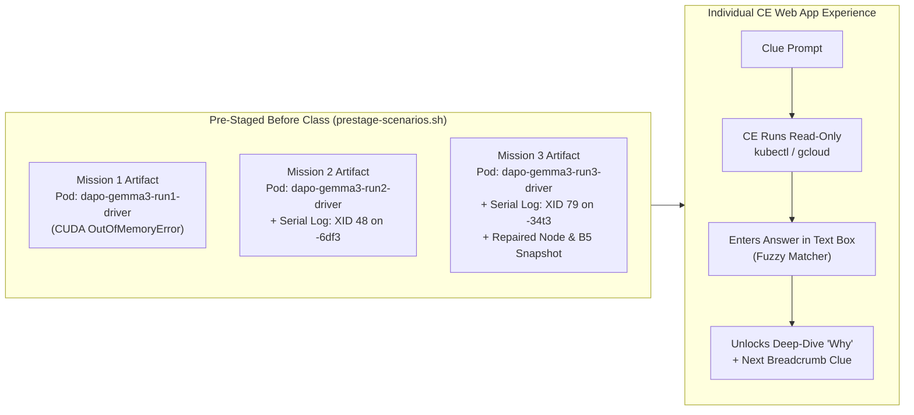

# Interactive CE Breadcrumb Lab: "Operation Goodput" (Self-Paced Forensic Edition)

This guide accompanies the **Operation Goodput Interactive Web App** ([index.html](file:///usr/local/google/home/ikwak/jetski-playground/reliability/lab-webapp/index.html)) and the **Hands-Off Pre-Staging Script** ([prestage-scenarios.sh](file:///usr/local/google/home/ikwak/jetski-playground/reliability/lab-webapp/prestage-scenarios.sh)).

---

## 1. Lab Architecture: Self-Paced, Pre-Staged, and 100% Hands-Off

To make the lab maximally interactive for Customer Engineers (CEs) on a single shared read-only cluster **without** turning you into live "execution hands" or letting CEs copy crowd-voted answers:

1. **Individual Self-Paced Web App (No Peer-Peeking):**
   * Each CE opens the **Operation Goodput Web App** ([http://injaekwak.c.googlers.com:8787](http://injaekwak.c.googlers.com:8787) or hosted on the GKE System Node Pool).
   * Progress is tracked **individually per browser (`localStorage`)**—there is no shared voting board or public chat where CEs can copy other people's answers.
   * For each breadcrumb, the CE gets a **Clue** + an optional **CLI Hint** + a **Text Box** (with fuzzy/keyword matching and "warm/almost there" nudges) or a **Multiple-Choice Decision Gate**.
   * When their answer is correct (or close enough), the web app **reveals a deep-dive architectural explanation** of *why* the answer is right and **unlocks the next clue**.
2. **Pre-Generated Forensic Crime Scenes (Zero Live Instructor Intervention):**
   * Instead of injecting failures live during the session, you run [prestage-scenarios.sh](file:///usr/local/google/home/ikwak/jetski-playground/reliability/lab-webapp/prestage-scenarios.sh) **once** before the workshop.
   * All three scenarios (Job-level CUDA OOM, Transient `XID 48` on `-6df3`, and Catastrophic `XID 79` + completed host repair on `-34t3`) exist simultaneously in Kubernetes and Cloud Logging, allowing every CE to move from **Mission 1 $\to$ Mission 2 $\to$ Mission 3** at their own speed!
   * Each clue in the web app also includes a **"📟 View Captured Cluster Telemetry"** drawer as an instant fallback in case 30+ CEs hit Cloud Logging's `429 Read requests per minute` quota simultaneously.



---

## 2. One-Time Instructor Setup (Before the Lab)

### Step A: Grant Read-Only IAM Roles to CEs
Grant your CE participant group read-only visibility into the GKE cluster, Compute Engine reservations/instances, and Cloud Logging:

```bash
PROJECT="gpu-launchpad-playground"
CE_GROUP="group:ce-reliability-lab@google.com"

for ROLE in \
  roles/container.viewer \
  roles/compute.viewer \
  roles/logging.viewer \
  roles/monitoring.viewer; do
  gcloud projects add-iam-policy-binding "$PROJECT" \
    --member="$CE_GROUP" --role="$ROLE"
done
```
*(`roles/container.viewer` allows CEs to run `kubectl get nodes`, `kubectl get pods`, `kubectl describe`, and `kubectl logs`, while strictly blocking `kubectl label`, `kubectl delete`, `kubectl cordon`, and `kubectl exec`.)*

### Step B: Run the Pre-Staging Script Once
Run [prestage-scenarios.sh](file:///usr/local/google/home/ikwak/jetski-playground/reliability/lab-webapp/prestage-scenarios.sh) to stage the failed job driver pods (`dapo-gemma3-run1-driver`, `dapo-gemma3-run2-driver`, `dapo-gemma3-run3-driver`), emit the clean `XID 48` serial console log on `-6df3` (automatically cleaning up the one-shot pod so no spoiler remains), and publish the `mission3-maintenance-snapshot` ConfigMap:

```bash
bash /usr/local/google/home/ikwak/jetski-playground/reliability/lab-webapp/prestage-scenarios.sh
```

---

## 3. Complete Walkthrough of the 3 Missions & Clues

### Mission 1: The Midnight Pager (Job-Level Error: `CUDA Out of Memory`)
* **Storyline:** Training run `dapo-gemma3-run1` crashed less than 3 minutes into Step 1. The ML engineer blames bad GPU memory on the B200 nodes and asks you to replace a node.
* **Breadcrumb 1.1 — Initial Triage (Where to Look):**
  * **Clue:** Check `kubectl get nodes` and `kubectl get pods -n default`. How many allocatable GPUs (`nvidia.com/gpu`) are healthy across both nodes, or which pod failed?
  * **Accepted Input:** `16` (or `8`, `dapo-gemma3-run1-driver`, `True`).
  * **Unlocked Knowledge:** Both nodes report `Ready=True` with `8` GPUs each (`16` total), and the KubeRay worker pods are still running cleanly—only `dapo-gemma3-run1-driver` exited with `Error`. When worker pods stay up and a job dies on Step 1, start with the application traceback.
* **Breadcrumb 1.2 — Root Cause Analysis:**
  * **Clue:** Inspect `kubectl logs dapo-gemma3-run1-driver -n default`. What is the exact error that killed the run?
  * **Accepted Input:** `CUDA OOM` / `CUDA out of memory` / `torch.OutOfMemoryError` / `Out of memory`.
  * **Unlocked Knowledge:** Explains why `train_micro_batch_size=8` and `max_model_len=32768` exceeded the 178.35 GiB B200 HBM3e capacity when co-located with vLLM rollout engines. Connects to the ByteRobust paper finding: CUDA errors are #1 by incident count (36.1%), and OOMs account for >20% of failures—distinguishing an application OOM (0 XIDs in `/dev/kmsg`) from a hardware fault saves hours of unnecessary node repairs.
* **Breadcrumb 1.3 — Remediation Decision (Multiple Choice):**
  * **Clue:** Select the fastest way to recover `dapo-gemma3-run1`.
  * **Correct Choice:** **Do not reboot or replace any nodes.** Reduce `train_micro_batch_size` / `max_model_len` (or enable FSDP2 activation checkpointing) in the recipe YAML and resubmit immediately ($t_{\text{re}} = 0$).

---

### Mission 2: The Second Crash (Transient Hardware Fault: `XID 48`)
* **Storyline:** After fixing the batch size, `dapo-gemma3-run2` ran smoothly for 18 steps (`116.4s/step`) before crashing with a generic Python error: `RuntimeError: NCCL error: unhandled cuda error`. `kubectl get nodes` still shows both nodes `Ready=True` with 8 GPUs.
* **Breadcrumb 2.1 — Finding the Right Detective Surface:**
  * **Clue:** Where does Google Cloud capture low-level NVIDIA kernel driver (`NVRM`) messages, and what is the exact `log_id`? (Watch out for the `compute.googleapis.com/serial_port_1_output` trap and the bare `Xid` $\to$ `containerBoxID` substring trap!)
  * **Accepted Input:** `serialconsole.googleapis.com/serial_port_1_output` (or `serial_port_1_output`).
  * **Unlocked Knowledge:** Details the measured MTTD across surfaces: Cloud Logging serial port 1 is queryable in **2.07 seconds** with full PCI bus + XID detail, log-based alerts fire to Pub/Sub and Email in **~2 minutes**, whereas default GKE `dcgm-exporter` omits `DCGM_FI_DEV_XID_ERRORS` (field 319) entirely.
* **Breadcrumb 2.2 — Identifying the XID Code:**
  * **Clue:** Query `serialconsole.googleapis.com/serial_port_1_output` for `"NVRM: Xid"` on node `-6df3` (`instance_id=482910491827364512`). What XID code fired?
  * **Accepted Input:** `48` / `XID 48` / `Double Bit ECC` / `DBE`.
  * **Unlocked Knowledge:** Explains **XID 48 (Double-Bit ECC Error)**: why the driver immediately terminates the CUDA workload to prevent silent data corruption (SDC), and how our Run 8a/8b benchmarks proved that isolated XID 48 events **do not trigger automated GCE host replacement** (0/10 triggers).
* **Breadcrumb 2.3 — Official Google Cloud XID 48 Remediation (Multiple Choice):**
  * **Clue:** Consult [Google Cloud GPU Troubleshooting (`#xid-handling`)](https://docs.cloud.google.com/compute/docs/troubleshooting/troubleshooting-gpus#xid-handling) for `Xid 48: Double Bit ECC`. Select the recommended Customer Action on GKE.
  * **Correct Choice:** **Stop workloads and reset the GPUs (`sudo nvidia-smi --gpu-reset`) or reboot the GKE node (`kubectl label nodes <NODE_NAME> cloud.google.com/perform-reboot=true`)** to clear the volatile ECC error and activate any pending row remap, rather than reporting the host as faulty.

---

### Mission 3: The Catastrophic Fault (`XID 79` Bus Drop $\to$ Emergency Maintenance $\to$ Node Repaired)
* **Storyline:** The Cloud Monitoring log-based alert fires for `dapo-gemma3-run3`! The job crashed in **9.4 seconds** with `ActorUnavailableError: Socket closed (rpc_code: 14)`.
* **Breadcrumb 3.1 — Cloud Logging Forensics:**
  * **Clue:** Query `serialconsole.googleapis.com/serial_port_1_output` on node `-34t3` (`instance_id=174490015860863227`). What primary XID code fired on GPU 7 (`PCI:0000:cc:00`)?
  * **Accepted Input:** `79` / `XID 79` / `GPU has fallen off the bus`.
  * **Unlocked Knowledge:** Explains how GPU 7 disappearing from the PCIe bus (`XID 79`) cascaded within 1.7 seconds into **`XID 154` (`Node Reboot Required`) across all 8 GPUs** and **`XID 145` NVLink errors** across peer GPUs—while Kubernetes `kubectl get nodes` stayed `Ready=True, 8 GPUs` for 40 minutes!
* **Breadcrumb 3.2 — Confirming Platform Detection (Reservation & Instance):**
  * **Clue:** Check the Reservation health (`DEGRADED` in ~30s) and the Instance `upcomingMaintenance` (or `kubectl get configmap mission3-maintenance-snapshot -o yaml`). What exact string appears in `maintenanceReasons`?
  * **Accepted Input:** `FAILURE_GPU_XID` (or `FAILURE_GPU` / `DEGRADED`).
  * **Unlocked Knowledge:** Explains how **Emergent Maintenance** (`--enable-emergent-maintenance` on the reservation) schedules an `UNSCHEDULED` / `PENDING` maintenance event with a **7-day window** and `canReschedule: true`.
* **Breadcrumb 3.3 — Requesting Immediate Emergency Maintenance:**
  * **Clue:** Enter the exact `kubectl label node` command (or label key=value) to trigger/pull forward the emergency host repair on `-34t3` immediately.
  * **Accepted Input:** `cloud.google.com/perform-maintenance=true` (or `kubectl label node ... cloud.google.com/perform-maintenance=true`).
  * **Unlocked Knowledge:** Breaks down the exact timeline after applying `perform-maintenance=true`: taint applied at `+21s`, status flips `PENDING` $\to$ `ONGOING` (`canReschedule=false`) at `+51s`, drain finishes at `+14m 23s`, and `VM REPAIRING` runs for `~16m 20s` while sibling node `-6df3` stays completely untouched.
* **Breadcrumb 3.4 — Confirming the Bad Host Was Repaired & Avoiding the 4-Hour Trap:**
  * **Clue:** Inspect the post-repair state of `-34t3` (`kubectl get node` & `gcloud compute instances describe`). How does GCE repair the node (is it repaired **in-place** with the same Node Name / Instance ID and a new `lastStartTimestamp` + `8` GPUs?), and what signals confirm readiness at **+35 minutes** instead of waiting **4 hours** for `windowEndTime`?
  * **Accepted Input:** `lastStartTimestamp` / `in-place` / `8` GPUs / `Ready`.
  * **Unlocked Knowledge:** Reveals the three golden rules from Runs 10 & 11:
    1. **In-Place Repair (~35m):** Node name, K8s UID, and GCE Instance ID (`174490015860863227`) stay identical; `lastStartTimestamp` updates when the repaired VM boots back to `RUNNING`.
    2. **The `windowEndTime` Trap (+4h):** `upcomingMaintenance.maintenanceStatus` stays `ONGOING` until `windowEndTime` (4 hours after the label)—3.5 hours *after* the node is already `Ready` with 8 GPUs!
    3. **The Reservation `HEALTHY` Trap (-5.5m):** Reservation health flips back to `HEALTHY` ~5.5 minutes *before* the VM finishes booting. Always gate on `lastStartTimestamp` + `Node Ready=True` + `allocatable nvidia.com/gpu == 8`.
