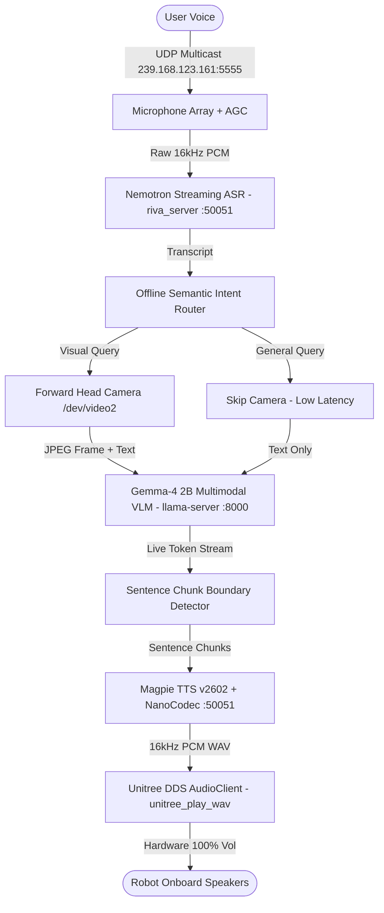

# Unitree R1 / G1 Humanoid Robot: Fully Offline Edge AI Deployment Guide

End-to-end guide for deploying and running **real-time multimodal AI (Nemotron Speech ASR + Magpie TTS v2602 + Gemma-4 2B Multimodal VLM via Native CUDA Engine)** 100% on-device on the **Unitree R1 / G1** humanoid robot (NVIDIA Jetson Orin NX).

---

## System & Hardware Architecture



| Component | Specification | Details / Configuration |
| :--- | :--- | :--- |
| **Target Host** | Unitree R1 / G1 Humanoid Robot | Integrated NVIDIA Jetson Orin NX (16GB Unified RAM/VRAM) |
| **Operating System** | Ubuntu 20.04 LTS (JetPack 5.1.1 / L4T R35.3.1) | Python **3.8.10 (`cp38`)**, CUDA 11.4 (`sm_87`) |
| **Robot Static IP** | `192.168.123.164` | `eth10` interface (Subnet `192.168.123.0/24`) |
| **Robot SSH** | `unitree@192.168.123.164` (password: `123`) | Direct Gigabit Ethernet connection |
| **Microphone Stream** | Unitree UDP Multicast Stream | `239.168.123.161:5555` (16kHz 16-bit Mono PCM) |
| **Speakers** | Unitree DDS AudioClient | `/home/unitree/unitree_sdk2/build/bin/unitree_play_wav` |
| **Forward Head Camera** | Forward-facing Vision Camera | **`/dev/video2`** (V4L2 640x480) |
| **Waist / Floor Camera**| Downward Obstacle Avoidance Camera | **`/dev/video0`** (Points at feet/floor) |
| **Build Power Profile** | **MAXN Mode (`nvpmodel -m 0`) + `jetson_clocks`** | Maximum clock frequencies (~2.0 GHz) to accelerate builds |
| **Runtime Power Profile**| **15W Balanced Mode (`nvpmodel -m 2`)** | Power-saving mode for robot battery runtime |
| **Internet Access** | **None on robot** | Fully offline deployment via laptop staging |

---

## Estimated Completion Times

| Stage | Action | Est. Duration |
| :--- | :--- | :---: |
| **Section 1** | Laptop asset downloads (models, wheels, debs) & transfer to robot | ~10–15 min |
| **Section 2** | Robot system libraries (gRPC debs, Python wheels) installation | ~2 min |
| **Section 3.1**| Unitree DDS Audio Player compilation (`unitree_play_wav` with Vol 100%) | ~30 sec |
| **Section 3.2**| `NeMo-Speech.cpp` CUDA compilation (`sm_87` native) in MAXN mode | ~20–25 min |
| **Section 3.3**| `llama.cpp` Native CUDA Engine compilation (`llama-server` `sm_87`) | ~5–7 min |
| **Section 3.4**| Transition power mode to 15W battery saver | ~10 sec |
| **Section 4** | Verification & Interactive Multimodal Voice/Vision Assistant | ~2–3 min |

---

## Quick Resume Guide (When Powering On Robot)

Follow these quick steps whenever you power on the robot:

```bash
# 1. SSH into the robot
ssh unitree@192.168.123.164

# 2. Set Jetson to Maximum Performance (MAXN) during builds
sudo nvpmodel -m 0
sudo jetson_clocks

# 3. Resume / verify the native CUDA binaries
export PATH=/home/unitree/.local/bin:/usr/local/cuda/bin:$PATH
ninja -C /home/unitree/NeMo-Speech.cpp/build-cuda riva_server
ninja -C /home/unitree/NeMo-Speech.cpp/llama.cpp/build-cuda bin/llama-server

# 4. Switch power mode to 15W battery saver
sudo nvpmodel -m 2

# 5. Launch the 3 services (Section 4) to run the Multimodal Assistant!
```

---

## 1. Laptop Staging Preparation (Run on Laptop with Internet)
*Estimated Time: ~10–15 minutes*

Because the Unitree robot has **no internet connection**, stage all weights, wheels, and deb packages in `~/robot_assets` on your developer laptop.

### 1.1 Create Staging Directories
```bash
mkdir -p ~/robot_assets/wheels \
         ~/robot_assets/debs \
         ~/robot_assets/models/magpie-tts/extracted
```

### 1.2 Download All Models

#### A. Nemotron Streaming ASR (Speech-to-Text)
```bash
huggingface-cli download \
  nvidia/nemotron-speech-streaming-en-0.6b-gguf \
  nemotron-speech-streaming-en-0.6b.q8_0.gguf \
  --local-dir ~/robot_assets/models
```

#### B. Magpie Multilingual TTS v2602 (Text-to-Speech)
```bash
huggingface-cli download \
  nvidia/magpie-tts-357m-multilingual-gguf \
  magpie_tts_multilingual_357m.v2602.f16.gguf \
  --local-dir ~/robot_assets/models
```

#### C. Nemo NanoCodec 22kHz Decoder
```bash
huggingface-cli download \
  nvidia/nemo-nano-codec-22khz-1.89kbps-21.5fps-gguf \
  nemo_nano_codec_22khz_1.89kbps_21.5fps.decoder.f16.gguf \
  --local-dir ~/robot_assets/models
```

#### D. Magpie TTS Tokenizer Extraction
```bash
# Download the .nemo archive to extract tokenizers
huggingface-cli download \
  nvidia/magpie_tts_multilingual_357m \
  magpie_tts_multilingual_357m.nemo \
  --local-dir ~/robot_assets/models/magpie-tts

# Extract tokenizer files into ~/robot_assets/models/magpie-tts/extracted/
tar -xf ~/robot_assets/models/magpie-tts/magpie_tts_multilingual_357m.nemo \
  -C ~/robot_assets/models/magpie-tts/extracted/
```

#### E. Gemma-4 2B Multimodal VLM (Base Model + Vision Projector)
```bash
# Stage Gemma-4 Q8_0 language model and F16 vision projector:
# ~/robot_assets/models/gemma-4-E2B-it-q8_0.gguf (4.3 GB)
# ~/robot_assets/models/mmproj-gemma-4-E2B-f16.gguf (942 MB)
```

---

### 1.3 Download Offline Wheels (Python 3.8 / `cp38` `aarch64`)

Download precompiled binary wheels for ARM64:

```bash
pip download \
  --only-binary=:all: \
  --platform manylinux2014_aarch64 \
  --implementation cp \
  --python-version 38 \
  --abi cp38 \
  --dest ~/robot_assets/wheels \
  "sounddevice==0.5.6" \
  "soundfile==0.13.1" \
  "requests==2.32.4" \
  "cffi==1.17.1" \
  "pycparser==2.23" \
  "protobuf==3.20.3" \
  "grpcio==1.38.0" \
  "grpcio_tools==1.38.0" \
  "nvidia-riva-client==2.16.0" \
  "cmake==4.4.2" \
  "ninja==1.13.0" \
  "numpy==1.24.4"
```

---

### 1.4 Download Ubuntu 20.04 (Focal) gRPC DEB Packages

```bash
cd ~/robot_assets/debs
curl -fLO http://ports.ubuntu.com/ubuntu-ports/pool/universe/g/grpc/protobuf-compiler-grpc_1.16.1-1ubuntu5_arm64.deb
curl -fLO http://ports.ubuntu.com/ubuntu-ports/pool/universe/g/grpc/libgrpc++-dev_1.16.1-1ubuntu5_arm64.deb
curl -fLO http://ports.ubuntu.com/ubuntu-ports/pool/universe/g/grpc/libgrpc++1_1.16.1-1ubuntu5_arm64.deb
curl -fLO http://ports.ubuntu.com/ubuntu-ports/pool/universe/g/grpc/libgrpc-dev_1.16.1-1ubuntu5_arm64.deb
curl -fLO http://ports.ubuntu.com/ubuntu-ports/pool/universe/g/grpc/libgrpc6_1.16.1-1ubuntu5_arm64.deb
curl -fLO http://ports.ubuntu.com/ubuntu-ports/pool/main/c/c-ares/libc-ares2_1.15.0-1build1_arm64.deb
curl -fLO http://ports.ubuntu.com/ubuntu-ports/pool/main/c/c-ares/libc-ares-dev_1.15.0-1build1_arm64.deb
```

---

### 1.5 Transfer Staged Assets & Test Scripts to Robot

Connect your laptop to the robot network (`192.168.123.x`) and transfer:

```bash
# Transfer assets (models, wheels, debs)
scp -r ~/robot_assets unitree@192.168.123.164:~/

# Transfer test scripts
scp robotics/unitree-r1/test_*.py unitree@192.168.123.164:~/
```

---

## 2. Jetson Orin Environment Setup (Offline on Robot)
*Estimated Time: ~2 minutes*

SSH into the robot (`ssh unitree@192.168.123.164`):

### 2.1 Set Power Mode to MAXN & Set Python Default
```bash
# 1. Set power profile to MAXN (Mode 0)
sudo nvpmodel -m 0
sudo jetson_clocks

# 2. Set system python default to Python 3.8
echo 123 | sudo -S ln -sf /usr/bin/python3 /usr/bin/python
```

---

### 2.2 Install gRPC & Python Packages
```bash
# 1. Install gRPC & C++ system libraries
sudo dpkg -i ~/robot_assets/debs/*.deb

# 2. Link CUDA stub to real Tegra driver binary
sudo cp -L /usr/lib/aarch64-linux-gnu/tegra/libcuda.so.1.1 /usr/local/cuda/targets/aarch64-linux/lib/stubs/libcuda.so

# 3. Install Python 3.8 packages and upgraded NumPy
pip3 install --user --no-index --find-links=/home/unitree/robot_assets/wheels \
  cmake ninja protobuf sounddevice soundfile requests nvidia-riva-client numpy

export PATH=/home/unitree/.local/bin:/usr/local/cuda/bin:$PATH

# 4. Patch riva proto stubs for grpc 1.38 compatibility
sed -i 's/_registered_method=True//g' /home/unitree/.local/lib/python3.8/site-packages/riva/client/proto/*.py
sed -i 's/,\s*)/)/g' /home/unitree/.local/lib/python3.8/site-packages/riva/client/proto/*.py
```

---

## 3. Build Audio Player & Speech Engines on Robot

### 3.1 Build Unitree DDS Audio Player (`unitree_play_wav`)
*Estimated Time: ~30 seconds*

The player is enhanced with **Hardware Volume 100%** and **Audio Duration Tracking** to prevent abrupt speech cutoff:

```bash
cat << 'CXXEOF' > /home/unitree/unitree_sdk2/example/g1/audio/unitree_play_wav.cpp
#include <iostream>
#include <fstream>
#include <vector>
#include <algorithm>
#include <cmath>
#include <unitree/common/time/time_tool.hpp>
#include <unitree/robot/g1/audio/g1_audio_client.hpp>
#include "wav.hpp"

#define CHUNK_SIZE 96000  // 3 seconds

int main(int argc, char const *argv[]) {
  if (argc < 3) {
    std::cout << "Usage: unitree_play_wav <wav_path> <NetWorkInterface>" << std::endl;
    return 1;
  }

  const char* wav_path = argv[1];
  const char* net_interface = argv[2];

  unitree::robot::ChannelFactory::Instance()->Init(0, net_interface);
  unitree::robot::g1::AudioClient client;
  client.Init();
  client.SetTimeout(5.0f);

  // Set hardware speaker volume to 100% (Maximum allowed by Unitree SDK)
  client.SetVolume(100);

  int32_t sample_rate = -1;
  int8_t num_channels = 0;
  bool filestate = false;
  std::vector<uint8_t> pcm = ReadWave(wav_path, &sample_rate, &num_channels, &filestate);

  if (!filestate || sample_rate != 16000 || num_channels != 1) {
    std::cerr << "Error: Only 16kHz mono WAV supported!" << std::endl;
    return 1;
  }

  size_t total_size = pcm.size();
  size_t offset = 0;
  std::string stream_id = std::to_string(unitree::common::GetCurrentTimeMillisecond());
  double duration_sec = static_cast<double>(total_size) / (16000.0 * 2.0);

  while (offset < total_size) {
    size_t remaining = total_size - offset;
    size_t current_chunk_size = std::min(static_cast<size_t>(CHUNK_SIZE), remaining);
    std::vector<uint8_t> chunk(pcm.begin() + offset, pcm.begin() + offset + current_chunk_size);
    client.PlayStream("tts_output", stream_id, chunk);
    offset += current_chunk_size;
    unitree::common::Sleep(1);
  }

  // Allow the hardware audio buffer to completely play out without cutting off
  if (duration_sec > 1.0) {
    unitree::common::Sleep(static_cast<int>(std::ceil(duration_sec)));
  }

  client.PlayStop(stream_id);
  return 0;
}
CXXEOF

cd /home/unitree/unitree_sdk2/build
make unitree_play_wav
```

---

### 3.2 Build `NeMo-Speech.cpp` with CUDA (Optimized for Jetson Orin `sm_87`)
*Estimated Time: ~20–25 minutes in MAXN mode*

```bash
cd /home/unitree/NeMo-Speech.cpp

# Apply CUDA GGML patches
bash scripts/apply-ggml-patches.sh

# Configure CMake targeting ONLY Orin sm_87
cmake -B build-cuda -G Ninja \
  -DCMAKE_CUDA_ARCHITECTURES=87 \
  -DGGML_CUDA=ON \
  -DNEMO_SPEECH_BUILD_GRPC=ON \
  -DNEMO_SPEECH_BUILD_ASR=ON \
  -DNEMO_SPEECH_BUILD_TTS=ON \
  -DSENTENCEPIECE_STATIC_LIB=/home/unitree/NeMo-Speech.cpp/.deps/sentencepiece/lib/libsentencepiece.a \
  -DSENTENCEPIECE_INCLUDE_DIR=/home/unitree/NeMo-Speech.cpp/.deps/sentencepiece/include \
  -DCMAKE_BUILD_TYPE=Release

# Build riva_server
ninja -C build-cuda riva_server -j$(nproc)
```

---

### 3.3 Build `llama-server` with CUDA (Native Multimodal VLM Engine)
*Estimated Time: ~5–7 minutes in MAXN mode*

```bash
cd /home/unitree/NeMo-Speech.cpp/llama.cpp

cmake -B build-cuda -G Ninja \
  -DGGML_CUDA=ON \
  -DCMAKE_CUDA_ARCHITECTURES=87 \
  -DCMAKE_BUILD_TYPE=Release \
  -DLLAMA_BUILD_UI=OFF \
  -DLLAMA_BUILD_WEBUI=OFF

ninja -C build-cuda server-context llama-ui
ar rcs build-cuda/tools/server/libserver-context.a build-cuda/tools/server/CMakeFiles/server-context.dir/*.cpp.o
ninja -C build-cuda bin/llama-server
```

---

### 3.4 Switch Power Mode to 15W Balanced Mode (Post-Build Battery Saver)
*Estimated Time: ~10 seconds*

```bash
# Set power profile to 15W (Mode 2)
sudo nvpmodel -m 2
```

---

## 4. Running the Real-Time Multimodal Assistant

### Terminal 1: Launch Riva Speech Server (ASR + Magpie TTS)
```bash
export LD_LIBRARY_PATH=/home/unitree/NeMo-Speech.cpp/build-cuda/bin:$LD_LIBRARY_PATH
/home/unitree/NeMo-Speech.cpp/build-cuda/bin/riva_server \
  --asr.model.path /home/unitree/robot_assets/models/nemotron-speech-streaming-en-0.6b.q8_0.gguf \
  --tts.magpie-model /home/unitree/robot_assets/models/magpie_tts_multilingual_357m.v2602.f16.gguf \
  --tts.codec-model /home/unitree/robot_assets/models/nemo_nano_codec_22khz_1.89kbps_21.5fps.decoder.f16.gguf \
  --tts.tokenizer-model-dir /home/unitree/robot_assets/models/magpie-tts/extracted \
  --bind 127.0.0.1:50051
```

### Terminal 2: Launch Native CUDA Gemma-4 Multimodal Server (Port 8000)
```bash
export LD_LIBRARY_PATH=/home/unitree/NeMo-Speech.cpp/llama.cpp/build-cuda/bin:$LD_LIBRARY_PATH
/home/unitree/NeMo-Speech.cpp/llama.cpp/build-cuda/bin/llama-server \
  -m /home/unitree/robot_assets/models/gemma-4-E2B-it-q8_0.gguf \
  --mmproj /home/unitree/robot_assets/models/mmproj-gemma-4-E2B-f16.gguf \
  --host 127.0.0.1 \
  --port 8000 \
  -c 2048 \
  -ngl 99 \
  --reasoning off
```

### Terminal 3: Run Interactive Multimodal Assistant
```bash
python ~/test_vision_voice_assistant.py
```

* **Interactive Workflow**:
  1. Robot plays greeting: *"Ask me what I am seeing, or ask any general question."*
  2. Press **`[ENTER]`** and speak naturally (e.g. *"What do you see?"* or *"What is your name?"*).
  3. Press **`[ENTER]`** when done speaking.
  4. **Fast Intent Router** detects intent:
     * **Visual Queries**: Captures live snapshot from the **forward head camera (`/dev/video2`)**.
     * **General Queries**: Skips camera to maximize speed.
  5. Gemma-4 streams answer tokens ($\sim$195 tokens/sec).
  6. **Sentence-Pipelined Magpie TTS** synthesizes and plays through the robot's speakers in **$\approx$ 200–300 ms**!

---

## Hardware Tips & Troubleshooting

### Camera Device Map on Unitree R1 / G1
* **`/dev/video2` (Forward Head Camera)**: Faces forward at users, objects, and rooms. Use for VLM reasoning.
* **`/dev/video0` (Waist / Downward Camera)**: Angles down toward the feet/floor for locomotion path planning.

### Audio Volume & Gain Control
* **Hardware Max**: `unitree_play_wav` invokes `client.SetVolume(100)`.
* **Software Dynamic Boost**: `test_vision_voice_assistant.py` applies peak normalisation and dynamic range scaling up to $3.5\times$ on TTS output and AGC on microphone input.
