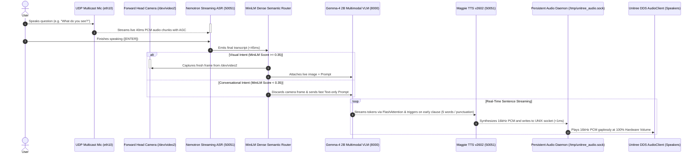

# Unitree R1 / G1 Humanoid Robot: Fully Offline Edge AI Deployment Guide

End-to-end guide for deploying and running **real-time multimodal AI (Nemotron Speech Streaming ASR + Magpie TTS v2602 + Gemma-4 2B Multimodal VLM via Native CUDA Engine)** 100% on-device on the **Unitree R1 / G1** humanoid robot (NVIDIA Jetson Orin NX).

---

## ⚡ Quick One-Command Launch

Whenever you power on the robot, you can start all servers and run the assistant with a single command:

```bash
# 1. SSH into the robot
ssh unitree@192.168.123.164

# 2. Run the all-in-one launcher
bash ~/app.sh
```

---

## System & Hardware Architecture



| Component | Specification | Details / Configuration |
| :--- | :--- | :--- |
| **Target Host** | Unitree R1 / G1 Humanoid Robot | Integrated NVIDIA Jetson Orin NX (16GB Unified RAM/VRAM) |
| **Operating System** | Ubuntu 20.04 LTS (JetPack 5.1.1 / L4T R35.3.1) | Python **3.8.10 (`cp38`)**, CUDA 11.4 (`sm_87`) |
| **Robot Static IP** | `192.168.123.164` | `eth10` interface (Subnet `192.168.123.0/24`) |
| **Robot SSH** | `unitree@192.168.123.164` (password: `123`) | Direct Gigabit Ethernet connection |
| **Microphone Stream** | Unitree UDP Multicast Stream | `239.168.123.161:5555` (16kHz 16-bit Mono PCM with AGC) |
| **Audio Playback** | Persistent Audio Daemon | `/tmp/unitree_audio.sock` $\rightarrow$ `unitree_audio_daemon` (Hardware Vol 100%) |
| **Forward Head Camera** | Forward-facing Perception Camera | **`/dev/video2`** (Live on-demand capture with brightness telemetry) |
| **Semantic Router** | 100% Offline Dense Classifier | **MiniLM-L6-v2 ONNX** cosine similarity vs visual intent anchors |
| **VLM Engine** | Native CUDA `llama-server` | FlashAttention enabled, 6 CPU threads, batch 512, `--cache-ram 0` |
| **Build Power Profile** | **MAXN Mode (`nvpmodel -m 0`) + `jetson_clocks`** | Maximum clock frequencies (~2.0 GHz) to accelerate builds |
| **Runtime Power Profile**| **15W Balanced Mode (`nvpmodel -m 2`)** | Power-saving mode for robot battery runtime |
| **Internet Access** | **None on robot** | Fully offline deployment via laptop staging |

---

## Useful Background Management Commands

```bash
# Check running server processes
ps aux | grep -E '(riva_server|llama-server|unitree_audio_daemon)'

# View live Riva ASR / TTS logs
tail -f /home/unitree/riva_server.log

# View live Gemma-4 VLM logs
tail -f /home/unitree/llama_server.log

# View live Audio Daemon logs
tail -f /home/unitree/audio_daemon.log

# Stop all background servers
killall -9 riva_server llama-server unitree_audio_daemon 2>/dev/null
```
