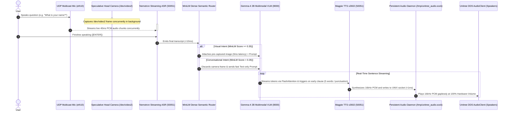

# Unitree R1 / G1 Humanoid Robot: Fully Offline Edge AI Deployment Guide

End-to-end guide for deploying and running **real-time multimodal AI (Nemotron Speech Streaming ASR + Magpie TTS v2602 + Gemma-4 2B Multimodal VLM via Native CUDA Engine)** 100% on-device on the **Unitree R1 / G1** humanoid robot (NVIDIA Jetson Orin NX).

---

## System & Hardware Architecture



| Component | Specification | Details / Configuration |
| :--- | :--- | :--- |
| **Target Host** | Unitree R1 / G1 Humanoid Robot | Integrated NVIDIA Jetson Orin NX (16GB Unified RAM/VRAM) |
| **Operating System** | Ubuntu 20.04 LTS (JetPack 5.1.1 / L4T R35.3.1) | Python **3.8.10 (`cp38`)**, CUDA 11.4 (`sm_87`) |
| **Robot Static IP** | `192.168.123.164` | `eth10` interface (Subnet `192.168.123.0/24`) |
| **Robot SSH** | `unitree@192.168.123.164` (password: `123`) | Direct Gigabit Ethernet connection |
| **Microphone Stream** | Unitree UDP Multicast Stream | `239.168.123.161:5555` (16kHz 16-bit Mono PCM with AGC) |
| **Audio Playback** | Persistent Audio Daemon | `/tmp/unitree_audio.sock` $\rightarrow$ `unitree_audio_daemon` (Hardware Vol 100%) |
| **Forward Head Camera** | Forward-facing Perception Camera | **`/dev/video2`** (Speculative Background Capture, 0ms latency) |
| **Semantic Router** | 100% Offline Dense Classifier | **MiniLM-L6-v2 ONNX** cosine similarity vs visual intent anchors |
| **VLM Engine** | Native CUDA `llama-server` | FlashAttention enabled, 6 CPU threads, batch 128, `--cache-ram 0` |
| **Build Power Profile** | **MAXN Mode (`nvpmodel -m 0`) + `jetson_clocks`** | Maximum clock frequencies (~2.0 GHz) to accelerate builds |
| **Runtime Power Profile**| **15W Balanced Mode (`nvpmodel -m 2`)** | Power-saving mode for robot battery runtime |
| **Internet Access** | **None on robot** | Fully offline deployment via laptop staging |

---

## Quick Resume & Single-Terminal Launch Guide

When you power on the robot, you can start all servers in the background and run the assistant from a **single SSH terminal**:

```bash
# 1. SSH into the robot
ssh unitree@192.168.123.164

# 2. Launch Riva Speech Server (ASR + Magpie TTS) in Background
export LD_LIBRARY_PATH=/home/unitree/NeMo-Speech.cpp/build-cuda/bin:$LD_LIBRARY_PATH
nohup /home/unitree/NeMo-Speech.cpp/build-cuda/bin/riva_server \
  --asr.model.path /home/unitree/robot_assets/models/nemotron-speech-streaming-en-0.6b.q8_0.gguf \
  --tts.magpie-model /home/unitree/robot_assets/models/magpie_tts_multilingual_357m.v2602.f16.gguf \
  --tts.codec-model /home/unitree/robot_assets/models/nemo_nano_codec_22khz_1.89kbps_21.5fps.decoder.f16.gguf \
  --tts.tokenizer-model-dir /home/unitree/robot_assets/models/magpie-tts/extracted \
  --bind 127.0.0.1:50051 > /home/unitree/riva_server.log 2>&1 &

# 3. Launch Native CUDA Gemma-4 Multimodal VLM with FlashAttention in Background
export LD_LIBRARY_PATH=/home/unitree/NeMo-Speech.cpp/llama.cpp/build-cuda/bin:$LD_LIBRARY_PATH
nohup /home/unitree/NeMo-Speech.cpp/llama.cpp/build-cuda/bin/llama-server \
  -m /home/unitree/robot_assets/models/gemma-4-E2B-it-q8_0.gguf \
  --mmproj /home/unitree/robot_assets/models/mmproj-gemma-4-E2B-f16.gguf \
  --host 127.0.0.1 \
  --port 8000 \
  -c 2048 \
  -ngl 99 \
  -t 6 \
  -ub 128 \
  --flash-attn on \
  --cache-ram 0 \
  --reasoning off > /home/unitree/llama_server.log 2>&1 &

# 4. Launch Persistent Gapless Audio Daemon
nohup /home/unitree/unitree_sdk2/build/bin/unitree_audio_daemon eth10 > /home/unitree/audio_daemon.log 2>&1 &

# 5. Wait a few seconds for GPU models to warm up, then launch the assistant:
sleep 6
python ~/test_vision_voice_assistant.py
```

---

## Useful Background Management Commands

```bash
# Check running server processes
ps aux | grep -E '(riva_server|llama-server|unitree_audio_daemon)'

# View live Riva ASR / TTS logs
tail -f /home/unitree/riva_server.log

# View live Gemma-4 VLM logs
tail -f /home/unitree/llama_server.log

# Stop all background servers
killall -9 riva_server llama-server unitree_audio_daemon 2>/dev/null
```
