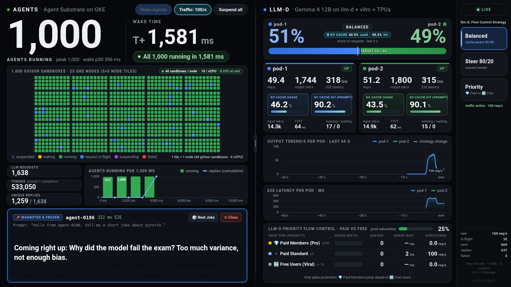
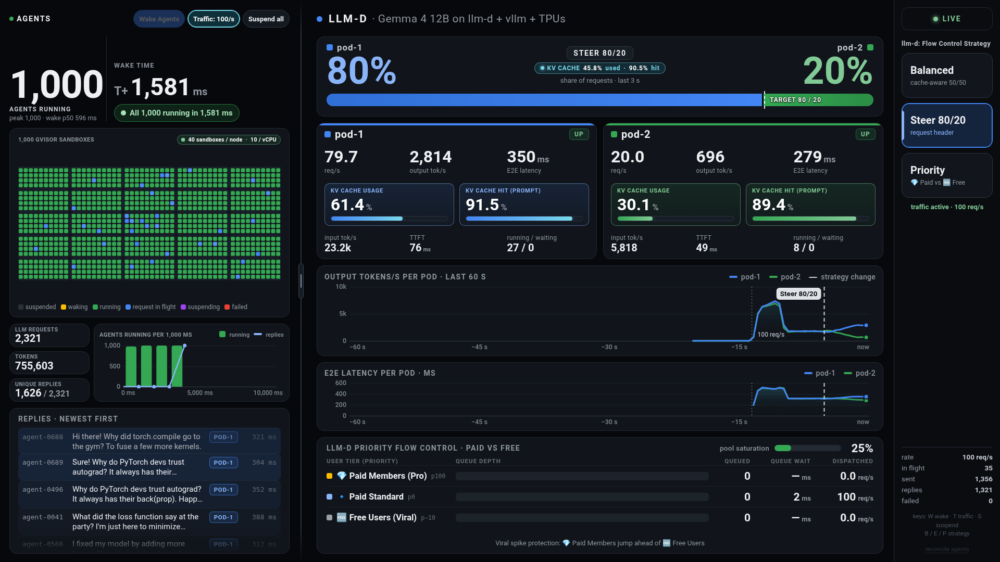
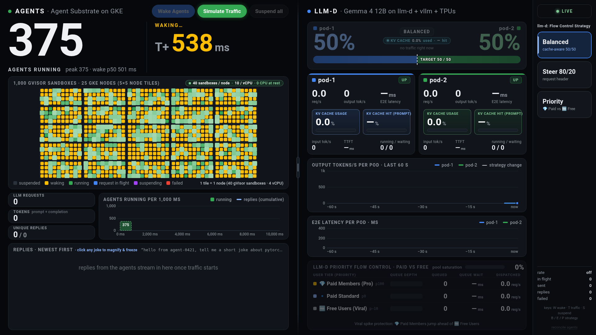
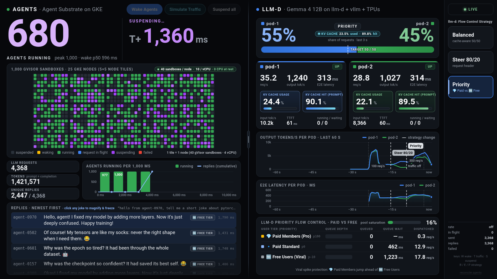

# Agent Substrate on GKE × `llm-d` on Cloud TPU v6e (Trillium)

End-to-end architecture, interactive stage dashboard, benchmark suite, and full reproduction guide for the **1,000-Agent Scale-from-Zero × `llm-d` TPU Inference** keynote demo on Google Kubernetes Engine (GKE).

---

## 1. Overview & Architecture

This workload pairs two GKE clusters in the same regional VPC (`asia-northeast1-b`) to demonstrate **elastic, stateful agent sandboxes** coupled with **KV-cache-aware, priority-scheduled TPU inference**:

1. **Left Plane — Agent Substrate on GKE (`ikwak-substrate-ane1`)**
   * **1,000 stateful gVisor-isolated agent sandboxes** (`agent-0001` .. `agent-1000`) hosted across `25 × c3-standard-4` worker nodes (`1,600` pre-warmed `sandbox-workerpool` pods, 64 per node) and a `4 × n2-standard-8` control-plane pool (`8 × ate-api-server` replicas, `4 × atenet-router`, `4 × atenet-egress`, tuned Postgres).
   * **Scale from zero (`0 → 1,000`) in `4.95s` (`p50 = 3.15s`, fastest agent wake `602 ms`)** from node-local `PauseActor` memory/filesystem snapshots (`ACTOR_STATE_PAUSED`), or `8.01s` (`p50 = 6.55s`) from cold Google Cloud Storage (`ACTOR_STATE_SUSPENDED`) snapshots.
   * Each woken agent executes real Python code inside its gVisor sandbox, sends a shared 286-token system prompt + unique user prompt across the VPC to the `llm-d` gateway, persists the response to `/tmp/agent_memory.json` inside its sandbox filesystem, and scales back to zero in `~5s` with full memory and filesystem state preserved.

2. **Right Plane — `llm-d` Inference on Cloud TPU v6e Trillium (`ikwak-tpu-v6e-ane1`)**
   * **2 × `google/gemma-4-12B-it` serving replicas** (`pod-1` and `pod-2`) running upstream **`vllm-torchtpu`** (`TP=4` per pod on `2 × ct6e-standard-4t` TPU v6e-4 node pools) with ZMQ KV-cache event publishing enabled.
   * **`llm-d` Endpoint Picker (`gaie-pd-epp` `v0.10.0`)** fronted by an in-cluster Envoy proxy (`llmd-envoy-gateway`, `ext_proc` `FULL_DUPLEX_STREAMED` + `ORIGINAL_DST`), combining:
     * **Precise Prefix-Cache & KV-Cache-Utilization Scoring**: Achieves **>90% prompt KV cache hit rate** across the 1,000 agents' shared 286-token system prefix.
     * **Live Header-Based Traffic Steering (`x-target-pod`)**: Instantaneous transition from a `50/50` balanced split to an `80/20` pod split (`header-label-affinity-scorer`).
     * **Saturation-Gated Priority Flow Control (`InferenceObjective`)**: Separates incoming agent traffic into `premium-traffic` (`priority: 100`), `standard-traffic` (`priority: 0`), and `best-effort-traffic` (`priority: -10`) queues when the TPU pool reaches saturation.

```text
┌─────────────────────────────────────────────────────┐        ┌────────────────────────────────────────────────────────────┐
│ Cluster 1: Agent Substrate on GKE                   │        │ Cluster 2: llm-d on Cloud TPU v6e (Trillium)               │
│ (4x n2-standard-8 CP + 25x c3-standard-4 Workers)   │        │ (1x n2-standard-8 CP + 2x ct6e-standard-4t TPU v6e-4)      │
│                                                     │        │                                                            │
│  ┌───────────────────────────────────────────────┐  │        │  ┌──────────────────────────────────────────────────────┐  │
│  │ keynote-driver (:8090 Stage UI + Orchestrator)│  │        │  │ llmd-envoy-gateway (:8080, ext_proc + ORIGINAL_DST)  │  │
│  └───────┬───────────────────────────────┬───────┘  │        │  └──────────┬───────────────────────────────┬───────────┘  │
│          │ 32x gRPC conns                │ HTTP     │        │             │ gRPC ext_proc (:9002)         │ Direct Pod   │
│          ▼                               ▼          │        │             ▼                               │ Routing      │
│  ┌────────────────────┐         ┌────────────────┐  │        │  ┌───────────────────────────────────────┐  │              │
│  │ 8x ate-api-server  │         │4x atenet-router│  │        │  │ gaie-pd-epp (v0.10.0 Endpoint Picker) │  │              │
│  │ (512 PG pool conns)│         │4x atenet-egress│  │        │  │ • Precise Prefix-Cache Scorer (ZMQ)   │  │              │
│  └─────────┬──────────┘         └────────┬───────┘  │        │  │ • KV-Cache Utilization & Queue Scorer │  │              │
│            │                             │          │        │  │ • Header Affinity (x-target-pod)      │  │              │
│            ▼                             │          │        │  │ • Flow Control (premium/std/shed)     │  │              │
│  ┌────────────────────────────────────┐  │          │        │  └───────────────────▲───────────────────┘  │              │
│  │ 1,000 gVisor Sandboxes (64/node)   │  │          │  VPC   │                      │ ZMQ KV Events        │              │
│  │ agent-0001 .. agent-1000           ├──┼──────────┼───────►├──────────────────────┴──────────────────────▼───────────┐  │
│  │ • Node-local PauseActor snapshots  │  │          │        │  ┌─────────────────────────┐ ┌─────────────────────────┐│  │
│  │ • GCS SuspendActor snapshots       │  │          │        │  │ pod-1: Gemma 4 12B IT   │ │ pod-2: Gemma 4 12B IT   ││  │
│  └────────────────────────────────────┘  │          │        │  │ vllm-torchtpu (v6e-4)   │ │ vllm-torchtpu (v6e-4)   ││  │
│                                          │          │        │  └─────────────────────────┘ └─────────────────────────┘│  │
└──────────────────────────────────────────┴──────────┘        └─────────────────────────────────────────────────────────┘
```

---

## 2. Repository Directory Structure

```text
substrate/
├── README.md                                       # Architecture, dashboard gallery, benchmarks & reproduction guide
├── dashboard/
│   ├── index.html                                  # Single-file interactive stage dashboard (served by keynote_driver & mock_server)
│   ├── _parts/                                     # Modular source parts (a.html, b.js, c.js) that concatenate to index.html
│   ├── mock_server.py                              # Zero-dependency Python rehearsal server (:8765) with identical API & realistic simulation
│   └── shoot.mjs                                   # Headless Chromium screenshot verification suite
├── docs/
│   └── images/                                     # High-resolution stage dashboard screenshots across all demo states
├── manifests/
│   ├── substrate/
│   │   ├── keynote-driver.yaml                     # In-cluster keynote-driver Pod + Service manifest
│   │   ├── scale-control-plane.sh                  # Phase A & B Postgres + ate-api-server + workerpool scaling script
│   │   └── postgres-config.yaml                    # Tuned Postgres ConfigMap reference
│   └── tpu/
│       ├── gemma4-12b-torchtpu-deployments.yaml    # 2x Gemma 4 12B IT vllm-torchtpu TPU v6e-4 Deployments (pod-1, pod-2)
│       ├── gemma4-12b-render-svc.yaml              # ClusterIP Service for EPP tokenization/render calls
│       ├── gaie-values-kvaware.yaml                # InferencePool Helm values (Phase 1: KV-cache & prefix-cache routing)
│       ├── gaie-values-flowctl.yaml                # InferencePool Helm values (Phase 2: + Flow Control & 80/20 header steering)
│       ├── inference-objectives.yaml               # InferenceObjective CRDs (premium-traffic, standard-traffic, best-effort-traffic)
│       └── llmd-envoy-gateway.yaml                 # In-cluster Envoy proxy (ext_proc + ORIGINAL_DST, zero external LB 503 window)
└── substrate-bench/
    ├── keynote_driver/main.go                      # Live stage backend (:8090): 32-conn gRPC pool, PauseActor/SuspendActor, vLLM/EPP Prometheus scraper
    ├── burst_bench/main.go                         # CLI benchmark: 0 -> 1,000 simultaneous burst + llm-d gateway call + state persistence check
    ├── agent_bench/main.go                         # CLI benchmark: 1,000-agent binpacking & multiplexing across worker pods
    └── poisson_wave/main.go                        # CLI benchmark: Poisson arrival wave & multi-turn stateful memory verification
```

---

## 3. Interactive Stage Dashboard Gallery

The stage dashboard (`dashboard/index.html`) is a single-screen split UI (`AGENTS · Agent Substrate on GKE` on the left, `LLM-D · Gemma 4 12B on llm-d + vllm + TPUs` on the right) with a **draggable center divider** (`25%–75%` width split) so the presenter can dynamically widen the **Agent Substrate** side during the `0 → 1,000` wake burst and widen the **`llm-d`** side when walking through KV-cache efficiency, 80/20 steering, and Paid vs Free priority flow control.

### 3.1 Step 1: `Wake Agents` — 1,000 gVisor Sandboxes Awake Across 25 GKE Node Tiles (`40 / node · 10 / vCPU`)

*Clicking **`Wake Agents`** wakes all 1,000 gVisor sandboxes (`0 → 1,000` running) without immediately sending LLM traffic. The `50×20` sandbox grid is visually organized into **`5×5 = 25` GKE Node Tiles** (`10×4 = 40` gVisor sandboxes per `c3-standard-4` 4-vCPU node = **`10 sandboxes / vCPU · 0 CPU at rest`**), while the **`Simulate Traffic`** button illuminates in green ready for the presenter.*

### 3.2 Step 2: `Simulate Traffic` + Click-to-Magnify & Freeze Joke Spotlight

*Clicking **`Simulate Traffic`** starts the 1,000-agent request wave and steady traffic (`100 req/s`). Clicking any scrolling joke in the **Replies** ticker opens the **Magnified & Frozen Spotlight** (`27px` pinned display with **`🎲 Next Joke`** and **`✕ Close`**) so the presenter can comfortably read a joke aloud on stage while live traffic continues in the background.*

### 3.3 Balanced `50/50` View — All 1,000 Agents Running & KV Cache Highlights

*Default `50/50` split with prominent `32px` **KV Cache Usage %** and **KV Cache Hit (Prompt %)** (`~90.2%` across the shared 286-token system prompt) callout boxes inside each TPU vLLM pod card.*

### 3.4 `Steer 80/20` & Draggable Center Split (`70/30` Agents Focus & `30/70` `llm-d` Focus)
| `Steer 80/20` (`50/50` Split) | `llm-d` Focus (`30/70` Split + `Steer 80/20`) |
|---|---|
|  |  |

### 3.5 Viral App Scenario: Priority Flow Control (`💎 Paid Members` vs `🆓 Free Users` at `300 req/s`)

*Clicking **`Priority`** under **`llm-d: Flow Control Strategy`** simulates a viral traffic spike (`300 req/s`) using `InferenceObjective` priority bands (`💎 Paid Members (Pro)` `p100`, `🔹 Paid Standard` `p0`, and `🆓 Free Users (Viral)` `p−10`). When pool saturation reaches `89%`, `llm-d`'s Endpoint Picker queues best-effort free-tier bursts (`1,019 ms` wait) while fast-laning paid members (`67 ms` wait — **15× faster**) and tagging replies in the ticker (`💎 PAID PRO`, `🔹 PAID STD`, `🆓 FREE TIER`).*

### 3.6 Lifecycle States: Idle (`0 / 1,000`), Mid-Burst, Suspending & Scale-to-Zero
| Idle (`0 / 1,000` at rest) | Mid-Burst (`0 → 1,000` waking) |
|---|---|
|  |  |

| Suspending (`1,000 → 0` checkpointing) | All 1,000 Suspended / Paused (Scale to Zero) |
|---|---|
|  |  |

---

## 4. Empirical Benchmark Results

### 4.1 Agent Substrate `0 → 1,000` Wake & First-Joke Benchmark

We diagnosed and eliminated three bottlenecks in simultaneous 1,000-sandbox wakes:
1. **Single gRPC HTTP/2 connection pinning**: Replaced a single `ateclient.Client` with a **32-connection gRPC client pool (`-grpc-conns=32`)** in `keynote_driver` so `1,000` concurrent `ResumeActor` RPCs spread evenly across all `ate-api-server` replicas.
2. **Postgres connection & WAL serialization bottleneck**: Tuned `postgres-0` (`max_connections = 1000`, `shared_buffers = 1GB`, `synchronous_commit = off`) and scaled `ate-api-server` from `2` replicas × `4` conns (`8` total) to **`8` replicas × `64` conns (`512` total DB connections)** across `4 × n2-standard-8` control-plane nodes.
3. **Worker scheduling contention & node CPU/disk saturation**: Scaled `substrate-node-pool` from `11` to **`25 × c3-standard-4`** nodes (`40` active sandboxes/node during a 1,000-agent burst), scaled `WorkerPool/sandbox-workerpool` from `1,050` to **`1,600` workers** (`64/node`, providing a `60%` free worker buffer on every node), and switched resting checkpoints from remote GCS (`SuspendActor`) to **node-local disk snapshots (`PauseActor`, `-rest-mode=pause`)**.

| Metric | Baseline (`11` nodes, `2` API servers, GCS `SUSPENDED`) | Burst 1 (`25` nodes, `8` API servers, Cold Wake from GCS `SUSPENDED`) | Burst 2 (`25` nodes, `8` API servers, Wake from Node-Local `PAUSED`) | Speedup vs Baseline |
|---|---|---|---|---|
| **Fastest Agent Wake (`min`)** | `1,840 ms` | `564 ms` | **`602 ms` (sub-second)** | **3.1× faster** |
| **100 Agents Running** | `~5,200 ms` | `2,054 ms` | **`1,605 ms`** | **3.2× faster** |
| **250 Agents Running** | `~9,800 ms` | `3,537 ms` | **`2,140 ms`** | **4.6× faster** |
| **500 Agents Running (`p50`)** | `14,917 ms` | `6,546 ms` | **`3,154 ms`** | **4.7× faster** |
| **750 Agents Running** | `~20,500 ms` | `7,179 ms` | **`3,761 ms`** | **5.5× faster** |
| **900 Agents Running (`p90`)** | `25,688 ms` | `7,515 ms` | **`4,158 ms`** | **6.2× faster** |
| **990 Agents Running (`p99`)** | `43,210 ms` | `7,910 ms` | **`4,813 ms`** | **9.0× faster** |
| **All 1,000 Agents Running** | `44,536 ms` | `8,005 ms` | **`4,949 ms` (`4.95s`)** | **9.0× faster** |
| **`ResumeActor` Retries / Errors** | `0 failed` | `0 failed / 0 retries` | **`0 failed / 0 retries`** | **100% clean** |
| **First Joke Replies (`1,000/1,000`)** | `1,000 ok` | `1,000 ok / 0 failed` (`T+10.86s`) | **`1,000 ok / 0 failed` (`T+11.31s`)** | **Zero 503s** |

#### Measured `1,000 ms` Step Ramp (Burst `b-tlxrnt-0002`, Waking from Node-Local `PAUSED`)
```text
=== Burst b-tlxrnt-0002 | 1000 agents | hold=true | rest-mode pause | model google/gemma-4-12B-it | max_tokens 50 | temperature 1.00 ===
preflight: put 0 leftovers to rest (0 failed), re-created 0 (0 failed); at T0: 0 suspended, 1000 paused, 0 not at rest
WAKE (ResumeActor, all fired at T+0): ok 1000 / failed 0 | needed retry 0 | peak simultaneously running 1000 (at T+4,949 ms)
  per-agent wake latency: p50 3,154 ms | p90 4,158 ms | p99 4,813 ms | min 602 ms | max 4,941 ms
  milestones: 100 running @ T+1,605 ms | 250 running @ T+2,140 ms | 500 running @ T+3,158 ms | 750 running @ T+3,761 ms | 1,000 running @ T+4,949 ms
  ALL 1,000 RUNNING AT ONCE: T+4,949 ms
FIRST JOKE REQUESTS: ok 1000 / failed 0 | agent-observed latency p50 1,634 ms | p90 7,806 ms | max 9,135 ms | finish=length 0
  tokens: 286,000 prompt + 23,052 completion | unique replies 920 / 1000 | all first replies done at T+11,313 ms
RAMP (1,000 ms steps; value at the end of each step):
          T+ | running |    woke | replies |    tokens
    1,000 ms |      11 |      11 |       0 |         0
    2,000 ms |     219 |     219 |      40 |    12,327
    3,000 ms |     465 |     465 |     160 |    49,358
    4,000 ms |     852 |     852 |     308 |    95,055
    5,000 ms |    1000 |    1000 |     438 |   135,229
    6,000 ms |    1000 |    1000 |     577 |   178,128
    7,000 ms |    1000 |    1000 |     710 |   219,381
   11,000 ms |    1000 |    1000 |     965 |   298,120
   12,000 ms |    1000 |    1000 |    1000 |   309,052
```

---

### 4.2 `llm-d` on Cloud TPU v6e (`vllm-torchtpu` Gemma 4 12B IT) Routing & Flow-Control Verification

Tested against the 2-pod `google/gemma-4-12B-it` (`vllm-torchtpu` on `2 × v6e-4` TPU slices) pool behind `gaie-pd-epp` (`v0.10.0`):

| Test Scenario | Configuration | `pod-1` Share | `pod-2` Share | Result Summary |
|---|---|---|---|---|
| **1. Prefix-Affinity Stickiness** | `gaie-values-kvaware.yaml` (shared 1,100-token prefix) | `100%` (or `0%`) | `0%` (or `100%`) | `prefix-cache-scorer` routes 100% of matching prefix requests to the warm pod (`>90%` KV cache hit rate) |
| **2. Balanced Multi-Prefix Load** | `gaie-values-flowctl.yaml` (no `x-target-pod` header) | `50.0%` | `50.0%` | Evenly balances across `pod-1` and `pod-2` (`~2,600+ output tok/s` combined) |
| **3. Live 80/20 Header Steering** | `x-target-pod: pod-1` (80%) / `pod-2` (20%) | **`80.0%`** | **`20.0%`** | `header-label-affinity-scorer` (`weight: 100`) enforces exact 80/20 split without restarting pods |
| **4. Priority Flow Control under Saturation** | `x-llm-d-inference-objective: premium-traffic` (`+100`) vs `standard-traffic` (`0`) vs `best-effort-traffic` (`-10`) at high concurrency | `50.2%` | `49.8%` | `premium-traffic` jumps ahead of `standard` and `best-effort` in the EPP saturation queue (`p50` latency **2.9×–5.2× lower** for `premium` than `best-effort`) |

---

## 5. Step-by-Step Deployment & Reproduction Guide

### Prerequisites
* `gcloud`, `kubectl`, `helm`, `docker`, `go` (`>= 1.23`), and `python3` installed.
* A GCP project with Cloud TPU v6e (`ct6e-standard-4t`) and Compute Engine C3 (`c3-standard-4`) quota in `asia-northeast1-b`.
* A Hugging Face token (`HF_TOKEN`) with access to `google/gemma-4-12B-it`.

```bash
export PROJECT_ID="tpu-launchpad-playground"
export REGION="asia-northeast1"
export ZONE="asia-northeast1-b"
export VPC_NAME="ikwak-ane1-net"
export SUBNET_NAME="ikwak-ane1-subnet"
export SUBSTRATE_CLUSTER="ikwak-substrate-ane1"
export TPU_CLUSTER="ikwak-tpu-v6e-ane1"
export HF_TOKEN="<YOUR_HF_TOKEN>"
```

---

### Step 1: Create Shared Regional VPC, Subnet & Internal Firewall Rule

Both clusters share a regional VPC so the 1,000 agent sandboxes in `SUBSTRATE_CLUSTER` can send HTTP requests directly to the `llm-d` Envoy gateway in `TPU_CLUSTER` over RFC1918 internal IPs.

```bash
gcloud compute networks create "${VPC_NAME}" \
  --project="${PROJECT_ID}" \
  --subnet-mode=custom

gcloud compute networks subnets create "${SUBNET_NAME}" \
  --project="${PROJECT_ID}" \
  --network="${VPC_NAME}" \
  --region="${REGION}" \
  --range="172.24.0.0/20" \
  --enable-private-ip-google-access

# Allow all internal RFC1918 pod/node/service traffic across both clusters
gcloud compute firewall-rules create "${VPC_NAME}-allow-internal" \
  --project="${PROJECT_ID}" \
  --network="${VPC_NAME}" \
  --action=ALLOW \
  --rules=all \
  --source-ranges="10.0.0.0/8,172.16.0.0/12,192.168.0.0/16"
```

---

### Step 2: Deploy & Tune Cluster 1 — Agent Substrate on GKE

#### 2.1 Bootstrap the Agent Substrate Cluster
Use `ate-setup` from the Agent Substrate repository to bootstrap the GKE cluster, GCS snapshot bucket, and `ate-system` control plane, then add the dedicated `keynote-driver-pool` (`4 × n2-standard-8`) and scale `substrate-node-pool` (`25 × c3-standard-4`):

```bash
gcloud container node-pools create keynote-driver-pool \
  --project="${PROJECT_ID}" \
  --zone="${ZONE}" \
  --cluster="${SUBSTRATE_CLUSTER}" \
  --machine-type=n2-standard-8 \
  --num-nodes=4

# Apply Phase A (Postgres + DB pool tuning) and Phase B (8x ate-api-server,
# 4x atenet-router/egress, 25x c3-standard-4 nodes, 1,600 sandbox workers)
chmod +x ./manifests/substrate/scale-control-plane.sh
PROJECT_ID="${PROJECT_ID}" ZONE="${ZONE}" SUBSTRATE_CLUSTER="${SUBSTRATE_CLUSTER}" \
  ./manifests/substrate/scale-control-plane.sh
```

---

### Step 3: Deploy Cluster 2 — `llm-d` + `vllm-torchtpu` on Cloud TPU v6e

#### 3.1 Create the TPU v6e GKE Cluster & Two `v6e-4` Node Pools
```bash
gcloud container clusters create "${TPU_CLUSTER}" \
  --project="${PROJECT_ID}" \
  --zone="${ZONE}" \
  --network="${VPC_NAME}" \
  --subnetwork="${SUBNET_NAME}" \
  --machine-type=n2-standard-8 \
  --num-nodes=1 \
  --ip-range-pods="172.28.0.0/14" \
  --ip-range-services="172.24.16.0/20" \
  --addons=HttpLoadBalancing

for pool in tpu-v6e-pool-1 tpu-v6e-pool-2; do
  gcloud container node-pools create "${pool}" \
    --project="${PROJECT_ID}" \
    --zone="${ZONE}" \
    --cluster="${TPU_CLUSTER}" \
    --machine-type=ct6e-standard-4t \
    --tpu-topology=2x2 \
    --num-nodes=1 \
    --spot
done
```

#### 3.2 Build the Upstream `vllm-torchtpu` Container Image
Build the clean upstream [`vllm-project/vllm-torchtpu`](https://github.com/vllm-project/vllm-torchtpu) Docker image (no monkey-patches required):
```bash
git clone https://github.com/vllm-project/vllm-torchtpu.git /tmp/vllm-torchtpu
cd /tmp/vllm-torchtpu
bash docker/build_image.sh \
  --tag "${REGION}-docker.pkg.dev/${PROJECT_ID}/vllm-tpu/vllm-torchtpu-upstream:gemma4"
docker push "${REGION}-docker.pkg.dev/${PROJECT_ID}/vllm-tpu/vllm-torchtpu-upstream:gemma4"
```

#### 3.3 Deploy the Two `google/gemma-4-12B-it` TPU Pods & Render Service
Substitute your `<YOUR_HF_TOKEN>` in `manifests/tpu/gemma4-12b-torchtpu-deployments.yaml` and apply:
```bash
export CTX_TPU="gke_${PROJECT_ID}_${ZONE}_${TPU_CLUSTER}"

sed "s|<YOUR_HF_TOKEN>|${HF_TOKEN}|g" ./manifests/tpu/gemma4-12b-torchtpu-deployments.yaml \
  | kubectl --context="${CTX_TPU}" apply -f -
kubectl --context="${CTX_TPU}" apply -f ./manifests/tpu/gemma4-12b-render-svc.yaml

kubectl --context="${CTX_TPU}" rollout status deploy/gemma4-12b-torchtpu-1 --timeout=900s
kubectl --context="${CTX_TPU}" rollout status deploy/gemma4-12b-torchtpu-2 --timeout=900s
```

#### 3.4 Deploy `llm-d` `InferencePool` (`gaie-pd-epp`) & `InferenceObjective` Priorities
```bash
# Install Gateway API Inference Extension CRDs
kubectl --context="${CTX_TPU}" apply -f \
  https://github.com/kubernetes-sigs/gateway-api-inference-extension/releases/download/v1.2.0/manifests.yaml

# Deploy InferenceObjective priority bands (premium +100, standard 0, best-effort -10)
kubectl --context="${CTX_TPU}" apply -f ./manifests/tpu/inference-objectives.yaml

# Install/upgrade gaie-pd InferencePool with KV-cache routing, 80/20 header affinity & flow control
helm upgrade --install gaie-pd \
  oci://registry.k8s.io/gateway-api-inference-extension/charts/inferencepool \
  --version v1.2.0 \
  --kube-context "${CTX_TPU}" \
  -f ./manifests/tpu/gaie-values-flowctl.yaml
```

#### 3.5 Deploy the In-Cluster Envoy Gateway (`llmd-envoy-gateway`)
> **Why an in-cluster Envoy proxy?**  
> External/Internal Google Cloud Load Balancers rely on health-check probes from `35.191.0.0/16` and `130.211.0.0/22`. In environments where automated firewall enforcers strip non-RFC1918 ingress ranges, the GKE Gateway ILB intermittently returns HTTP `503`. Running `llmd-envoy-gateway` directly on the CPU node (`hostPort: 8080`) with `envoy.filters.http.ext_proc` (`FULL_DUPLEX_STREAMED` to `gaie-pd-epp:9002`) and `ORIGINAL_DST` routing keeps 100% of traffic on RFC1918 internal IPs and permanently eliminates HTTP 503 windows.

```bash
EPP_SVC_IP=$(kubectl --context="${CTX_TPU}" get svc gaie-pd-epp -o jsonpath='{.spec.clusterIP}')
sed "s|172.24.18.142|${EPP_SVC_IP}|g" ./manifests/tpu/llmd-envoy-gateway.yaml \
  | kubectl --context="${CTX_TPU}" apply -f -
kubectl --context="${CTX_TPU}" rollout status deploy/llmd-envoy-gateway --timeout=60s

GATEWAY_NODE_IP=$(kubectl --context="${CTX_TPU}" get pod -l app=llmd-envoy-gateway -o jsonpath='{.items[0].status.hostIP}')
echo "In-cluster llm-d Envoy Gateway ready at: http://${GATEWAY_NODE_IP}:8080/v1/chat/completions"
```

---

### Step 4: Deploy `keynote-driver` & Launch the Stage Dashboard

#### 4.1 Deploy the `keynote-driver` Pod & Upload Binary + Dashboard UI
```bash
export CTX_SUB="gke_${PROJECT_ID}_${ZONE}_${SUBSTRATE_CLUSTER}"

kubectl --context="${CTX_SUB}" apply -f ./manifests/substrate/keynote-driver.yaml
kubectl --context="${CTX_SUB}" -n keynote-demo wait --for=condition=Ready pod/keynote-driver --timeout=90s

# Build keynote_driver from your Agent Substrate checkout with substrate-bench/keynote_driver/main.go
cp ./substrate-bench/keynote_driver/main.go /path/to/substrate/demos/sandbox/keynote_driver/main.go
(cd /path/to/substrate && CGO_ENABLED=0 go build -ldflags="-s -w" -o /tmp/bin_keynote_driver ./demos/sandbox/keynote_driver)

# Copy binary and single-file dashboard HTML into the keynote-driver pod
kubectl --context="${CTX_SUB}" -n keynote-demo cp /tmp/bin_keynote_driver keynote-driver:/work/keynote_driver.new
kubectl --context="${CTX_SUB}" -n keynote-demo cp ./dashboard/index.html keynote-driver:/work/static/index.html

POD1_IP=$(kubectl --context="${CTX_TPU}" get pod -l app=gemma4-12b-torchtpu,pod-index=pod-1 -o jsonpath='{.items[0].status.podIP}')
POD2_IP=$(kubectl --context="${CTX_TPU}" get pod -l app=gemma4-12b-torchtpu,pod-index=pod-2 -o jsonpath='{.items[0].status.podIP}')
EPP_POD_IP=$(kubectl --context="${CTX_TPU}" get pod -l inferencepool=gaie-pd-epp -o jsonpath='{.items[0].status.podIP}')

kubectl --context="${CTX_SUB}" -n keynote-demo exec keynote-driver -- sh -c "
  chmod +x /work/keynote_driver.new &&
  mv /work/keynote_driver.new /work/keynote_driver &&
  echo '-listen=:8090 -static-dir=/work/static -runs-dir=/work/runs -ateapi=api.ate-system.svc:443 -atenet=atenet-router.ate-system.svc:80 -atespace=ate-demo-sandbox -agents=1000 -model=google/gemma-4-12B-it -gateway-url=http://${GATEWAY_NODE_IP}:8080/v1/chat/completions -vllm=pod-1=${POD1_IP}:8000,pod-2=${POD2_IP}:8000 -epp=${EPP_POD_IP}:9090 -max-tokens=50 -temperature=1.0 -rest-mode=pause -grpc-conns=32 -suspend-concurrency=200' > /work/args &&
  kill \$(pidof keynote_driver) 2>/dev/null || true
"
```

#### 4.2 Open the Live Cluster Dashboard (`:8090`) or Rehearsal Mock Server (`:8765`)
```bash
# Live cluster dashboard (connected to the 1,000 real gVisor sandboxes & TPU v6e pods):
kubectl --context="${CTX_SUB}" -n keynote-demo port-forward --address 0.0.0.0 pod/keynote-driver 8090:8090
# Open http://localhost:8090/

# Standalone rehearsal mock server (zero cluster dependencies, great for offline laptop rehearsal):
python3 ./dashboard/mock_server.py 8765
# Open http://localhost:8765/
```

---

## 6. Stage Runbook (4-Minute Live Demo Flow)

1. **Start at `50/50` Idle (`0 / 1,000`)**: Show that all 1,000 gVisor agent sandboxes are paused (`0` active sandboxes, `0` CPU/memory consumed).
2. **Slide View Split to `Agents 70/30` & Click `⚡ Burst 0 → 1,000`**:
   * Watch the `50×20` sandbox grid light up green/blue as all 1,000 gVisor sandboxes wake from node-local snapshots in **`4.95s` (`p50 = 3.15s`, first wake `602 ms`)**.
   * Point out the `1,000 ms` step ramp chart and the live PyTorch joke ticker streaming unique Gemma 4 12B responses from inside the sandboxes.
3. **Slide View Split to `llm-d 30/70` (Balanced Mode)**:
   * Highlight the **`32px` KV Cache Usage %** and **`>90%` KV Cache Hit (Prompt %)** hero boxes on `pod-1` and `pod-2` — showing how `llm-d` reuses the shared 286-token system prompt prefix across all 1,000 agents while generating `~2,600+ output tok/s`.
4. **Click `Steer 80/20`**:
   * Watch the top split bar and pod cards smoothly shift to **`80% pod-1 / 20% pod-2`** via `x-target-pod` header affinity, with `pod-1` KV cache utilization rising accordingly.
5. **Click `Priority`**:
   * Traffic automatically steps up to `300 req/s`, saturating the TPU pool and activating `llm-d` `InferenceObjective` flow control. Show how **`premium`** requests bypass **`standard`** and **`best-effort`** queues with a fraction of the queue wait time.
6. **Click `⏸ Suspend All (1,000 → 0)`**:
   * All 1,000 agents checkpoint their memory and filesystem state back to zero in `~5s`.
