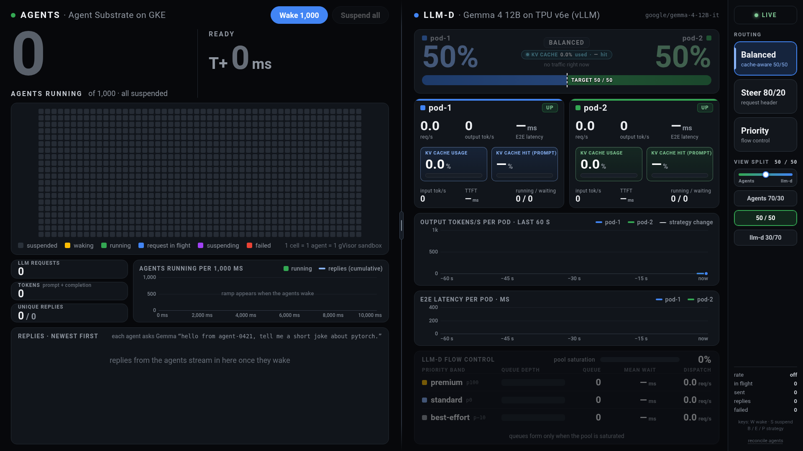
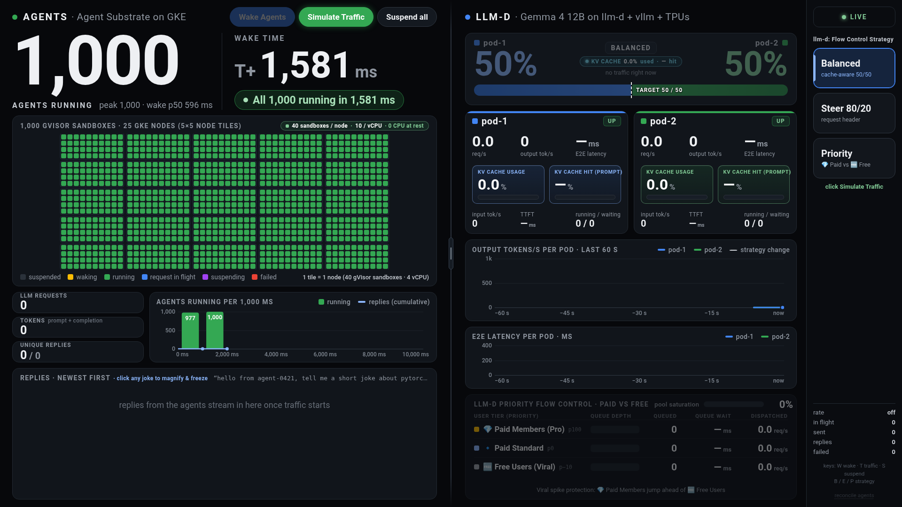
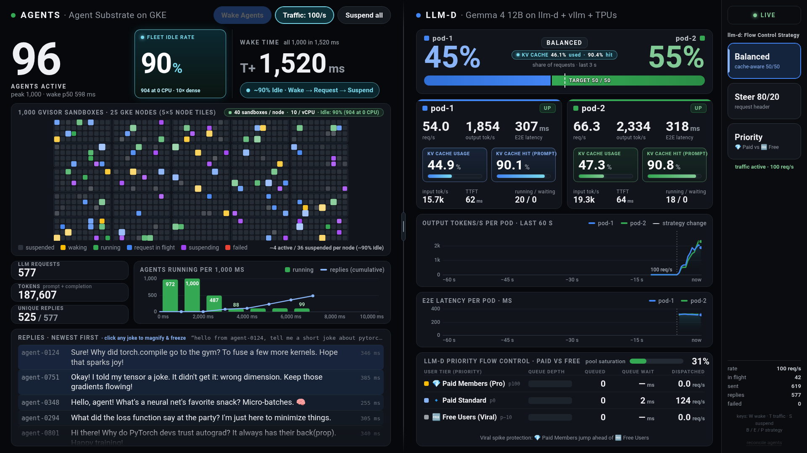
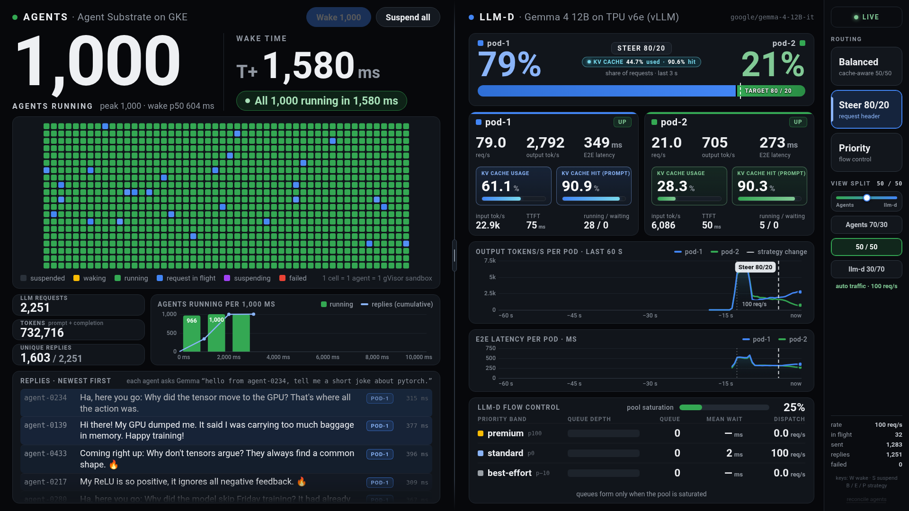
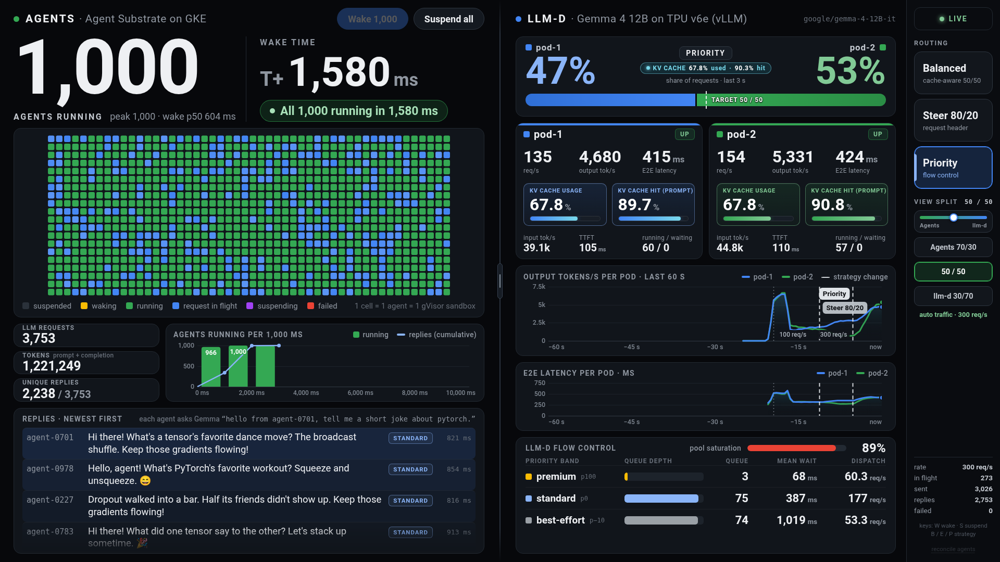
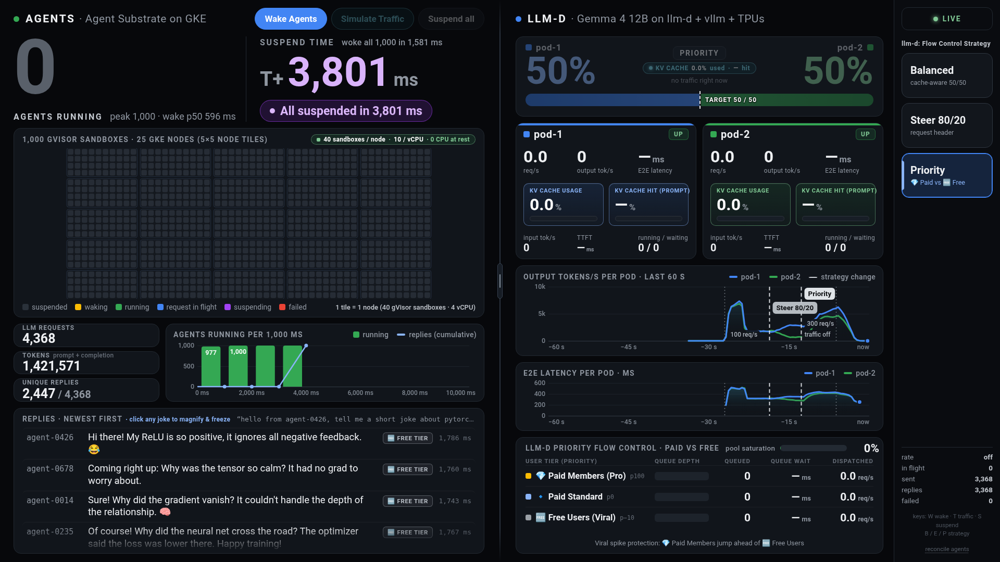
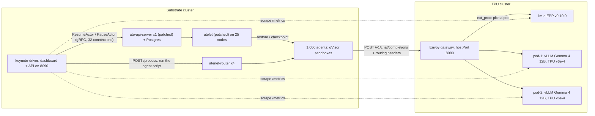

# Agent Substrate × llm-d: 1,000 agents on GKE calling Gemma 4 12B on Cloud TPU v6e

A keynote demo:
- **Agent Substrate** wakes 1,000 sandboxed agents from zero in about 3 seconds on GKE.
- The agents call **Gemma 4 12B**, served by vLLM on **Cloud TPU v6e** behind the **llm-d** router.
- The stage dashboard shows both sides live, and lets the presenter switch llm-d's routing (balanced, header-steered 80/20, priority flow control).

This folder has the dashboard, the orchestrator ("keynote driver"), the patches, the manifests, and a step-by-step guide. The guide was re-verified against the running clusters on 2026-09-26 (see [How this guide was verified](#10-how-this-guide-was-verified)).

> [!WARNING]
> This is a demo setup, and several settings trade safety for speed:
> - Postgres runs with `fsync=off`;
> - a privileged node tuner is used;
> - the gVisor flags weaken isolation;
> - an unauthenticated file server exposes the Postgres data directory.
>
> Read [Known issues and disclosures](#9-known-issues-and-disclosures) before reusing any of it.

**Contents:** [1. What the demo shows](#1-what-the-demo-shows) · [2. Results](#2-results) · [3. Architecture](#3-architecture) · [4. Changes from stock](#4-changes-from-stock) · [5. Repository layout](#5-repository-layout) · [6. Reproduce it](#6-reproduce-it) · [7. Pre-show health check](#7-pre-show-health-check) · [8. Stage runbook](#8-stage-runbook) · [9. Known issues and disclosures](#9-known-issues-and-disclosures) · [10. How this guide was verified](#10-how-this-guide-was-verified) · [11. Cleanup and revert](#11-cleanup-and-revert)

---

## 1. What the demo shows

The dashboard is one 1920×1080 page with a draggable divider.

**Left panel, "Agents":** 1,000 Agent Substrate actors (`agent-0001` … `agent-1000`).
- Each agent is a gVisor sandbox. When idle it is paused to a snapshot on its node's local disk.
- A 50×20 grid shows every agent's state.
- Also shown: a millisecond wake clock, a ramp chart, and a ticker with the agents' LLM replies.

**Right panel, "llm-d":** two vLLM replicas (`pod-1`, `pod-2`) of `google/gemma-4-12B-it` on TPU v6e.
- They sit behind the llm-d endpoint picker (EPP).
- Shown per pod: live split, request rate, tokens/s, latency, prefix-cache hit rate and KV usage.
- A flow-control panel shows the three priority bands.

| Button | What happens |
|---|---|
| **Wake Agents** | All 1,000 paused agents are resumed at once (`ResumeActor`). The clock stops when all 1,000 are RUNNING. No LLM calls are made yet. |
| **Simulate Traffic** | Starts the duty cycle at 100 requests/s. Random agents wake, run a script inside their sandbox that asks the LLM for a short PyTorch joke, and pause again. About 90% of the fleet is paused at any moment ("fleet idle rate"). |
| **Balanced / Steer 80/20 / Priority** | Changes how the agents' requests are labelled:<br>• Balanced: no routing header.<br>• Steer 80/20: `x-target-pod: pod-1` on 80% of requests and `pod-2` on 20%.<br>• Priority: 300 req/s, split 20% premium / 60% standard / 20% best-effort via `x-llm-d-inference-objective`. |
| **Suspend all** | Pauses every running agent back to zero compute. |

Each reply shown in the ticker came from inside an agent's sandbox. The agent's script POSTs to the llm-d gateway with `wget`, saves the reply to `/tmp/agent_memory.json` in the sandbox, and returns it.

## 2. Results

**How these were measured:** measured on the live clusters on 2026-09-26, with the configuration in this folder:
- patched ate-api/atelet with `restoreSem` 12;
- keynote driver v4;
- rest mode `pause`.

Every run was checked against **ground truth**, not only the dashboard's own counters:
- actor states from ate-api (`kubectl ate get actors`);
- real gVisor sandbox processes counted on the 25 nodes.

### 2.1 Agent Substrate: wake, duty cycle, suspend

| Run (driver v4, restoreSem 12) | Wake 1,000 → all RUNNING | Per-agent wake p50 | Then | Suspend all (from click) | After suspend (ate-api / nodes) |
|---|---|---|---|---|---|
| morning, Priority run | 2,984 ms | – | 60 s Priority traffic | 3,781 ms (waited on one failing agent, see §9) | 1,000 PAUSED / 0 sandboxes |
| morning, warm-up after re-creating one agent | 3,111 ms | – | no traffic | 2,522 ms (all 1,000 up) | 1,000 PAUSED / 0 |
| morning, Balanced run | 2,940 ms | – | 60 s Balanced traffic | 604 ms | 1,000 PAUSED / 0 |
| morning, health check | 2,990 ms | – | no traffic | 2,505 ms (all 1,000 up) | 1,000 PAUSED / 0 |
| afternoon r1 (first wake after an atelet restart) | 3,286 ms | 1,628 ms | 60 s Balanced | 741 ms | 1,000 PAUSED / 0 |
| afternoon r2 | 2,902 ms | 1,571 ms | 60 s Balanced | 602 ms | 1,000 PAUSED / 0 |
| afternoon r3 | 2,985 ms | 1,648 ms | 60 s Balanced | 683 ms | 1,000 PAUSED / 0 |
| guide verification, health check (first wake after an atelet restart) | 3,089 ms | 1,660 ms | no traffic | 2,566 ms (all 1,000 up) | 1,000 PAUSED / 0 |
| guide verification, full cycle | 2,958 ms | 1,578 ms | Balanced → 80/20 → Priority → Balanced, 150 s | 607 ms | 1,000 PAUSED / 0 |
| guide verification, §7 commands run as written | 3,085 ms | 1,619 ms | no traffic | 2,440 ms (all 1,000 up) | 1,000 PAUSED / 0 |

**Wake 1,000:**
- Median 2,988 ms over these 10 wakes, range 2,902–3,286 ms.
- 4 of 10 took longer than 3.0 s: the two first wakes after an atelet restart, the warm-up after re-creating an agent, and one ordinary health check (3,085 ms).
- 0 wake failures in every run.
- In the full-cycle verification run: 100 agents were running at 715 ms, 500 at 1,589 ms, 750 at 2,172 ms and all 1,000 at 2,958 ms. The fastest agent took 475 ms.

**Why the tail is about 3 s:** an agent is pinned to the node that holds its local snapshot, and today's placement is uneven, at 32–47 agents per node.
- Nodes with 40 or fewer agents finish by about 2.45 s.
- The 2–3 nodes with 46–47 agents set the tail.

**Simulate Traffic (60 s, Balanced):**
- Fleet idle rate p50 is 90.9–91%.
- 998–1,000 distinct agents complete a full wake → LLM call → pause cycle.
- About 6,200 LLM requests with 0 failed.
- Mid-traffic ground truth in the verification run: 934 PAUSED, 27 PAUSING and 39 RUNNING actors; 65 sandboxes on the nodes.

**Suspend all:**
- 0.60–0.74 s from the click in Balanced mode, when about 100 agents are up.
- 2.4–2.6 s with all 1,000 up.
- 1.3–3.8 s in Priority mode, because it waits for queued LLM calls.

**`restoreSem` experiment:** atelet's per-node restore concurrency, 16 against the deployed 12. Same 60 s Balanced cycle, 0 failures in all runs. 16 was not faster, so 12 stays deployed.

| restoreSem | Wake 1,000 (3 runs) | Per-agent p50 | Suspend all |
|---|---|---|---|
| 16 | 2,992 (first after restart) / 3,099 / 3,326 ms | 1,793–1,824 ms | 613–670 ms |
| 12 | 3,286 (first after restart) / 2,902 / 2,985 ms | 1,571–1,648 ms | 602–741 ms |

### 2.2 llm-d on TPU v6e (from the guide-verification run)

**Setup:** medians over each phase, excluding the first 8 s after each switch.
- Traffic comes from the agents' sandboxes, through the gateway, to the EPP and then vLLM.
- Every request uses the same 286-token system prompt, a per-agent user prompt, and `max_tokens` 50.

| Strategy (offered load) | Split pod-1 / pod-2 | Per-pod req/s | Output tok/s per pod | E2E latency per pod | Prefix-cache hit | Flow control |
|---|---|---|---|---|---|---|
| Balanced (100 req/s) | 53.4% / 46.6% | 56.7 / 49.5 | 1,309 / 1,135 | 172 / 165 ms | 89.5% | idle (saturation 0) |
| Steer 80/20 (100 req/s) | **80.0% / 20.0%** | 83.7 / 21.0 | 1,928 / 483 | 196 / 149 ms | 89.5% | idle |
| Priority (300 req/s) | 50.5% / 49.5% | 124.2 / 119.4 | 2,886 / 2,848 | 345 / 346 ms | 89.5% | saturation median 0.2, max 0.45; queues up to 31; wait ≤ 19 ms in every band |
| Balanced again (100 req/s) | 53.6% / 46.4% | 56.9 / 49.3 | 1,318 / 1,146 | 170 / 165 ms | 89.5% | idle |

**Traffic totals:** 21,681 LLM requests during the traffic phases of this run.
- 0 failed.
- 5 retries after an llm-d HTTP 503.
- 8 requests abandoned because their agent was being paused.

**What this shows:**
- **80/20 steering takes effect within seconds.** The split reached 77–80.7% within the first sampled window after the click.
- **The prefix cache is reused across all 1,000 agents.** About 90% of prompt tokens are served from the prefix cache.
- **On the live pool, Priority mode does not produce visible queueing.** The saturation detector allows 256 in-flight requests per pod, so 300 req/s never saturates the pool, and every band waits about the same few milliseconds.
  - An earlier llm-d-only test capped concurrency at 16 per pod to force saturation. There, the mean latency was premium 0.40 s, standard 0.68 s and best-effort 1.26 s, and the EPP queue wait was about 80 ms for premium against about 1.1 s for best-effort.
  - The deployed values do **not** include that cap.
  - The large premium-vs-free gap in the [Priority screenshot](./docs/images/05_priority.png) comes from the mock backend, not the live cluster.

### 2.3 Dashboard screenshots

These images were rendered against the **mock backend** (`dashboard/mock_server.py`), not the live cluster, so their numbers are simulated. The live dashboard has the same layout.

| Idle | All 1,000 awake |
|---|---|
|  |  |

| Balanced | Steer 80/20 |
|---|---|
|  |  |

| Priority (mock numbers) | Suspended |
|---|---|
|  |  |

More states, including errors, reconnect and 1440×900, are in [`docs/images/`](./docs/images/).

---

## 3. Architecture



**Wake path:** the driver calls `ResumeActor` for all 1,000 agents at once, over 32 gRPC connections. ate-api binds each actor to a pre-warmed worker pod on the node that holds its snapshot. That node's atelet restores the gVisor sandbox with `runsc restore`, through the `runsc_fast` wrapper. `ResumeActor` returns when the actor is RUNNING.

**LLM path:** the driver POSTs to `atenet-router` `/process`, addressed to the actor's DNS name. The agent's sandbox runs a shell script that calls the gateway with `wget`, adding:
- `x-target-pod` in Steer mode;
- `x-llm-d-inference-objective` in Priority mode.

Envoy asks the EPP (`ext_proc`) which pod to use:
- The EPP scores pods by prefix-cache match (from vLLM's KV-cache events over ZMQ), in-flight requests, KV-cache utilization and the `x-target-pod` header.
- Flow control applies priority bands, but only when the pool is saturated.
- Envoy then forwards the request to the chosen vLLM pod (`ORIGINAL_DST`).

**Why an in-cluster Envoy instead of a GKE Gateway:** the Gateway's internal load balancer depends on health-check probes from Google's ranges (35.191.0.0/16, 130.211.0.0/22). In this project an automated firewall policy strips non-RFC1918 source ranges, and the load balancer returned intermittent 503s. A plain Envoy on the CPU node, with `hostPort` 8080, avoids load balancers entirely. The agents reach it at `<node IP>:8080` across the shared VPC.

| | Substrate cluster (`ikwak-substrate-ane1`) | TPU cluster (`ikwak-tpu-v6e-ane1`) |
|---|---|---|
| Location, version | `asia-northeast1-b`, GKE 1.35.8-gke.1036000, REGULAR channel | `asia-northeast1-b`, GKE 1.35.8-gke.1036000 (created at 1.35.7 and auto-upgraded), REGULAR |
| Node pools | `substrate-node-pool`: 25 × c3-standard-4, which runs atelet and 1,600 worker pods (64 per node).<br>`keynote-driver-pool`: 4 × n2-standard-8, label `pool=keynote-driver`, taint `dedicated=keynote-driver:NoSchedule`, which runs Postgres, 1 ate-api, 4 atenet-router, 4 atenet-egress and the keynote driver. | `default-pool`: 1 × e2-standard-4, which runs the EPP and Envoy.<br>`tpu-v6e-spot` and `tpu-v6e-spot-decode`: 1 × ct6e-standard-4t each (TPU v6e, 2x2 topology, Spot, hyperdisk-balanced 100 GB, taint `google.com/tpu=present:NoSchedule`). |
| Networking | VPC-native. Pods `10.56.0.0/14` and services `34.118.224.0/20`, both auto-assigned. Dataplane V2. | Pods `172.28.0.0/14` and services `172.24.16.0/20`, from the subnet's secondary ranges `pods` and `services`. Gateway API standard channel. |
| Other | Workload Identity; beta APIs `podcertificaterequests` + `clustertrustbundles`; managed OpenTelemetry (all set by `setup-gcp`) | – |

**Software:**
- **Agent Substrate:** [agent-substrate/substrate](https://github.com/agent-substrate/substrate) `v0.1.0` (`fa6d949`) with the GKE release images `v0.1.0-gke.1`. ate-api and atelet are replaced by patched builds (§4).
- **vLLM:** [vllm-project/vllm-torchtpu](https://github.com/vllm-project/vllm-torchtpu) @ `3eb7abb5` with no code changes. The deployed image digest is `sha256:699c7ccf…`. It runs `google/gemma-4-12B-it` with TP=4, `--max-model-len 2048`, `--gpu-memory-utilization 0.90` and KV-cache events over ZMQ.
- **llm-d:** EPP `ghcr.io/llm-d/llm-d-router-endpoint-picker:v0.10.0`, installed with the `inferencepool` Helm chart v1.2.0. Envoy is `envoyproxy/envoy:v1.39-latest`.

## 4. Changes from stock

| Where | Change | Why |
|---|---|---|
| ate-api ([patch](./patches/ateapi-atelet-fast-wake.patch)) | Caches: actor templates (2 s TTL), atepg templates, and JWT verification (20 s TTL, so a revoked token keeps working for up to 20 s).<br>`UpdateActorFast` finalizes RUNNING without a re-read.<br>Optimistic worker-cache `MarkFull` and asynchronous worker-binding bookkeeping.<br>Outbox poll interval cut from 50 to 5 ms.<br>Mutex in the atelet dialer.<br>Default log level `warn`. | Removes synchronous Postgres round trips from `ResumeActor`. **Requires exactly one ate-api replica**, because the caches are per process. |
| atelet (same patch) | `restoreSem` = 12 (per-node restore concurrency).<br>Skips `resetActorDirs` when already clean.<br>`writeFileAtomic` replaced by plain `os.WriteFile` (no fsync).<br>Local checkpoints are hard-linked.<br>Image and volume setup runs sequentially.<br>Embeds the `runsc_fast` wrapper. | Faster restores |
| [`runsc_fast_sync.c`](./patches/runsc_fast_sync.c) | Adds `--shared-root=/tmp/runsc-shared-root --gofer-network-namespace=host --host-settings=ignore --restore-spec-validation=ignore -log=/dev/null`.<br>Drops `--alsologtostderr` and `-direct`.<br>Sets `GOMAXPROCS=2`. | Faster `runsc restore`. **Weakens isolation, and gVisor logs are discarded.** |
| Postgres ([`scale-control-plane.sh`](./manifests/substrate/scale-control-plane.sh)) | Settings: `max_connections 1000`, `shared_buffers 4GB`, `work_mem 32MB`, `synchronous_commit off`, **`fsync off`, `full_page_writes off`**, `autovacuum_naptime 5s`, and others.<br>Pinned to one keynote-driver-pool node with 2–16 CPU. | Database latency during 1,000 concurrent binds |
| ate-api, atenet | ate-api has 1 replica, pinned next to Postgres, with a DB pool of 160 max / 64 min connections. atenet-router and atenet-egress have 4 replicas each on keynote-driver-pool. | Keeps the control plane off the busy worker nodes |
| [WorkerPool](./manifests/substrate/sandbox-workerpool.yaml) | 1,600 pre-warmed workers, requests 10m CPU / 64 Mi, limits 1 CPU / 256 Mi | Each node keeps idle workers even with all 1,000 agents awake |
| [ActorTemplate `sandbox-dense`](./manifests/substrate/sandbox-dense-template.yaml.tmpl) | The upstream sandbox demo app, sized to 1 CPU / 256 Mi | Matches the dense workers |
| podcertificate-controller | `WORKERS_PER_SIGNER=16` | Signs the 1,600 worker certificates quickly |
| [ate-node-tuner](./manifests/substrate/ate-node-tuner.yaml) | A privileged DaemonSet:<br>• remounts `/var` with `nobarrier,commit=600`;<br>• sets dirty-page sysctls, the THP setting and the performance CPU governor;<br>• runs a page-cache warmer that reads every local checkpoint every 20 s. | Faster restores. **Risks data loss on a node crash.** |
| keynote driver ([main.go](./substrate-bench/keynote_driver/main.go)) | Rests agents with `PauseActor`, a node-local snapshot (`-rest-mode=pause`); uses 32 gRPC connections; runs a duty cycle of about 100 active agents; cross-checks against ate-api after Suspend all | The demo orchestrator |
| llm-d ([values](./manifests/tpu/gaie-values-flowctl.yaml)) | Scorers: precise prefix-cache (weight 3); `active-request-scorer` instead of `queue-scorer` (2); kv-cache-utilization (2); `header-label-affinity-scorer` on `x-target-pod` (100).<br>Flow control with bands 100 / 0 / −10 and a concurrency detector at 256 per pod. | `queue-scorer` reads a lagging vLLM gauge; in a 1,000-request burst it sent about 750 requests in a row to one pod (86.5/13.5) |

## 5. Repository layout

```text
substrate/
├── README.md                          this guide
├── plan.md                            status, decisions and open items
├── implementation.md                  engineering notes: patches, tuning, measurements, lessons
├── dashboard/
│   ├── index.html                     the stage dashboard (one file, served by the driver)
│   ├── mock_server.py                 offline mock of the driver API for rehearsal (simulated numbers)
│   └── shoot.mjs                      headless-Chrome screenshot script (drives the mock)
├── docs/images/                       dashboard screenshots, rendered with the mock
├── manifests/
│   ├── substrate/
│   │   ├── scale-control-plane.sh     sizes and tunes the Substrate cluster (idempotent, DRY_RUN=1)
│   │   ├── deploy-patched-binaries.sh runs the patched ate-api/atelet on the stock images (idempotent, DRY_RUN=1)
│   │   ├── http_srv.go                the file server that script uses
│   │   ├── sandbox-workerpool.yaml    1,600-worker WorkerPool
│   │   ├── sandbox-dense-template.yaml.tmpl  ActorTemplate for the agents
│   │   ├── ate-node-tuner.yaml        node tuning DaemonSet (see §9)
│   │   └── keynote-driver.yaml        driver namespace, RBAC and pod
│   └── tpu/
│       ├── prereqs.yaml               StorageClass, ServiceAccount and PVCs for the vLLM pods
│       ├── gemma4-12b-torchtpu-deployments.yaml  vLLM pod-1 and pod-2
│       ├── gemma4-12b-render-svc.yaml Service the EPP uses for tokenization
│       ├── inference-objectives.yaml  priority bands (premium / standard / best-effort)
│       ├── gaie-values-flowctl.yaml   llm-d EPP Helm values (deployed)
│       ├── gaie-values-kvaware.yaml   earlier values, not deployed
│       └── llmd-envoy-gateway.yaml    in-cluster Envoy gateway
├── patches/
│   ├── ateapi-atelet-fast-wake.patch  against agent-substrate/substrate@fa6d949 (v0.1.0)
│   ├── runsc_fast_sync.c              runsc wrapper embedded in atelet (deployed)
│   └── runsc_fast_async.c             DO NOT USE: failed experiment (see implementation.md)
└── substrate-bench/
    ├── keynote_driver/main.go         the driver: dashboard backend + orchestrator
    └── agent_bench/ burst_bench/ poisson_wave/   earlier CLI benchmarks; not used by the demo (they compile against v0.1.0 + the patch)
```

---

## 6. Reproduce it

The measured setup used project `tpu-launchpad-playground`, VPC `ikwak-ane1-net` / subnet `ikwak-ane1-subnet`, and the cluster names in §3. Replace them with your own.

### 6.0 Prerequisites and variables

**Tools:**
- `gcloud`, `kubectl`, `helm` 3, `git`, `python3`, `envsubst`, `gzip`, `curl`;
- Go 1.21 or newer. The upstream `go.mod` requires Go 1.27.0, and with the default `GOTOOLCHAIN=auto` the `go` command downloads it (the demo builds ran on go1.27.0);
- `gcc` with static glibc (the demo used gcc 15.2.0, Debian);
- `docker`, to build the vLLM image;
- for the mock screenshots only: Node 22 and Google Chrome.

**Quota** in one zone:
- 100 C3 vCPUs (25 × c3-standard-4);
- 32 N2 vCPUs (4 × n2-standard-8);
- 4 E2 vCPUs (1 × e2-standard-4);
- 8 Spot TPU v6e chips (2 × ct6e-standard-4t).

**Hugging Face:** a token with access to `google/gemma-4-12B-it`.

```bash
git clone https://github.com/saltysoup/jetski-playground.git
cd jetski-playground/substrate
export REPO_DIR="$PWD"

export PROJECT_ID="<your-project>"
export PROJECT_NUMBER="$(gcloud projects describe "${PROJECT_ID}" --format='value(projectNumber)')"
export REGION="asia-northeast1" ZONE="asia-northeast1-b"
export VPC_NAME="<vpc>" SUBNET_NAME="<subnet>"
export SUBSTRATE_CLUSTER="<substrate-cluster>" TPU_CLUSTER="<tpu-cluster>"
export BUCKET_NAME="ate-snapshots-${PROJECT_ID}-${SUBSTRATE_CLUSTER}"   # Substrate snapshot bucket
export SUBSTRATE_SRC="$HOME/src/substrate"    # upstream Agent Substrate checkout
export BIN_DIR="$HOME/src/keynote-bin"        # build outputs
export CTX_SUB="gke_${PROJECT_ID}_${ZONE}_${SUBSTRATE_CLUSTER}"
export CTX_TPU="gke_${PROJECT_ID}_${ZONE}_${TPU_CLUSTER}"
read -rsp "Hugging Face token: " HF_TOKEN && export HF_TOKEN && echo
mkdir -p "${BIN_DIR}"
```

### 6.1 Shared VPC

Both clusters share one subnet, so the agents' sandboxes can reach the gateway's node IP directly.

```bash
gcloud compute networks create "${VPC_NAME}" --project="${PROJECT_ID}" --subnet-mode=custom
gcloud compute networks subnets create "${SUBNET_NAME}" --project="${PROJECT_ID}" \
  --network="${VPC_NAME}" --region="${REGION}" --range=172.24.0.0/20 \
  --secondary-range=pods=172.28.0.0/14,services=172.24.16.0/20 \
  --enable-private-ip-google-access
gcloud compute firewall-rules create "${VPC_NAME}-allow-internal" --project="${PROJECT_ID}" \
  --network="${VPC_NAME}" --direction=INGRESS --action=ALLOW --rules=tcp,udp,icmp \
  --source-ranges=10.0.0.0/8,172.16.0.0/12,192.168.0.0/16,100.64.0.0/10
```

### 6.2 Substrate cluster and Agent Substrate v0.1.0

```bash
git clone https://github.com/agent-substrate/substrate.git "${SUBSTRATE_SRC}"
cd "${SUBSTRATE_SRC}" && git checkout fa6d949685a6318940a9a0195c867c864009b820   # tag v0.1.0

gcloud auth application-default login          # setup-gcp uses Application Default Credentials
GCE_REGION="${REGION}" CLUSTER_LOCATION="${ZONE}" CLUSTER_NAME="${SUBSTRATE_CLUSTER}" \
NETWORK="${VPC_NAME}" SUBNETWORK="${SUBNET_NAME}" GVISOR_NODE_MACHINE_TYPE=c3-standard-4 \
  go run ./tools/setup-gcp bootstrap           # APIs, cluster (2 nodes), bucket, IAM, dashboards
gcloud container clusters get-credentials "${SUBSTRATE_CLUSTER}" --zone="${ZONE}" --project="${PROJECT_ID}"

export KUBECTL_CONTEXT="${CTX_SUB}"
go run ./cmd/ate-setup deploy ate-system --no-dev-env \
  --image-repo us-docker.pkg.dev/gke-substrate-release/substrate --image-tag v0.1.0-gke.1
go run ./cmd/ate-setup deploy demo sandbox --no-dev-env \
  --image-repo us-docker.pkg.dev/gke-substrate-release/substrate --image-tag v0.1.0-gke.1

go build -o "${BIN_DIR}/kubectl-ate" ./cmd/kubectl-ate && export PATH="${BIN_DIR}:${PATH}"
envsubst < "${REPO_DIR}/manifests/substrate/sandbox-dense-template.yaml.tmpl" \
  | kubectl ate --context="${CTX_SUB}" create actor-template -f -
```

> [!CAUTION]
> `setup-gcp create cluster` **deletes and recreates** an existing cluster whose network or subnet differs from `NETWORK` / `SUBNETWORK`. Never re-run it against a live cluster with different values.

Upstream Agent Substrate also warns about worker node pools:
- Turn node **auto-upgrade** off on the pools that run workers: `gcloud container node-pools update substrate-node-pool --cluster "${SUBSTRATE_CLUSTER}" --location "${ZONE}" --no-enable-autoupgrade`.
- Don't use Spot nodes for workers.
- An actor that is awake when its worker pod is killed ends up `CRASHED`.
- Here, a paused actor also loses its node-local snapshot when its node is recreated.

The demo clusters still have auto-upgrade on (see §9).

### 6.3 Build the patched binaries and the driver

These commands run in the upstream checkout.

```bash
cd "${SUBSTRATE_SRC}"
git apply "${REPO_DIR}/patches/ateapi-atelet-fast-wake.patch"
gcc -O3 -static -s -o cmd/atelet/runsc_fast "${REPO_DIR}/patches/runsc_fast_sync.c"   # embedded into atelet
mkdir -p cmd/keynote_driver && cp "${REPO_DIR}/substrate-bench/keynote_driver/main.go" cmd/keynote_driver/

export CGO_ENABLED=0
go build -buildvcs=false -trimpath -ldflags="-s -w" -o "${BIN_DIR}/ateapi" ./cmd/ateapi
go build -buildvcs=false -trimpath -ldflags="-s -w" -o "${BIN_DIR}/atelet" ./cmd/atelet
go build -buildvcs=false -trimpath -o "${BIN_DIR}/keynote_driver" ./cmd/keynote_driver
gzip -9n -c "${BIN_DIR}/ateapi" > "${BIN_DIR}/bin_ateapi.gz"
gzip -9n -c "${BIN_DIR}/atelet" > "${BIN_DIR}/bin_atelet.gz"
(cd "${REPO_DIR}/manifests/substrate" && go build -trimpath -ldflags="-s -w" -o "${BIN_DIR}/http_srv" http_srv.go)
sha256sum cmd/atelet/runsc_fast "${BIN_DIR}/ateapi" "${BIN_DIR}/atelet" "${BIN_DIR}/keynote_driver"
```

With go1.27.0 (linux/amd64) and gcc 15.2.0 these builds are byte-for-byte reproducible, and match what runs in the demo cluster:

| File | sha256 (prefix) |
|---|---|
| `runsc_fast` | `403b8d3d` |
| `ateapi` | `c53a6b41` |
| `atelet` | `c24d7425` |
| `keynote_driver` | `fdef79b4` |

Other toolchains produce different bytes but the same code.

### 6.4 Size and tune the Substrate cluster

```bash
cd "${REPO_DIR}"
PROJECT_ID="${PROJECT_ID}" ZONE="${ZONE}" SUBSTRATE_CLUSTER="${SUBSTRATE_CLUSTER}" \
  DRY_RUN=1 ./manifests/substrate/scale-control-plane.sh     # shows what would change
PROJECT_ID="${PROJECT_ID}" ZONE="${ZONE}" SUBSTRATE_CLUSTER="${SUBSTRATE_CLUSTER}" \
  ./manifests/substrate/scale-control-plane.sh
kubectl --context="${CTX_SUB}" apply -f manifests/substrate/ate-node-tuner.yaml   # used for the measured results; see §9
```

**What `scale-control-plane.sh` does:** every step is idempotent. It:
1. resizes `substrate-node-pool` to 25 nodes;
2. creates `keynote-driver-pool` (4 × n2-standard-8, label + taint);
3. labels the worker nodes `ate.dev/substrate-version=v0.1.0-gke.1`;
4. tunes and pins Postgres;
5. sets 1 ate-api replica with DB pool 160/64;
6. sets 4 + 4 atenet replicas;
7. sets podcert `WORKERS_PER_SIGNER=16`;
8. applies the 1,600-worker WorkerPool.

Run it **before** the next step. It may restart `postgres-0`, and the next step starts a file server inside that pod.

### 6.5 Run the patched ate-api and atelet

```bash
cd "${REPO_DIR}"
BIN_DIR="${BIN_DIR}" CTX_SUB="${CTX_SUB}" DRY_RUN=1 ./manifests/substrate/deploy-patched-binaries.sh
BIN_DIR="${BIN_DIR}" CTX_SUB="${CTX_SUB}" ./manifests/substrate/deploy-patched-binaries.sh
```

**How it works:**
1. The script starts `http_srv` inside `postgres-0`. It serves the Postgres data directory on `:18888`, which is a security problem (see §9).
2. It uploads `bin_ateapi.gz` / `bin_atelet.gz`, verifying the sha256.
3. It adds `fetch-bin` init containers that download them into ate-api (an emptyDir) and atelet (the node's `/var/lib/ateom-gvisor`).
4. It restarts only what changed.

After `postgres-0` restarts, re-run the script before any ate-api or atelet pod restarts. The download URL uses the pod IP.

### 6.6 TPU cluster

```bash
gcloud container clusters create "${TPU_CLUSTER}" --project="${PROJECT_ID}" --zone="${ZONE}" \
  --release-channel=regular --network="${VPC_NAME}" --subnetwork="${SUBNET_NAME}" \
  --enable-ip-alias --cluster-secondary-range-name=pods --services-secondary-range-name=services \
  --machine-type=e2-standard-4 --num-nodes=1 --gateway-api=standard
for pool in tpu-v6e-spot tpu-v6e-spot-decode; do
  gcloud container node-pools create "${pool}" --project="${PROJECT_ID}" --zone="${ZONE}" \
    --cluster="${TPU_CLUSTER}" --machine-type=ct6e-standard-4t --tpu-topology=2x2 --num-nodes=1 \
    --spot --disk-type=hyperdisk-balanced --disk-size=100
done
gcloud container clusters get-credentials "${TPU_CLUSTER}" --zone="${ZONE}" --project="${PROJECT_ID}"
```

GKE adds the `google.com/tpu=present:NoSchedule` taint to TPU nodes by itself. The live TPU pools also show `transparentHugepageEnabled: ALWAYS` in their Linux node config. The commands above don't set it, and we didn't confirm whether it is a GKE default.

### 6.7 vLLM image (upstream vllm-torchtpu, unmodified)

```bash
export VLLM_IMAGE="${REGION}-docker.pkg.dev/${PROJECT_ID}/<repo>/vllm-torchtpu:3eb7abb5"
git clone https://github.com/vllm-project/vllm-torchtpu.git "$HOME/src/vllm-torchtpu"
cd "$HOME/src/vllm-torchtpu" && git checkout 3eb7abb5cc6ff4bae816e988010cf7bee6e9225c
./docker/build_image.sh -t "${VLLM_IMAGE}" --target prod
docker push "${VLLM_IMAGE}"
```

### 6.8 vLLM pods

```bash
cd "${REPO_DIR}"
kubectl --context="${CTX_TPU}" create secret generic llm-d-hf-token --from-literal=HF_TOKEN="${HF_TOKEN}"
kubectl --context="${CTX_TPU}" apply -f manifests/tpu/prereqs.yaml
sed "s|asia-northeast1-docker.pkg.dev/tpu-launchpad-playground/ikwak-vllm-torchtpu/vllm-torchtpu:3eb7abb5@sha256:699c7ccfce3a007298675dd8991950004b137171dac4c5738408599eadfec846|${VLLM_IMAGE}|" \
  manifests/tpu/gemma4-12b-torchtpu-deployments.yaml | kubectl --context="${CTX_TPU}" apply -f -
kubectl --context="${CTX_TPU}" apply -f manifests/tpu/gemma4-12b-render-svc.yaml
kubectl --context="${CTX_TPU}" rollout status deploy/gemma4-12b-torchtpu-1 --timeout=1800s
kubectl --context="${CTX_TPU}" rollout status deploy/gemma4-12b-torchtpu-2 --timeout=1800s
```

The first start downloads the weights into the PVC and compiles, which takes several minutes. Later restarts reuse the cache.

### 6.9 llm-d: CRDs, priorities, endpoint picker, gateway

```bash
cd "${REPO_DIR}"
kubectl --context="${CTX_TPU}" apply -f \
  https://github.com/kubernetes-sigs/gateway-api-inference-extension/releases/download/v1.0.1/manifests.yaml
kubectl --context="${CTX_TPU}" apply -f manifests/tpu/inference-objectives.yaml
helm upgrade --install gaie-pd oci://registry.k8s.io/gateway-api-inference-extension/charts/inferencepool \
  --version v1.2.0 --kube-context "${CTX_TPU}" -n default -f manifests/tpu/gaie-values-flowctl.yaml
kubectl --context="${CTX_TPU}" rollout status deploy/gaie-pd-epp --timeout=300s

EPP_SVC_IP=$(kubectl --context="${CTX_TPU}" get svc gaie-pd-epp -o jsonpath='{.spec.clusterIP}')
sed "s|172.24.18.142|${EPP_SVC_IP}|g" manifests/tpu/llmd-envoy-gateway.yaml | kubectl --context="${CTX_TPU}" apply -f -
kubectl --context="${CTX_TPU}" rollout status deploy/llmd-envoy-gateway --timeout=120s
```

The demo cluster ran exactly these CRDs: GAIE **v1.0.1**. With the Gateway API enabled, GKE's addon manager also manages the v1 `InferencePool` CRD and upgraded it to its own newer revision (v1.4.0 here). Expect that one CRD to differ.

**Smoke test from any pod in the VPC:** `curl http://<gateway node IP>:8080/v1/chat/completions -H 'Content-Type: application/json' -d '{"model":"google/gemma-4-12B-it","messages":[{"role":"user","content":"hi"}],"max_tokens":8}'`. The gateway node IP is the `hostIP` of the `llmd-envoy-gateway` pod.

### 6.10 Keynote driver and dashboard

```bash
cd "${REPO_DIR}"
kubectl --context="${CTX_SUB}" apply -f manifests/substrate/keynote-driver.yaml
kubectl --context="${CTX_SUB}" -n keynote-demo wait --for=condition=Ready pod/keynote-driver --timeout=120s

GATEWAY_IP=$(kubectl --context="${CTX_TPU}" get pod -l app=llmd-envoy-gateway -o jsonpath='{.items[0].status.hostIP}')
POD1_IP=$(kubectl --context="${CTX_TPU}" get pod -l app=gemma4-12b-torchtpu,llm-d.ai/replica=pod-1 -o jsonpath='{.items[0].status.podIP}')
POD2_IP=$(kubectl --context="${CTX_TPU}" get pod -l app=gemma4-12b-torchtpu,llm-d.ai/replica=pod-2 -o jsonpath='{.items[0].status.podIP}')
EPP_IP=$(kubectl --context="${CTX_TPU}" get pod -l inferencepool=gaie-pd-epp -o jsonpath='{.items[0].status.podIP}')
echo "gateway=${GATEWAY_IP} pod-1=${POD1_IP} pod-2=${POD2_IP} epp=${EPP_IP}"

D="kubectl --context=${CTX_SUB} -n keynote-demo"
$D cp dashboard/index.html keynote-driver:/work/static/index.html
$D cp "${BIN_DIR}/keynote_driver" keynote-driver:/work/keynote_driver.new
# kubectl cp can report success on a truncated copy: compare checksums before switching.
[ "$($D exec keynote-driver -- sha256sum /work/keynote_driver.new | cut -d' ' -f1)" = "$(sha256sum "${BIN_DIR}/keynote_driver" | cut -d' ' -f1)" ] || { echo "copy corrupted, re-run"; exit 1; }
$D exec keynote-driver -- sh -c "
  echo '-listen=:8090 -static-dir=/work/static -runs-dir=/work/runs -ateapi=api.ate-system.svc:443 -atenet=atenet-router.ate-system.svc:80 -atespace=ate-demo-sandbox -agents=1000 -model=google/gemma-4-12B-it -gateway-url=http://${GATEWAY_IP}:8080/v1/chat/completions -vllm=pod-1=${POD1_IP}:8000,pod-2=${POD2_IP}:8000 -epp=${EPP_IP}:9090 -max-tokens=50 -temperature=1.0 -rest-mode=pause -grpc-conns=32 -suspend-concurrency=200' > /work/args &&
  chmod +x /work/keynote_driver.new && mv /work/keynote_driver.new /work/keynote_driver &&
  { kill \$(pidof keynote_driver) 2>/dev/null || true; }"
sleep 5 && $D exec keynote-driver -- tail -n 3 /work/driver.log
```

The pod's shell loop restarts `/work/keynote_driver` whenever it exits, so this sequence also upgrades a running driver. The pod IPs change when the vLLM or EPP pods restart; re-run the block after any restart.

### 6.11 Create the 1,000 agents and warm them up

```bash
kubectl --context="${CTX_SUB}" -n keynote-demo port-forward pod/keynote-driver 8090:8090 &
curl -s -X POST localhost:8090/api/reconcile -d '{}'            # creates agent-0001..1000 from sandbox-dense
until curl -s localhost:8090/api/state | python3 -c 'import json,sys; sys.exit(json.load(sys.stdin)["phase"]!="idle")'; do sleep 5; done
curl -s localhost:8090/api/state | python3 -c 'import json,sys; print(json.load(sys.stdin).get("note"))'
```

Then do the [health check](#7-pre-show-health-check) once. A new actor's first wake restores from the template's golden snapshot in GCS, which is slower. Pausing it afterwards leaves a node-local snapshot, which is what makes later wakes fast.

### 6.12 Open the dashboard, or rehearse offline

- **Live:** keep the port-forward running and open `http://localhost:8090/`.
- **Offline rehearsal:** run `python3 dashboard/mock_server.py 8765` and open `http://localhost:8765/`. The mock simulates every number.
- **Screenshots of the mock:** with the mock running, `node dashboard/shoot.mjs --out=./shots` clicks through the demo in headless Chrome and saves 13 PNGs in about a minute. It needs Node 22 and Google Chrome.

---

## 7. Pre-show health check

Do this once before the show, with the port-forward from §6.11 running, and then don't touch the agents until the show. It makes sure the snapshots used on stage come from a clean, idle pause.

```bash
post() { curl -s -X POST -H 'Content-Type: application/json' "localhost:8090/api/$1" -d "${2:-{\}}"; echo; }
state() { curl -s localhost:8090/api/state | python3 -c 'import json,sys,collections; d=json.load(sys.stdin); b=d["burst"] or {}; print(d["phase"], dict(collections.Counter(d["agents"])), "all_running_ms", b.get("all_running_ms"), "wake_failed", b.get("wake_failed"), "all_suspended_ms", b.get("all_suspended_ms"))'; }
post strategy '{"mode":"balanced"}'
post burst '{"hold":true,"wake_only":true}'; sleep 8; state     # expect: running {'2': 1000} all_running_ms ~3000 wake_failed 0 ...
kubectl ate --context="${CTX_SUB}" get actors -a ate-demo-sandbox -o json \
  | python3 -c 'import json,sys,collections; d=json.load(sys.stdin); d=d if isinstance(d,list) else d.get("actors",[]); print(collections.Counter(a["status"]["state"] for a in d))'   # expect: Counter({'ACTOR_STATE_RUNNING': 1000})
post suspend; sleep 6; state                                     # expect: idle {'0': 1000} ... all_suspended_ms ~2500
kubectl ate --context="${CTX_SUB}" get actors -a ate-demo-sandbox -o json \
  | python3 -c 'import json,sys,collections; d=json.load(sys.stdin); d=d if isinstance(d,list) else d.get("actors",[]); print(collections.Counter(a["status"]["state"] for a in d))'   # expect: Counter({'ACTOR_STATE_PAUSED': 1000})
```

**If an agent does not reach RUNNING:**
1. Look for `inconsistent private memory files on restore` in the driver log: `kubectl --context="${CTX_SUB}" -n keynote-demo exec keynote-driver -- tail -n 200 /work/driver.log`.
2. Delete that agent: `kubectl ate --context="${CTX_SUB}" delete actor --any-state agent-NNNN -a ate-demo-sandbox`.
3. Re-create it: `post reconcile`, then wait until `state` prints `idle` again.
4. Run this health check again.

## 8. Stage runbook

1. **Before walking on:** the health check passed; the dashboard shows 0 / 1,000 and Balanced.
2. **Wake Agents:** the counter races to 1,000 in about 3 s. It sends no LLM calls.
3. **Simulate Traffic:** agents cycle at about 90% idle and jokes scroll. Click a joke to magnify it.
4. **Steer 80/20:** the split bar moves to 80/20 within seconds.
5. **Priority:** raises the load to 300 req/s and tags requests by band. On the live pool, queues and waits stay near zero (§2.2), so talk to the bands rather than to a latency gap.
6. **Balanced**, then **Suspend all:** suspend takes about 0.6 s from Balanced. From Priority it takes 1.3–3.8 s, because it waits for queued calls.
7. After any reconcile or agent re-creation, do one warm-up wake + suspend (the health check) before the next show.

## 9. Known issues and disclosures

**Safety trade-offs (demo only):**
- **Postgres:** `fsync=off` and `full_page_writes=off`. A node crash can corrupt the Substrate database.
- **Node tuner:** privileged and hostPID. It remounts `/var` with `nobarrier,commit=600`, so up to 10 minutes of writes can be lost and the filesystem can be corrupted on a crash. It also changes sysctls, THP and the CPU governor, and runs a page-cache warmer. Its effects persist until the nodes are recreated.
- **`runsc_fast` flags:** `--gofer-network-namespace=host`, `--host-settings=ignore` and `--restore-spec-validation=ignore` weaken gVisor isolation and checks. `-log=/dev/null` discards gVisor logs, which is why a sandbox crash could not be root-caused.
- **`http_srv` in `postgres-0`:** serves the whole Postgres data directory, including raw database files, unauthenticated on the pod network.
- **Patched ate-api:**
  - It must run as a single replica, which is a single point of failure.
  - A revoked token keeps working for up to 20 s because of the JWT cache.
  - Worker binding is asynchronous. RUNNING is still only set after the restore completes; we checked this.
- **Patched atelet:** writes files non-atomically and without fsync.

**Honesty notes for the stage:**
- **Wake Agents** makes no LLM calls; jokes start with Simulate Traffic.
- Each duty-cycle agent is held "running" for 70–140 ms before its request so the grid is visible.
- Numbers on the `:8765` mock and in `docs/images/` are simulated.
- The page-cache warmer keeps checkpoints in RAM.
- **Priority** does not show a latency gap on the live pool (§2.2).

**Operational risks:**
- **Unrestorable snapshot.** Once in about 13,000 pause/restore cycles, an agent's app died just before a pause. gVisor checkpointed it with no error, and every later restore failed (`inconsistent private memory files on restore`). "Wake 1,000" then stops at 999 until that agent is re-created (see the §7 repair steps).
- **Node recreation destroys node-local snapshots.** This includes auto-upgrade, auto-repair and maintenance. Agents paused on the affected node can no longer be restored and must be re-created. Upstream also warns that actors awake when their worker dies go `CRASHED`.
  - **Auto-upgrade is on for every pool in both demo clusters, and there is no maintenance exclusion.** The TPU cluster already moved from 1.35.7 to 1.35.8.
  - Consider `--no-enable-autoupgrade` on the Substrate pools, and a maintenance exclusion, through the show.
- **Spot TPU nodes can be preempted.** The vLLM pod then restarts on a new node, which takes minutes. The pod IPs change, so re-run §6.10.
- **`postgres-0` restarts** stop `http_srv`. Re-run §6.5 before anything restarts ate-api or atelet.
- **Wake-time margin is thin.** It depends on the per-node placement imbalance (§2.1).

## 10. How this guide was verified

Done on 2026-09-26 against the live clusters. The rule was: run every build, deploy and demo step for real; check cluster, VPC and TPU creation read-only; recreate nothing. "As written" means the command block was copied out of this README and run unchanged, with only the §6.0 variables set.

| Step | How it was checked | Result |
|---|---|---|
| 6.1 VPC | `gcloud compute networks describe`, `subnets describe`, `firewall-rules list` | Custom-mode VPC. Subnet 172.24.0.0/20 with private Google access and secondary ranges `pods` 172.28.0.0/14 and `services` 172.24.16.0/20 (GKE added one more for the Substrate cluster's pods). The internal-allow rule has an auto-generated name but the same direction, priority, source ranges and protocols. |
| 6.2 Substrate cluster | `gcloud container clusters describe`; the `setup-gcp` and `ate-setup` sources at `fa6d949` (subcommands and environment variables); the clone, checkout and `kubectl-ate` build lines as written; the template rendered with `envsubst` compared with `kubectl ate get actor-template`; the create line as written | Matches §3. The rendered template equals the live one field for field, and the create line returns `AlreadyExists` without changing it. `setup-gcp` and `ate-setup` were **not** run: they would modify or recreate the live cluster. |
| 6.3 Build | As written, in a new directory with a fresh clone of upstream | The patch applies cleanly. `runsc_fast`, the three binaries, both `.gz` files and `http_srv` are byte-identical to what runs in the cluster. |
| 6.4 `scale-control-plane.sh` + node tuner | As written: dry run, real run, node-tuner apply | Everything `unchanged`; no pod restarted |
| 6.5 `deploy-patched-binaries.sh` | As written, with the §6.3 build | Both binaries `unchanged`, served correctly over HTTP, specs unchanged, nothing restarted. An earlier real run, with a byte-different build of the same code, uploaded the binaries and restarted ate-api and all 25 atelets in 46 s. |
| 6.6 TPU cluster | `gcloud container clusters describe`, including its node pools | Matches §3 |
| 6.7 vLLM image | `gcloud artifacts docker images describe` at the digest in the manifest | Present, and both vLLM pods run that digest. **Not rebuilt** (TPU side is read-only). |
| 6.8 vLLM pods | `kubectl diff` of `prereqs.yaml`, the deployments and the render Service; a positive control confirmed `diff` catches changes | No differences |
| 6.9 llm-d | `kubectl diff` of the objectives and the gateway; `helm template` with the repo values against `helm get manifest`; `kubectl diff` of the v1.0.1 CRDs | No differences. All 7 Helm objects are identical. The only CRD difference is the GKE-managed `InferencePool`. |
| 6.10 driver | As written, including `kubectl apply` of `keynote-driver.yaml` | Same args as before. The driver restarted with the §6.3 build (`fdef79b4`) and saw 1,000 paused agents. The pod itself was not recreated. |
| 6.11 reconcile | The `reconcile`, wait and `note` lines as written | Works: `re-created 0 … 1000 paused, 0 not at rest`. All 1,000 agents already existed, so the create path was not exercised. |
| 6.12 mock | `mock_server.py`, `curl` of the API, `shoot.mjs` as written | All 13 screenshots, no console errors. This check found a stale wait in `shoot.mjs` that timed out at the suspend step; it is fixed. |
| 7 health check | As written | 1,000 RUNNING in 3,085 ms with 0 failed; then 1,000 PAUSED in 2,440 ms, and 0 sandboxes on the 25 nodes |
| Full demo cycle | Driver API plus ground truth (ate-api states, sandbox processes on the nodes) | See §2: Balanced → 80/20 → Priority → Balanced, 21,681 LLM requests with 0 failed, 1,000 PAUSED and 0 sandboxes after suspend |

**Not run:**
- cluster, VPC and node-pool creation;
- the vLLM image build;
- `setup-gcp` and `ate-setup`;
- §6.11 creation of new agents (all 1,000 already existed);
- §11.

## 11. Cleanup and revert

None of these were run during verification.

```bash
# Stop the node tuner (its mount/sysctl changes persist until the nodes are recreated)
kubectl --context="${CTX_SUB}" -n ate-system delete ds ate-node-tuner
# Stop the file server inside postgres-0 and remove the uploaded binaries
kubectl --context="${CTX_SUB}" -n ate-system exec postgres-0 -c postgres -- sh -c \
  'kill $(pidof http_srv); rm -f /var/lib/postgresql/data/bin_*.gz*'
# Back to stock ate-api/atelet: the init containers were added by patch, so delete the objects and redeploy
kubectl --context="${CTX_SUB}" -n ate-system delete deploy/ate-api-server ds/atelet-v0-1-0-gke-1
(cd "${SUBSTRATE_SRC}" && git stash && KUBECTL_CONTEXT="${CTX_SUB}" go run ./cmd/ate-setup deploy ate-system \
  --no-dev-env --image-repo us-docker.pkg.dev/gke-substrate-release/substrate --image-tag v0.1.0-gke.1)
# Everything
gcloud container clusters delete "${SUBSTRATE_CLUSTER}" --zone="${ZONE}" --project="${PROJECT_ID}"
gcloud container clusters delete "${TPU_CLUSTER}" --zone="${ZONE}" --project="${PROJECT_ID}"
gcloud storage rm --recursive "gs://${BUCKET_NAME}"
```
