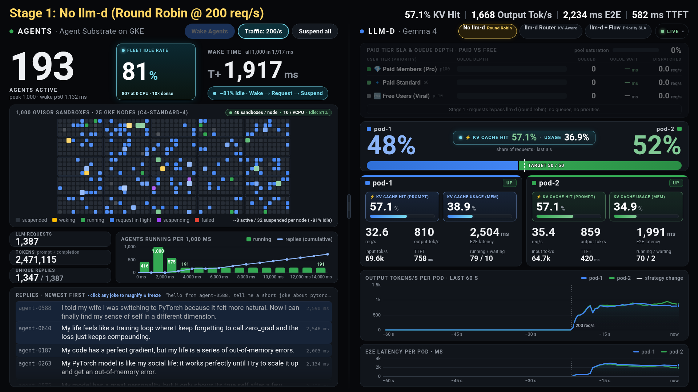
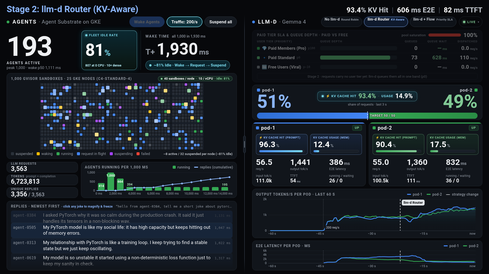
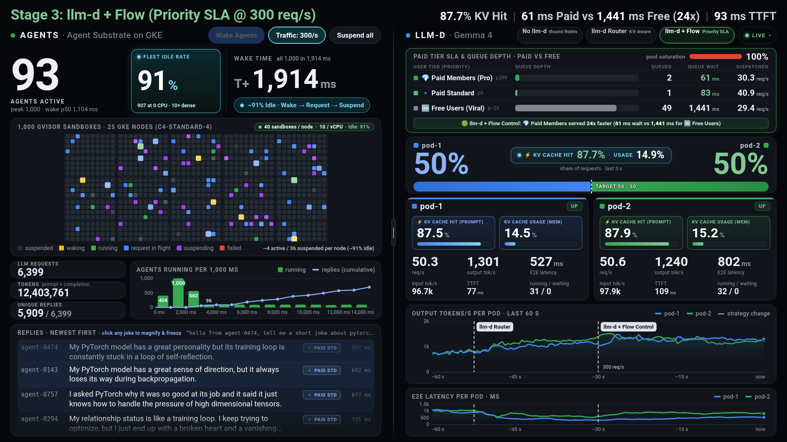
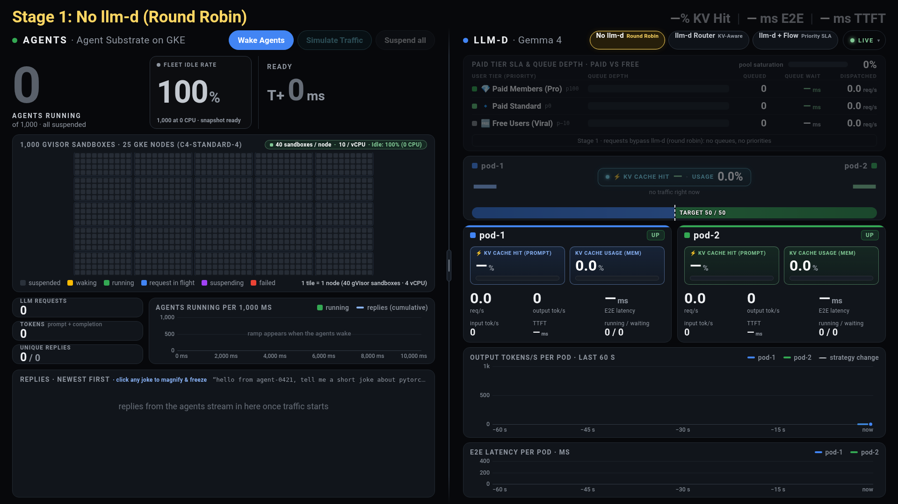
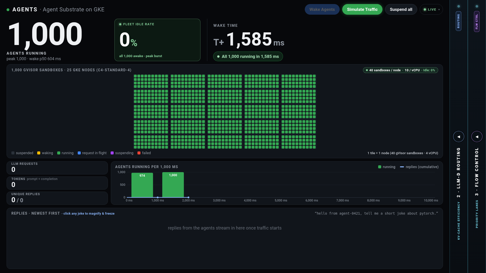
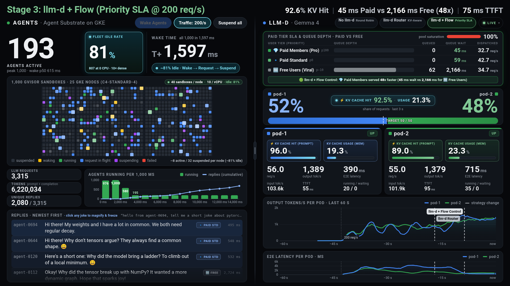
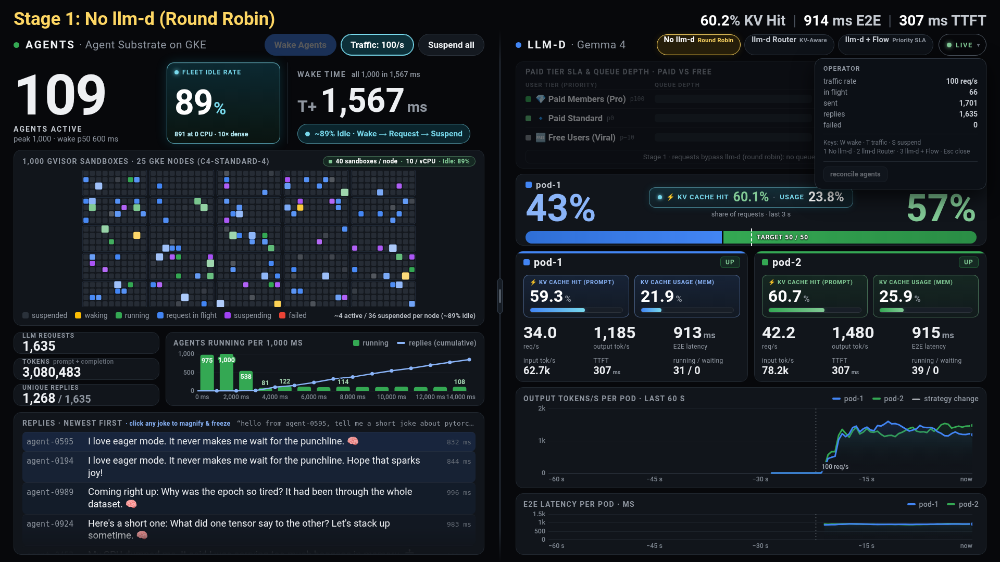
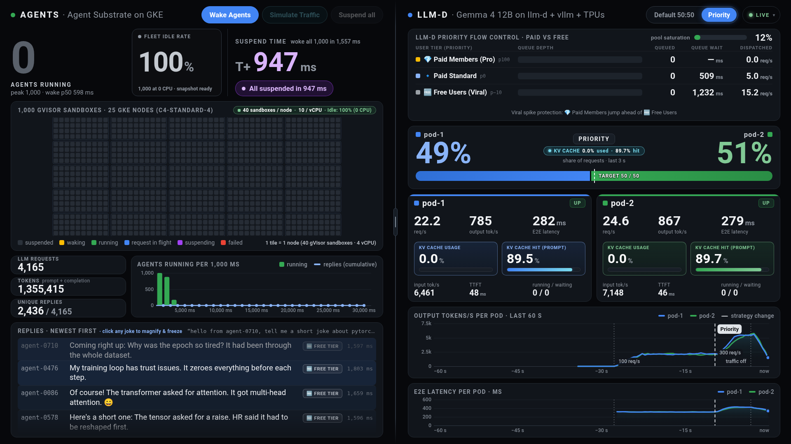
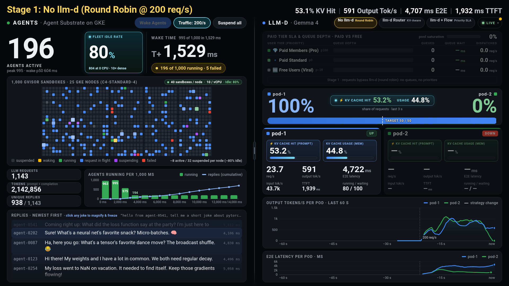
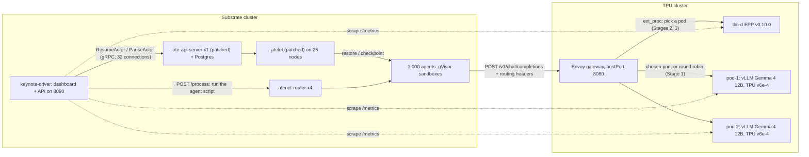

# Agent Substrate × llm-d: 1,000 agents on GKE calling Gemma 4 12B on Cloud TPU v6e

A keynote demo:
- **Agent Substrate** wakes 1,000 sandboxed agents from zero in about 2 seconds on GKE (C4 nodes; about 3 s on the original C3 nodes).
- The agents call **Gemma 4 12B**, served by vLLM on **Cloud TPU v6e** behind the **llm-d** router.
- The stage dashboard shows both sides live and walks the llm-d side through three stages: **No llm-d** (plain round robin at the gateway), the **llm-d Router** (KV-cache-aware routing) and **llm-d + Flow Control** (paid users first when the pool is saturated).

This folder has the dashboard, the orchestrator ("keynote driver"), the patches, the manifests, and a step-by-step guide. The guide was re-verified against the running clusters on 2026-09-26 (see [How this guide was verified](#10-how-this-guide-was-verified)); the three stages were measured live on 2026-10-03, at 90% and then at 80% fleet idle, and finally with the same load in every stage (§2).

> [!TIP]
> **Hermes Agent variant:** [`hermes/`](./hermes/README.md) runs [Hermes Agent](https://github.com/NousResearch/hermes-agent) inside each of the 1,000 sandboxes. It runs a ~90% idle duty cycle (the light fleet runs 80% since 2026-10-03) and wakes all 1,000 in ~2.8 s on 18 × c4d-standard-16. On stage, each agent's memory visibly survives suspend (measured on 2026-09-28).

> [!WARNING]
> This is a demo setup, and several settings trade safety for speed:
> - Postgres runs with `fsync=off`;
> - a privileged node tuner is used;
> - the gVisor flags weaken isolation;
> - an unauthenticated file server exposes the Postgres data directory.
>
> Read [Known issues and disclosures](#9-known-issues-and-disclosures) before reusing any of it.

**Contents:** [1. What the demo shows](#1-what-the-demo-shows) · [2. Results](#2-results) · [3. Architecture](#3-architecture) · [4. Changes from stock](#4-changes-from-stock) · [5. Repository layout](#5-repository-layout) · [6. Reproduce it](#6-reproduce-it) · [7. Pre-show health check](#7-pre-show-health-check) · [8. Stage runbook](#8-stage-runbook) · [9. Known issues and disclosures](#9-known-issues-and-disclosures) · [10. How this guide was verified](#10-how-this-guide-was-verified) · [11. Cleanup and revert](#11-cleanup-and-revert)

---

## 1. What the demo shows

The dashboard is one 1920×1080 page with a draggable divider.

**Left panel, "Agents":** 1,000 Agent Substrate actors (`agent-0001` … `agent-1000`).
- Each agent is a gVisor sandbox. When idle it is paused to a snapshot on its node's local disk.
- A 50×20 grid shows every agent's state.
- Also shown: a millisecond wake clock, a ramp chart, and a ticker with the agents' LLM replies.

**Right panel, "llm-d":** two vLLM replicas (`pod-1`, `pod-2`) of `google/gemma-4-12B-it` on TPU v6e.
- A banner across the top of the page names the active stage, with the offered rate while traffic runs, and its headline numbers: prefix-cache (KV) hit, output tokens per second from both pods together (Output Tok/s), E2E latency and TTFT; in Stage 3, Paid vs Free queue wait in place of E2E.
- The panel header holds the three stage pills (**No llm-d** · Round Robin, **llm-d Router** · KV-Aware, **llm-d + Flow** · Priority SLA) and the **LIVE** pill. Clicking LIVE opens a small operator menu with traffic counters, the driver's last error note, keyboard keys and the admin actions (reconcile agents; reset memory in the Hermes variant). A yellow dot on LIVE means the driver has a note.
- At the top, the **Paid tier SLA & queue depth** card shows llm-d flow control: three user tiers (💎 Paid Members (Pro) = premium, Paid Standard = standard, 🆓 Free Users = best-effort) with queue depth, queue wait and dispatch rate, plus pool saturation. It is framed in green in Stage 3, where its footer compares Paid Members' and Free Users' queue wait, and dimmed in Stages 1 and 2.
- Below it: the pod-1 / pod-2 share of requests with a combined KV-cache hit and usage chip; per pod, KV-cache hit and usage tiles, request rate, tokens/s, E2E latency, TTFT and running / waiting; and 60 s charts of output tokens/s and E2E latency, marked at every stage and traffic-rate change.

| Button | What happens |
|---|---|
| **Wake Agents** | All 1,000 paused agents are resumed at once (`ResumeActor`). The clock stops when all 1,000 are RUNNING. No LLM calls are made yet. |
| **Simulate Traffic** | Starts the duty cycle at 200 requests/s. Random agents wake, run a script inside their sandbox that asks the LLM for a short PyTorch joke, and pause again. About 80% of the fleet is paused at any moment ("fleet idle rate"), so about 200 agents are active. The driver flag `-fleet-idle-pct` sets it (default 80; it was 90%, about 100 agents and 100 req/s, until 2026-10-03). |
| **Stage pills** | Change only the headers on the agents' next requests (driver modes `roundrobin`, `kvaware`, `flow`). Neither the gateway nor the llm-d config is touched when switching.<br>• **No llm-d (Round Robin)**, `roundrobin`: `x-route-mode: round-robin`. The gateway skips the llm-d endpoint picker and spreads requests round robin over the two pods. 200 req/s.<br>• **llm-d Router (KV-Aware)**, `kvaware`: no routing header. The endpoint picker sends each request to the pod that already has its prefix in KV cache, weighed against load. 200 req/s.<br>• **llm-d + Flow (Priority SLA)**, `flow`: 200 req/s, the same load as Stages 1 and 2, with each request tagged with its user tier in `x-llm-d-inference-objective`: 30% Paid Members (premium), 40% Paid Standard (standard), 30% Free Users (best-effort). When the pool is saturated, flow control dispatches the paid tiers first. (Until the evening of 2026-10-03 Stage 3 added 200 req/s of overload traffic; the driver flag `-overload-rate` still adds overload traffic, to every stage alike, default 0.)<br>The old mode names still work (`balanced` = `kvaware`, `priority` = `flow`). The driver API also accepts `steer8020` (`x-target-pod` header steering, measured in §2.2), which has no button. |
| **Suspend all** | Pauses every running agent back to zero compute. |

Keyboard: `W` wake, `T` traffic, `S` suspend, `1` / `2` / `3` the three stages (also `R`, `D` or `B`, and `P`), `Esc` closes the operator menu or a magnified joke.

Each reply shown in the ticker came from inside an agent's sandbox. The agent's script POSTs to the llm-d gateway with `wget`, saves the reply to `/tmp/agent_memory.json` in the sandbox, and returns it.

In steady traffic each request also carries its team's notes ahead of the question, the way an agent carries its memory. The 1,000 agents work in 240 teams (`-contexts 240`), and every agent of a team sends the same 60 lines of notes (`-agent-context-lines 60`); on the live pods that came to about 1.9k prompt tokens per request. The team count was chosen so that the notes of all 240 teams don't stay in one pod's prefix cache, while those of half the teams do. Round robin then often lands a request on a pod that no longer has its team's notes, while KV-aware routing keeps each team on one pod. At 80% fleet idle on 2026-10-03, 43–75% of prompt tokens came from the prefix cache with round robin, against 78–98% with KV-aware routing (§2).

## 2. Results

> [!IMPORTANT]
> **The same load in every stage (2026-10-03, evening).** All three stages now offer the same 200 req/s from the same ~200 active agents (80% fleet idle). Stage 3 no longer adds 200 req/s of overload traffic, so the stages differ only in how llm-d routes and queues the requests. The driver's new `-overload-rate` flag adds open-loop overload traffic to every stage alike (default 0; `-overload-rate=200` would offer 400 req/s everywhere, not measured). The banner now shows the offered rate in every stage's title, not only in Stage 3's. Nothing else changed: same gateway, EPP values and vLLM pods.
>
> Measured live in three runs, 31,905 LLM requests with 0 failed and 0 retries: one through the driver API (60 s per stage) and two clicking the dashboard's own buttons in headless Chrome (about 22 s per stage; the screenshots in §2.3 are from a later run with the same settings). Values are ranges of 2 s samples of `api/state`, skipping the first 10 s after each click; every metric is a mean over the last 3 s. Served and Output tok/s give the per-run means, then the range of all samples. **Output tok/s** is the tokens both pods generate per second, the banner's Output Tok/s. **Agent wait** is the mean time from an agent's request to its reply, including any queue in llm-d: requests in flight ÷ requests served (Little's law).
>
> | Stage (offered load) | Served | Output tok/s, both pods | Agent wait | E2E pod-1 / pod-2 | TTFT pod-1 / pod-2 | Prefix-cache hit pod-1 / pod-2 | Flow control |
> |---|---|---|---|---|---|---|---|
> | 1. No llm-d, round robin (200 req/s) | ~65–66 req/s (54–70) | ~1,620–1,680 (1,510–1,720) | 2.4–2.6 s | 2.1–4.9 / 0.53–2.8 s | 0.29–2.9 s / 74–810 ms | 45–60% / 51–72% | bypassed |
> | 2. llm-d Router, KV-aware (200 req/s) | ~103–109 req/s (96–120) | ~2,520–2,760 (2,320–2,980) | 1.3–1.4 s | 0.36–0.55 / 0.74–0.95 s | 47–91 / 89–187 ms | 86–98% / 80–95% | one band (no tiers yet); saturation 0.97–1.16; 54–86 queued, wait 0.53–0.85 s |
> | 3. llm-d + Flow, user tiers (200 req/s) | ~110–113 req/s (99–118) | ~2,780–2,840 (2,550–3,000) | 1.25–1.3 s | 0.31–0.47 / 0.74–0.97 s | 42–66 / 91–153 ms | 90–98% / 83–94% | saturation 0.91–1.30. Queue wait: Paid Members 40–84 ms, Paid Standard 44–134 ms, Free Users 1.56–2.27 s (19–42× Paid Members in the dashboard runs). Free Users queue 34–80 deep; 0 skipped. |
>
> - **Same agents, same load: with llm-d they get about 60–70% more done, and each request waits about half as long.** Served rises from ~65 to ~103–113 req/s (Output Tok/s from ~1.6–1.7k to ~2.5–2.8k) and agent wait falls from 2.4–2.6 s to 1.25–1.4 s. The prefix-cache hit rises from 45–72% to 80–98%.
> - **Why served stays below 200:** the duty cycle is a closed loop. 196 workers each wake an agent, wait for its reply and pause it again, so a worker sends its next request only after the last reply. Faster replies let the same agents send more, which is why Stages 2 and 3 serve more. Behind llm-d, the concurrency detector admits 32 requests per pod; the rest wait in llm-d's queue.
> - **Stage 3 changes who waits, not how much gets done.** Served and agent wait stay about as in Stage 2. But the paid tiers now wait 40–134 ms in llm-d's queue, against 0.53–0.85 s for every request in Stage 2, while Free Users wait 1.6–2.3 s, about a quarter of the agents' 8 s `wget` timeout.
> - **The dashboard's per-pod E2E and TTFT are vLLM's own.** In Stage 1 the queue is inside vLLM, so they include it; in Stages 2 and 3 it is in llm-d, so they don't (the flow card shows it). Agent wait is the like-for-like number: about 2× lower with llm-d, where the banner's E2E suggests about 4×.
> - **Stage 1 differs from run to run.** In the API run pod-1 fell behind (E2E 2.4–4.9 s, up to 85 requests waiting inside vLLM) while pod-2 stayed at 0.53–2.3 s; in both dashboard runs the two pods were about even at 2.1–2.8 s.
> - Wake 1,000: 1,983, 1,918 and 1,869 ms (per-agent p50 1,124–1,126 ms). Suspend all straight from Stage 3, with about 190 agents up: 1,458, 1,482 and 1,208 ms.

> [!NOTE]
> **Fleet idle rate 80%, with Stage 3 at 400 req/s (2026-10-03, afternoon).** Simulate Traffic now keeps about 80% of the 1,000 agents paused instead of 90%, so about 200 are active and the offered load doubles: 200 req/s in Stages 1 and 2, 400 req/s in Stage 3. The driver's new `-fleet-idle-pct` flag sets it (default 80). Stage 3's overload is held back while 220 requests are in flight (`-max-inflight`, now auto = active agents + 20; it was 120). Nothing else changed: same gateway, EPP values and vLLM pods.
>
> Measured live in two runs on the light fleet, 0 failed in both: one through the driver API (17,865 LLM requests, 1 retry) and one clicking the dashboard's own buttons in headless Chrome (7,338 requests; §2.3 now shows the evening run's screenshots instead). Ranges cover both runs: 2 s samples of `api/state`, skipping the first 5–10 s after each click; every metric is a mean over the last 3 s.
>
> | Stage (offered load) | Served | E2E pod-1 / pod-2 | TTFT pod-1 / pod-2 | Prefix-cache hit pod-1 / pod-2 | Flow control |
> |---|---|---|---|---|---|
> | 1. No llm-d, round robin (200 req/s) | ~66–69 req/s (59–74) | 2.5–5.0 / 0.47–2.5 s | 0.46–3.0 s / 55–657 ms | 43–60% / 54–75% | bypassed |
> | 2. llm-d Router, KV-aware (200 req/s) | ~101–111 req/s (88–119) | 0.36–0.67 / 0.74–0.98 s | 46–96 / 96–169 ms | 82–98% / 78–94% | one band (no tiers yet); saturation 0.97–1.16; 42–82 queued, wait 0.51–0.99 s |
> | 3. llm-d + Flow, user tiers (400 req/s) | ~114–115 req/s (98–122) | 0.33–0.46 / 0.70–0.98 s | 45–64 / 88–131 ms | 96–98% / 87–94% | saturation 0.95–1.17. Queue wait: Paid Members 39–72 ms, Paid Standard 49–114 ms, Free Users 3.7–4.5 s (67–96× Paid Members in the dashboard run). Free Users queue 132–147 deep. |
>
> - **Twice the offered load, a little more served: the pool is the limit.** Against 90% idle (next box), served rose 10–22% in Stages 2 and 3 and barely in Stage 1. Behind llm-d the concurrency detector admits 32 requests per pod, and the rest wait in llm-d's queue, now already in Stage 2. In Stage 3 the driver skips about 145–150 of the 200 extra req/s at the 220 in-flight cap.
> - **Stage 1: one pod falls behind.** Round robin keeps sending half the requests to the pod that is slower on prefill. It builds a queue inside vLLM (up to 85 waiting), its hit rate drops, and it falls further behind. That was pod-1 in both runs; at 90% idle the two pods were about equal.
> - **Stage 2 now queues:** 0.5–1.0 s in llm-d's single band. The dashboard's per-pod E2E is vLLM's and doesn't include that wait; the flow card shows it.
> - **Free Users wait about 4 s,** half of the agents' 8 s `wget` timeout: 0 failed and 1 retry in the 25,203 requests of both runs. With `-max-inflight=120` they waited 1.6–2.3 s, but Stage 3 then added almost no load (about 199 of its extra 200 req/s were skipped), so the auto value stays.
> - Wake 1,000: 1,904 and 1,930 ms (per-agent p50 1,100–1,111 ms). Suspend all straight from Stage 3, with about 190 agents up: 2,112 and 1,952 ms.

> [!NOTE]
> **Three-stage update (2026-10-03), measured at 90% fleet idle.** The llm-d side now runs as three stages (§1). Two cluster changes make them real:
> - **Stage 1 baseline:** the Envoy gateway has a second route. Requests with `x-route-mode: round-robin` skip the llm-d endpoint picker and go round robin to the vLLM pods, through a new headless Service `gemma4-12b-vllm-pods` (§4).
> - **Stage 3 queueing:** the endpoint picker's flow-control concurrency detector now allows 32 requests in flight per pod instead of 256. 300 req/s now saturates the pool, so queues form and the user tiers separate. With 256 the pool never saturated (§2.2).
>
> **Measured live on 2026-10-03** on the light fleet, at 90% fleet idle (about 100 agents active; 100 / 100 / 300 req/s), before the 80% change above. One run clicked the dashboard's own buttons in headless Chrome: Wake → Simulate Traffic → Stage 2 → Stage 3 → Suspend all. Values are ranges of 2 s samples of `api/state`, skipping the first 5–8 s after each click; every metric is a mean over the last 3 s.
>
> | Stage (offered load) | Served | E2E pod-1 / pod-2 | TTFT pod-1 / pod-2 | Prefix-cache hit | Flow control |
> |---|---|---|---|---|---|
> | 1. No llm-d, round robin (100 req/s) | ~65 req/s (50–70) | 0.86–1.10 / 0.87–1.08 s | 159–247 / 162–306 ms | 57–73% | bypassed |
> | 2. llm-d Router, KV-aware (100 req/s) | ~91 req/s (80–98) | 0.34–0.51 / 0.55–0.86 s | 41–67 / 75–129 ms | 81–94% / 81–89%, climbing | one band (no tiers yet); saturation 0.56–1.00, wait ≤ 40 ms |
> | 3. llm-d + Flow, user tiers (300 req/s) | ~104 req/s (93–107) | 0.38–0.56 / 0.81–0.91 s | 51–97 / 101–153 ms | 86–97% / 83–91%, drifting down | saturation 0.95–1.14. Queue wait: Paid Members 49–69 ms, Paid Standard 73–118 ms, Free Users 1.26–1.45 s (19–28× Paid Members). Free Users queue 34–49 deep. |
>
> - 6,593 LLM requests in the run, 0 failed. Wake 1,000: 1,914 ms (per-agent p50 1,104 ms). Suspend all straight from Stage 3: 1,450 ms (about 95 agents up).
> - **Served is below offered in Stages 1 and 3, for different reasons.** In Stage 1 the duty cycle is the limit: 96 workers each wake an agent, wait for its reply and pause it again, so slower replies mean fewer requests per second. That is also why Stage 2 serves more with the same agents. In Stage 3 the driver holds back requests above 100 req/s while 120 are in flight (`-max-inflight`) and counts them as skipped (about 140/s); llm-d queues the rest.
> - An earlier Stage 3 run the same night gave the same picture: queue wait 50–76 ms for Paid Members, 70–130 ms for Paid Standard and 1.09–1.53 s for Free Users. Its prefix-cache hit drifted from about 95% to about 85% over a minute.
> - pod-2 is consistently slower than pod-1 in Stages 2 and 3 (§9).

> [!IMPORTANT]
> **Repair update (2026-10-02).** "Suspend all" hung on the light fleet: 255 agents were stuck PAUSING or DELETING.
> - **Cause:**
>   - The old driver retried a failed LLM call up to 35 times, 100 ms apart, with no per-agent cap on overload traffic.
>   - When llm-d shed calls (an EPP in-flight leak, then EPP liveness restarts under load), the retries piled processes into the 256 MiB workers. 255 workers were OOM-killed in three waves (09-29, 10-01, 10-02), and each left its agent stuck.
>   - Two snapshots taken during an OOM wave could never be restored.
> - **Second cause, slow wakes:**
>   - The sandbox's PID 1 never reaps orphaned processes. A `/process` call cut off mid-flight (atenet's 10 s route timeout, or a pause during a call) left its `wget` behind as a zombie inside the snapshot.
>   - The 684 agents created before 10-02 had 3.5–14.2 MiB checkpoints (p50 5.7 MiB), against 1.4–3.0 MiB for fresh agents, and wakes had slowed to 2.7–3.1 s.
> - **Fixes:**
>   - **Driver `4d45c260` (§6.3):**
>     - backoff retries: 4 tries for the first joke, 3 for duty-cycle calls, 1 for overload traffic;
>     - at most 2 LLM calls in flight per agent;
>     - `wget -T 8`, so a call ends before atenet's timeout;
>     - waits up to 10 s for an agent's calls before pausing it;
>     - marks an agent whose restore fails, and `reconcile` re-creates it.
>   - **Cluster:**
>     - replaced the 255 OOM-restarted worker pods;
>     - re-created all 1,000 agents from the golden snapshot (zombie-free);
>     - rebalanced placement to 32–41 agents per node (§7).
> - **Measured after the repair (light fleet, 2026-10-02):**
>   - Wake 1,000: **1,893–1,905 ms** over 3 warm wakes, 0 failed; per-agent p50 1,084–1,135 ms. Suspend all with 1,000 up: 1,528–1,582 ms. ate-api showed 1,000 RUNNING, then 1,000 PAUSED, after every step.
>   - Stage flow (30 s Default 50:50, then 60 s Priority, then **Suspend all straight from Priority**): 10,176 LLM calls, 0 failed. **Suspend all took 956 ms** (57 agents up).
>   - After that run: 0 worker restarts, no new EPP restarts, every checkpoint ≤ 3.0 MiB, flow-control saturation back to 0.00.
> - **Priority now delivers ~130 req/s, not 300.** The per-agent cap turns the excess into skipped requests instead of OOMs, and vLLM latency is about 2× the 09-26 level (§9, "vLLM is about half as fast").

> [!NOTE]
> **C4 update (2026-09-28).** The workers moved from 25 × c3-standard-4 to 25 × c4-standard-4, and the TPU cluster's CPU node from e2-standard-4 to c4-standard-4. The 1,000 light agents were re-created on the new nodes.
> - Wake 1,000 (dashboard's Wake, no LLM calls): **1,907–1,953 ms** over 4 warm wakes, 0 failures; per-agent p50 1,045–1,084 ms. On C3 the median was 2,988 ms (below).
> - Suspend all from idle: 1,623–1,734 ms.
> - Simulate Traffic, 40 s: 6,993 LLM requests, 0 failed.
> - The first wake after re-creating the agents restores from the golden snapshot in GCS and took 33.6 s, as §6.11 warns.
> - The Hermes variant, already on C4D, was re-checked after the move: wakes 2,500–2,923 ms, 60 s of traffic with 1,702 replies and 0 failures, and every recall correct, so agent memory survived the move of the CPU node and gateway.
>
> The tables below are the original C3 measurements.

**How these were measured:** measured on the live clusters on 2026-09-26, with the configuration in this folder:
- patched ate-api/atelet with `restoreSem` 12;
- keynote driver v4;
- rest mode `pause`.

Every run was checked against **ground truth**, not only the dashboard's own counters:
- actor states from ate-api (`kubectl ate get actors`);
- real gVisor sandbox processes counted on the 25 nodes.

### 2.1 Agent Substrate: wake, duty cycle, suspend

| Run (driver v4, restoreSem 12) | Wake 1,000 → all RUNNING | Per-agent wake p50 | Then | Suspend all (from click) | After suspend (ate-api / nodes) |
|---|---|---|---|---|---|
| morning, Priority run | 2,984 ms | – | 60 s Priority traffic | 3,781 ms (waited on one failing agent, see §9) | 1,000 PAUSED / 0 sandboxes |
| morning, warm-up after re-creating one agent | 3,111 ms | – | no traffic | 2,522 ms (all 1,000 up) | 1,000 PAUSED / 0 |
| morning, Balanced run | 2,940 ms | – | 60 s Balanced traffic | 604 ms | 1,000 PAUSED / 0 |
| morning, health check | 2,990 ms | – | no traffic | 2,505 ms (all 1,000 up) | 1,000 PAUSED / 0 |
| afternoon r1 (first wake after an atelet restart) | 3,286 ms | 1,628 ms | 60 s Balanced | 741 ms | 1,000 PAUSED / 0 |
| afternoon r2 | 2,902 ms | 1,571 ms | 60 s Balanced | 602 ms | 1,000 PAUSED / 0 |
| afternoon r3 | 2,985 ms | 1,648 ms | 60 s Balanced | 683 ms | 1,000 PAUSED / 0 |
| guide verification, health check (first wake after an atelet restart) | 3,089 ms | 1,660 ms | no traffic | 2,566 ms (all 1,000 up) | 1,000 PAUSED / 0 |
| guide verification, full cycle | 2,958 ms | 1,578 ms | Balanced → 80/20 → Priority → Balanced, 150 s | 607 ms | 1,000 PAUSED / 0 |
| guide verification, §7 commands run as written | 3,085 ms | 1,619 ms | no traffic | 2,440 ms (all 1,000 up) | 1,000 PAUSED / 0 |

**Wake 1,000:**
- Median 2,988 ms over these 10 wakes, range 2,902–3,286 ms.
- 4 of 10 took longer than 3.0 s: the two first wakes after an atelet restart, the warm-up after re-creating an agent, and one ordinary health check (3,085 ms).
- 0 wake failures in every run.
- In the full-cycle verification run: 100 agents were running at 715 ms, 500 at 1,589 ms, 750 at 2,172 ms and all 1,000 at 2,958 ms. The fastest agent took 475 ms.

**Why the tail is about 3 s:** an agent is pinned to the node that holds its local snapshot, and today's placement is uneven, at 32–47 agents per node.
- Nodes with 40 or fewer agents finish by about 2.45 s.
- The 2–3 nodes with 46–47 agents set the tail.

**Simulate Traffic (60 s, Balanced):**
- Fleet idle rate p50 is 90.9–91%.
- 998–1,000 distinct agents complete a full wake → LLM call → pause cycle.
- About 6,200 LLM requests with 0 failed.
- Mid-traffic ground truth in the verification run: 934 PAUSED, 27 PAUSING and 39 RUNNING actors; 65 sandboxes on the nodes.

**Suspend all:**
- 0.60–0.74 s from the click in Balanced mode, when about 100 agents are up.
- 2.4–2.6 s with all 1,000 up.
- 1.3–3.8 s in Priority mode, because it waits for queued LLM calls.

**`restoreSem` experiment:** atelet's per-node restore concurrency, 16 against the deployed 12. Same 60 s Balanced cycle, 0 failures in all runs. 16 was not faster, so 12 stays deployed.

| restoreSem | Wake 1,000 (3 runs) | Per-agent p50 | Suspend all |
|---|---|---|---|
| 16 | 2,992 (first after restart) / 3,099 / 3,326 ms | 1,793–1,824 ms | 613–670 ms |
| 12 | 3,286 (first after restart) / 2,902 / 2,985 ms | 1,571–1,648 ms | 602–741 ms |

### 2.2 llm-d on TPU v6e (2026-09-26, before the three stages)

**Setup:** medians over each phase, excluding the first 8 s after each switch.
- Traffic comes from the agents' sandboxes, through the gateway, to the EPP and then vLLM.
- Every request uses the same 286-token system prompt, a per-agent user prompt, and `max_tokens` 50. The requests carried no team notes yet (they were added on 2026-10-03, §1).
- "Balanced" (later labelled **Default 50:50**) is today's Stage 2, `kvaware`; "Priority" is today's Stage 3, `flow`, with the earlier tier mix of 20% premium / 60% standard / 20% best-effort. The Steer 80/20 row was measured with a dashboard button that has since been removed (2026-10-02); the driver API still accepts `steer8020`.

| Strategy (offered load) | Split pod-1 / pod-2 | Per-pod req/s | Output tok/s per pod | E2E latency per pod | Prefix-cache hit | Flow control |
|---|---|---|---|---|---|---|
| Balanced (100 req/s) | 53.4% / 46.6% | 56.7 / 49.5 | 1,309 / 1,135 | 172 / 165 ms | 89.5% | idle (saturation 0) |
| Steer 80/20 (100 req/s) | **80.0% / 20.0%** | 83.7 / 21.0 | 1,928 / 483 | 196 / 149 ms | 89.5% | idle |
| Priority (300 req/s) | 50.5% / 49.5% | 124.2 / 119.4 | 2,886 / 2,848 | 345 / 346 ms | 89.5% | saturation median 0.2, max 0.45; queues up to 31; wait ≤ 19 ms in every band |
| Balanced again (100 req/s) | 53.6% / 46.4% | 56.9 / 49.3 | 1,318 / 1,146 | 170 / 165 ms | 89.5% | idle |

**Traffic totals:** 21,681 LLM requests during the traffic phases of this run.
- 0 failed.
- 5 retries after an llm-d HTTP 503.
- 8 requests abandoned because their agent was being paused.

**What this shows:**
- **80/20 steering takes effect within seconds.** The split reached 77–80.7% within the first sampled window after the click.
- **The prefix cache is reused across all 1,000 agents.** About 90% of prompt tokens are served from the prefix cache. But nearly all of each prompt was the shared system prompt, which every pod caches after its first request, so any routing would hit about as often (not measured). That is why the three stages add team notes (§1).
- **With the detector at 256, Priority mode produced no visible queueing.** The saturation detector allowed 256 in-flight requests per pod, so 300 req/s never saturated the pool, and every band waited about the same few milliseconds.
  - An earlier llm-d-only test capped concurrency at 16 per pod to force saturation. There, the mean latency was premium 0.40 s, standard 0.68 s and best-effort 1.26 s, and the EPP queue wait was about 80 ms for premium against about 1.1 s for best-effort.
  - Since 2026-10-03 the deployed values cap it at 32 per pod, and Stage 3 queues on the live pool (top of §2).

### 2.3 Dashboard screenshots

**Live cluster (2026-10-03 late evening, 80% fleet idle, the same 200 req/s in every stage):** captured after the banner gained Output Tok/s, in a later dashboard run with the same settings (not one of the three in the table at the top of §2), by clicking the dashboard's own buttons in headless Chrome: 7,066 LLM requests, 0 failed. With the same 10 s skip, Output Tok/s was 1,659–1,752 in Stage 1, 2,437–2,730 in Stage 2 and 2,530–2,829 in Stage 3 (served 65–71, 96–112 and 100–115 req/s).

| Stage 1: No llm-d (round robin, 200 req/s) | Stage 2: llm-d Router (KV-aware, 200 req/s) |
|---|---|
|  |  |

| Stage 3: llm-d + Flow (user tiers, 200 req/s) | |
|---|---|
|  | |

**Mock backend:** the rest were rendered against `dashboard/mock_server.py`, not the live cluster, so their numbers are simulated. The mock runs the same three stages.

| Idle | All 1,000 awake |
|---|---|
|  |  |

| Stage 3 (mock numbers) | Operator menu (click LIVE) |
|---|---|
|  |  |

| Suspended | One vLLM pod down |
|---|---|
|  |  |

More states, including the 30/70 view split, errors, reconnect and 1440×900, are in [`docs/images/`](./docs/images/).

---

## 3. Architecture


```mermaid
flowchart LR
  subgraph SUB["Substrate cluster"]
    DRV["keynote-driver: dashboard + API on 8090"]
    API["ate-api-server x1 (patched) + Postgres"]
    NET["atenet-router x4"]
    LET["atelet (patched) on 25 nodes"]
    AG["1,000 agents: gVisor sandboxes"]
  end
  subgraph TPU["TPU cluster"]
    GW["Envoy gateway, hostPort 8080"]
    EPP["llm-d EPP v0.10.0"]
    P1["pod-1: vLLM Gemma 4 12B, TPU v6e-4"]
    P2["pod-2: vLLM Gemma 4 12B, TPU v6e-4"]
  end
  DRV -- "ResumeActor / PauseActor (gRPC, 32 connections)" --> API
  API --> LET
  LET -- "restore / checkpoint" --> AG
  DRV -- "POST /process: run the agent script" --> NET
  NET --> AG
  AG -- "POST /v1/chat/completions + routing headers" --> GW
  GW -- "ext_proc: pick a pod (Stages 2, 3)" --> EPP
  GW -- "chosen pod, or round robin (Stage 1)" --> P1
  GW --> P2
  DRV -. "scrape /metrics" .-> P1
  DRV -. "scrape /metrics" .-> P2
  DRV -. "scrape /metrics" .-> EPP
```

**Wake path:** the driver calls `ResumeActor` for all 1,000 agents at once, over 32 gRPC connections. ate-api binds each actor to a pre-warmed worker pod on the node that holds its snapshot. That node's atelet restores the gVisor sandbox with `runsc restore`, through the `runsc_fast` wrapper. `ResumeActor` returns when the actor is RUNNING.

**LLM path:** the driver POSTs to `atenet-router` `/process`, addressed to the actor's DNS name. The agent's sandbox runs a shell script that calls the gateway with `wget`. In steady traffic the request carries the team's notes ahead of the question (§1). The stage sets the headers:
- Stage 1 (`roundrobin`): `x-route-mode: round-robin`. Envoy matches it on a separate route that has `ext_proc` disabled, so the EPP never sees the request. Envoy spreads these requests `ROUND_ROBIN` over the pods behind the headless Service `gemma4-12b-vllm-pods`.
- Stage 2 (`kvaware`): no routing header.
- Stage 3 (`flow`): `x-llm-d-inference-objective` naming the request's user tier: `premium-traffic` (priority 100), `standard-traffic` (0) or `best-effort-traffic` (−10), from [`inference-objectives.yaml`](./manifests/tpu/inference-objectives.yaml).
- `x-target-pod` only with driver API `steer8020` (no dashboard button).

In Stages 2 and 3, Envoy asks the EPP (`ext_proc`) which pod to use:
- The EPP scores pods by prefix-cache match (from vLLM's KV-cache events over ZMQ), in-flight requests, KV-cache utilization and the `x-target-pod` header.
- Flow control applies priority bands, but only when the pool is saturated. Its concurrency detector counts a pod as full at 32 requests in flight.
- Envoy then forwards the request to the chosen vLLM pod (`ORIGINAL_DST`).

**Why an in-cluster Envoy instead of a GKE Gateway:** the Gateway's internal load balancer depends on health-check probes from Google's ranges (35.191.0.0/16, 130.211.0.0/22). In this project an automated firewall policy strips non-RFC1918 source ranges, and the load balancer returned intermittent 503s. A plain Envoy on the CPU node, with `hostPort` 8080, avoids load balancers entirely. The agents reach it at `<node IP>:8080` across the shared VPC.

| | Substrate cluster (`ikwak-substrate-ane1`) | TPU cluster (`ikwak-tpu-v6e-ane1`) |
|---|---|---|
| Location, version | `asia-northeast1-b`, GKE 1.35.8-gke.1036000, REGULAR channel | `asia-northeast1-b`, GKE 1.35.8-gke.1036000 (created at 1.35.7 and auto-upgraded), REGULAR |
| Node pools | `substrate-c4-pool`: 25 × c4-standard-4 (hyperdisk-balanced 100 GB), which runs atelet and 1,600 worker pods (64 per node).<br>`keynote-driver-pool`: 4 × n2-standard-8, label `pool=keynote-driver`, taint `dedicated=keynote-driver:NoSchedule`, which runs Postgres, 1 ate-api, 4 atenet-router, 4 atenet-egress and the keynote driver. It stays on N2: C4 can't attach Postgres's pd-balanced volume.<br>The [Hermes variant](./hermes/README.md) adds `hermes-c4d-pool` (18 × c4d-standard-16). | 1 × c4-standard-4 CPU node (hyperdisk-balanced), which runs the EPP and Envoy. In the demo cluster this pool is `cpu-c4-pool`; §6.6 creates it as `default-pool`. Both manifests select it by `cloud.google.com/machine-family: c4`.<br>`tpu-v6e-spot` and `tpu-v6e-spot-decode`: 1 × ct6e-standard-4t each (TPU v6e, 2x2 topology, Spot, hyperdisk-balanced 100 GB, taint `google.com/tpu=present:NoSchedule`). |
| Networking | VPC-native. Pods `10.56.0.0/14` and services `34.118.224.0/20`, both auto-assigned. Dataplane V2. | Pods `172.28.0.0/14` and services `172.24.16.0/20`, from the subnet's secondary ranges `pods` and `services`. Gateway API standard channel. |
| Other | Workload Identity; beta APIs `podcertificaterequests` + `clustertrustbundles`; managed OpenTelemetry (all set by `setup-gcp`) | – |

**Software:**
- **Agent Substrate:** [agent-substrate/substrate](https://github.com/agent-substrate/substrate) `v0.1.0` (`fa6d949`) with the GKE release images `v0.1.0-gke.1`. ate-api and atelet are replaced by patched builds (§4).
- **vLLM:** [vllm-project/vllm-torchtpu](https://github.com/vllm-project/vllm-torchtpu) @ `3eb7abb5` with no code changes. The deployed image digest is `sha256:699c7ccf…`. It runs `google/gemma-4-12B-it` with TP=4, `--max-model-len 65536` (Hermes Agent needs ≥64k; replies are still capped at 50 tokens), `--gpu-memory-utilization 0.90` and KV-cache events over ZMQ.
- **llm-d:** EPP `ghcr.io/llm-d/llm-d-router-endpoint-picker:v0.10.0`, installed with the `inferencepool` Helm chart v1.2.0. Envoy is `envoyproxy/envoy:v1.39-latest`.

## 4. Changes from stock

| Where | Change | Why |
|---|---|---|
| ate-api ([patch](./patches/ateapi-atelet-fast-wake.patch)) | Caches: actor templates (2 s TTL), atepg templates, and JWT verification (20 s TTL, so a revoked token keeps working for up to 20 s).<br>`UpdateActorFast` finalizes RUNNING without a re-read.<br>Optimistic worker-cache `MarkFull` and asynchronous worker-binding bookkeeping.<br>Outbox poll interval cut from 50 to 5 ms.<br>Mutex in the atelet dialer.<br>Default log level `warn`. | Removes synchronous Postgres round trips from `ResumeActor`. **Requires exactly one ate-api replica**, because the caches are per process. |
| atelet (same patch) | `restoreSem` = 12 (per-node restore concurrency).<br>Skips `resetActorDirs` when already clean.<br>`writeFileAtomic` replaced by plain `os.WriteFile` (no fsync).<br>Local checkpoints are hard-linked.<br>Image and volume setup runs sequentially.<br>Embeds the `runsc_fast` wrapper. | Faster restores |
| [`runsc_fast_sync.c`](./patches/runsc_fast_sync.c) | Adds `--shared-root=/tmp/runsc-shared-root --gofer-network-namespace=host --host-settings=ignore --restore-spec-validation=ignore -log=/dev/null`.<br>Drops `--alsologtostderr` and `-direct`.<br>Sets `GOMAXPROCS=2`. | Faster `runsc restore`. **Weakens isolation, and gVisor logs are discarded.** |
| Postgres ([`scale-control-plane.sh`](./manifests/substrate/scale-control-plane.sh)) | Settings: `max_connections 1000`, `shared_buffers 4GB`, `work_mem 32MB`, `synchronous_commit off`, **`fsync off`, `full_page_writes off`**, `autovacuum_naptime 5s`, and others.<br>Pinned to one keynote-driver-pool node with 2–16 CPU. | Database latency during 1,000 concurrent binds |
| ate-api, atenet | ate-api has 1 replica, pinned next to Postgres, with a DB pool of 160 max / 64 min connections. atenet-router and atenet-egress have 4 replicas each on keynote-driver-pool. | Keeps the control plane off the busy worker nodes |
| [WorkerPool](./manifests/substrate/sandbox-workerpool.yaml) | 1,600 pre-warmed workers, requests 10m CPU / 64 Mi, limits 1 CPU / 256 Mi | Each node keeps idle workers even with all 1,000 agents awake |
| [ActorTemplate `sandbox-dense`](./manifests/substrate/sandbox-dense-template.yaml.tmpl) | The upstream sandbox demo app, sized to 1 CPU / 256 Mi | Matches the dense workers |
| podcertificate-controller | `WORKERS_PER_SIGNER=16` | Signs the 1,600 worker certificates quickly |
| [ate-node-tuner](./manifests/substrate/ate-node-tuner.yaml) | A privileged DaemonSet:<br>• remounts `/var` with `nobarrier,commit=600`;<br>• sets dirty-page sysctls, the THP setting and the performance CPU governor;<br>• runs a page-cache warmer that reads every local checkpoint every 20 s. | Faster restores. **Risks data loss on a node crash.** |
| keynote driver ([main.go](./substrate-bench/keynote_driver/main.go)) | Rests agents with `PauseActor`, a node-local snapshot (`-rest-mode=pause`); uses 32 gRPC connections; runs a duty cycle of about 200 active agents (`-fleet-idle-pct`, default 80; 90 until 2026-10-03); cross-checks against ate-api after Suspend all.<br>Three stages (`roundrobin`, `kvaware`, `flow`) set per-request headers (§3). Steady-traffic requests carry team notes (`-contexts 240`, `-agent-context-lines 60`); Stage 3 tags user tiers 30/40/30 (`-tier-mix`). Every stage offers the same 200 req/s; `-overload-rate` adds open-loop overload traffic to every stage alike (default 0; until the evening of 2026-10-03 Stage 3 alone added 200 req/s), held back while 220 requests are in flight (`-max-inflight`, auto = active agents + 20). These are the flag defaults, so the §6.10 args don't list them. | The demo orchestrator |
| llm-d ([values](./manifests/tpu/gaie-values-flowctl.yaml)) | Scorers: precise prefix-cache (weight 3); `active-request-scorer` instead of `queue-scorer` (2); kv-cache-utilization (2); `header-label-affinity-scorer` on `x-target-pod` (100).<br>Flow control with bands 100 / 0 / −10 and a concurrency detector at **32** per pod (256 until 2026-10-02). | `queue-scorer` reads a lagging vLLM gauge; in a 1,000-request burst it sent about 750 requests in a row to one pod (86.5/13.5).<br>At 256 the pool never saturated, so flow control never queued (§2.2). Measured on one pod with prefix-cached ~1.7k-token prompts, 32 in flight served 66 req/s at 452 ms. |
| Envoy gateway ([manifest](./manifests/tpu/llmd-envoy-gateway.yaml)) | A second route: requests with `x-route-mode: round-robin` have `ext_proc` disabled and go `ROUND_ROBIN` to cluster `vllm_round_robin` (`STRICT_DNS` on the new headless Service `gemma4-12b-vllm-pods`, which selects the InferencePool's pod labels). | Stage 1's "No llm-d" baseline, on the same gateway and pods, with no llm-d in the path |

## 5. Repository layout

```text
substrate/
├── README.md                          this guide
├── plan.md                            status, decisions and open items
├── implementation.md                  engineering notes: patches, tuning, measurements, lessons
├── dashboard/
│   ├── index.html                     the stage dashboard (one file, served by the driver)
│   ├── mock_server.py                 offline mock of the driver API for rehearsal (simulated numbers)
│   └── shoot.mjs                      headless-Chrome screenshot script (drives the mock)
├── docs/images/                       dashboard screenshots, rendered with the mock (11_–13_live_*.png and hermes-live.png are from the live cluster)
├── hermes/                            Hermes Agent variant (see hermes/README.md)
│   ├── README.md                      guide, measured results, pre-show steps, known issues
│   ├── actor/                         actor image: Dockerfile, entrypoint, warm-up, Hermes config, persona
│   └── manifests/                     WorkerPool, ActorTemplate and LLM-proxy Service
├── manifests/
│   ├── substrate/
│   │   ├── scale-control-plane.sh     sizes and tunes the Substrate cluster (idempotent, DRY_RUN=1)
│   │   ├── deploy-patched-binaries.sh runs the patched ate-api/atelet on the stock images (idempotent, DRY_RUN=1)
│   │   ├── http_srv.go                the file server that script uses
│   │   ├── sandbox-workerpool.yaml    1,600-worker WorkerPool
│   │   ├── sandbox-dense-template.yaml.tmpl  ActorTemplate for the agents
│   │   ├── ate-node-tuner.yaml        node tuning DaemonSet (see §9)
│   │   └── keynote-driver.yaml        driver namespace, RBAC and pod
│   └── tpu/
│       ├── prereqs.yaml               StorageClass, ServiceAccount and PVCs for the vLLM pods
│       ├── gemma4-12b-torchtpu-deployments.yaml  vLLM pod-1 and pod-2
│       ├── gemma4-12b-render-svc.yaml Service the EPP uses for tokenization
│       ├── inference-objectives.yaml  priority bands (premium / standard / best-effort)
│       ├── gaie-values-flowctl.yaml   llm-d EPP Helm values (deployed)
│       ├── gaie-values-kvaware.yaml   earlier values, not deployed
│       └── llmd-envoy-gateway.yaml    in-cluster Envoy gateway
├── ops/                               repair and rehearsal tools (§7)
│   ├── ck_scan.py                     per-agent checkpoint sizes from every node
│   ├── rebalance.py                   evens out agents per node after re-creations
│   └── demo_soak.py                   replays the stage flow and samples the driver's state
├── patches/
│   ├── ateapi-atelet-fast-wake.patch  against agent-substrate/substrate@fa6d949 (v0.1.0)
│   ├── runsc_fast_sync.c              runsc wrapper embedded in atelet (deployed)
│   └── runsc_fast_async.c             DO NOT USE: failed experiment (see implementation.md)
└── substrate-bench/
    ├── keynote_driver/main.go         the driver: dashboard backend + orchestrator
    ├── keynote_driver/hermes.go       -harness hermes: agent turns, memory grading, LLM proxy
    └── agent_bench/ burst_bench/ poisson_wave/   earlier CLI benchmarks; not used by the demo (they compile against v0.1.0 + the patch)
```

---

## 6. Reproduce it

The measured setup used project `tpu-launchpad-playground`, VPC `ikwak-ane1-net` / subnet `ikwak-ane1-subnet`, and the cluster names in §3. Replace them with your own.

### 6.0 Prerequisites and variables

**Tools:**
- `gcloud`, `kubectl`, `helm` 3, `git`, `python3`, `envsubst`, `gzip`, `curl`;
- Go 1.21 or newer. The upstream `go.mod` requires Go 1.27.0, and with the default `GOTOOLCHAIN=auto` the `go` command downloads it (the demo builds ran on go1.27.0);
- `gcc` with static glibc (the demo used gcc 15.2.0, Debian);
- `docker`, to build the vLLM image;
- for the mock screenshots only: Node 22 and Google Chrome.

**Quota** in one zone:
- 104 C4 vCPUs (25 × c4-standard-4 for workers, 1 × c4-standard-4 in the TPU cluster);
- 8 C3 vCPUs, only while §6.2–§6.4 run (`setup-gcp` creates 2 × c3-standard-4, and §6.4 deletes them);
- 32 N2 vCPUs (4 × n2-standard-8);
- 8 Spot TPU v6e chips (2 × ct6e-standard-4t);
- Hermes variant only: 288 C4D vCPUs (18 × c4d-standard-16).

**Hugging Face:** a token with access to `google/gemma-4-12B-it`.

```bash
git clone https://github.com/saltysoup/jetski-playground.git
cd jetski-playground/substrate
export REPO_DIR="$PWD"

export PROJECT_ID="<your-project>"
export PROJECT_NUMBER="$(gcloud projects describe "${PROJECT_ID}" --format='value(projectNumber)')"
export REGION="asia-northeast1" ZONE="asia-northeast1-b"
export VPC_NAME="<vpc>" SUBNET_NAME="<subnet>"
export SUBSTRATE_CLUSTER="<substrate-cluster>" TPU_CLUSTER="<tpu-cluster>"
export BUCKET_NAME="ate-snapshots-${PROJECT_ID}-${SUBSTRATE_CLUSTER}"   # Substrate snapshot bucket
export SUBSTRATE_SRC="$HOME/src/substrate"    # upstream Agent Substrate checkout
export BIN_DIR="$HOME/src/keynote-bin"        # build outputs
export CTX_SUB="gke_${PROJECT_ID}_${ZONE}_${SUBSTRATE_CLUSTER}"
export CTX_TPU="gke_${PROJECT_ID}_${ZONE}_${TPU_CLUSTER}"
read -rsp "Hugging Face token: " HF_TOKEN && export HF_TOKEN && echo
mkdir -p "${BIN_DIR}"
```

### 6.1 Shared VPC

Both clusters share one subnet, so the agents' sandboxes can reach the gateway's node IP directly.

```bash
gcloud compute networks create "${VPC_NAME}" --project="${PROJECT_ID}" --subnet-mode=custom
gcloud compute networks subnets create "${SUBNET_NAME}" --project="${PROJECT_ID}" \
  --network="${VPC_NAME}" --region="${REGION}" --range=172.24.0.0/20 \
  --secondary-range=pods=172.28.0.0/14,services=172.24.16.0/20 \
  --enable-private-ip-google-access
gcloud compute firewall-rules create "${VPC_NAME}-allow-internal" --project="${PROJECT_ID}" \
  --network="${VPC_NAME}" --direction=INGRESS --action=ALLOW --rules=tcp,udp,icmp \
  --source-ranges=10.0.0.0/8,172.16.0.0/12,192.168.0.0/16,100.64.0.0/10
```

### 6.2 Substrate cluster and Agent Substrate v0.1.0

```bash
git clone https://github.com/agent-substrate/substrate.git "${SUBSTRATE_SRC}"
cd "${SUBSTRATE_SRC}" && git checkout fa6d949685a6318940a9a0195c867c864009b820   # tag v0.1.0

gcloud auth application-default login          # setup-gcp uses Application Default Credentials
GCE_REGION="${REGION}" CLUSTER_LOCATION="${ZONE}" CLUSTER_NAME="${SUBSTRATE_CLUSTER}" \
NETWORK="${VPC_NAME}" SUBNETWORK="${SUBNET_NAME}" GVISOR_NODE_MACHINE_TYPE=c3-standard-4 \
  go run ./tools/setup-gcp bootstrap           # APIs, cluster (2 nodes), bucket, IAM, dashboards
# The 2 x c3-standard-4 bootstrap pool is temporary: §6.4 moves the workers to 25 x c4-standard-4 and deletes it.
# setup-gcp doesn't set a boot disk type, so it keeps its default (C3) machine type here.
gcloud container clusters get-credentials "${SUBSTRATE_CLUSTER}" --zone="${ZONE}" --project="${PROJECT_ID}"

export KUBECTL_CONTEXT="${CTX_SUB}"
go run ./cmd/ate-setup deploy ate-system --no-dev-env \
  --image-repo us-docker.pkg.dev/gke-substrate-release/substrate --image-tag v0.1.0-gke.1
go run ./cmd/ate-setup deploy demo sandbox --no-dev-env \
  --image-repo us-docker.pkg.dev/gke-substrate-release/substrate --image-tag v0.1.0-gke.1

go build -o "${BIN_DIR}/kubectl-ate" ./cmd/kubectl-ate && export PATH="${BIN_DIR}:${PATH}"
envsubst < "${REPO_DIR}/manifests/substrate/sandbox-dense-template.yaml.tmpl" \
  | kubectl ate --context="${CTX_SUB}" create actor-template -f -
```

> [!CAUTION]
> `setup-gcp create cluster` **deletes and recreates** an existing cluster whose network or subnet differs from `NETWORK` / `SUBNETWORK`. Never re-run it against a live cluster with different values.

Upstream Agent Substrate also warns about worker node pools:
- Turn node **auto-upgrade** off on the pools that run workers: `gcloud container node-pools update substrate-c4-pool --cluster "${SUBSTRATE_CLUSTER}" --location "${ZONE}" --no-enable-autoupgrade`.
- Don't use Spot nodes for workers.
- An actor that is awake when its worker pod is killed ends up `CRASHED`.
- Here, a paused actor also loses its node-local snapshot when its node is recreated.

The demo clusters still have auto-upgrade on (see §9).

### 6.3 Build the patched binaries and the driver

These commands run in the upstream checkout.

```bash
cd "${SUBSTRATE_SRC}"
git apply "${REPO_DIR}/patches/ateapi-atelet-fast-wake.patch"
gcc -O3 -static -s -o cmd/atelet/runsc_fast "${REPO_DIR}/patches/runsc_fast_sync.c"   # embedded into atelet
mkdir -p cmd/keynote_driver && cp "${REPO_DIR}"/substrate-bench/keynote_driver/*.go cmd/keynote_driver/

export CGO_ENABLED=0
go build -buildvcs=false -trimpath -ldflags="-s -w" -o "${BIN_DIR}/ateapi" ./cmd/ateapi
go build -buildvcs=false -trimpath -ldflags="-s -w" -o "${BIN_DIR}/atelet" ./cmd/atelet
go build -buildvcs=false -trimpath -o "${BIN_DIR}/keynote_driver" ./cmd/keynote_driver
gzip -9n -c "${BIN_DIR}/ateapi" > "${BIN_DIR}/bin_ateapi.gz"
gzip -9n -c "${BIN_DIR}/atelet" > "${BIN_DIR}/bin_atelet.gz"
(cd "${REPO_DIR}/manifests/substrate" && go build -trimpath -ldflags="-s -w" -o "${BIN_DIR}/http_srv" http_srv.go)
sha256sum cmd/atelet/runsc_fast "${BIN_DIR}/ateapi" "${BIN_DIR}/atelet" "${BIN_DIR}/keynote_driver"
```

With go1.27.0 (linux/amd64) and gcc 15.2.0 these builds are byte-for-byte reproducible, and match what runs in the demo cluster:

| File | sha256 (prefix) |
|---|---|
| `runsc_fast` | `403b8d3d` |
| `ateapi` | `c53a6b41` |
| `atelet` | `c24d7425` |
| `keynote_driver` | `4d45c260` (source as of the 2026-10-02 repair) |

Other toolchains produce different bytes but the same code. The light driver in the cluster runs `4d45c260`. The Hermes driver there still runs `a709458a`, built from the source as of the C4 move (before the repair). Its 1,080 workers (namespace `keynote-hermes`) showed 0 restarts on 2026-10-02, when the light fleet was repaired.

### 6.4 Size and tune the Substrate cluster

```bash
cd "${REPO_DIR}"
PROJECT_ID="${PROJECT_ID}" ZONE="${ZONE}" SUBSTRATE_CLUSTER="${SUBSTRATE_CLUSTER}" \
  DRY_RUN=1 ./manifests/substrate/scale-control-plane.sh     # shows what would change
PROJECT_ID="${PROJECT_ID}" ZONE="${ZONE}" SUBSTRATE_CLUSTER="${SUBSTRATE_CLUSTER}" \
  ./manifests/substrate/scale-control-plane.sh
kubectl --context="${CTX_SUB}" apply -f manifests/substrate/ate-node-tuner.yaml   # used for the measured results; see §9
```

**What `scale-control-plane.sh` does:** every step is idempotent. It:
1. creates `substrate-c4-pool` (25 × c4-standard-4, hyperdisk-balanced, worker label) and `keynote-driver-pool` (4 × n2-standard-8, label + taint), and cordons the bootstrap `substrate-node-pool`;
2. keeps `keynote-driver-pool` on N2, because C4 can't attach Postgres's pd-balanced volume;
3. labels the worker nodes `ate.dev/substrate-version=v0.1.0-gke.1`;
4. tunes and pins Postgres;
5. sets 1 ate-api replica with DB pool 160/64;
6. sets 4 + 4 atenet replicas;
7. sets podcert `WORKERS_PER_SIGNER=16`;
8. applies the 1,600-worker WorkerPool, then deletes the bootstrap `substrate-node-pool`.

Run it **before** the next step. It may restart `postgres-0`, and the next step starts a file server inside that pod.

### 6.5 Run the patched ate-api and atelet

```bash
cd "${REPO_DIR}"
BIN_DIR="${BIN_DIR}" CTX_SUB="${CTX_SUB}" DRY_RUN=1 ./manifests/substrate/deploy-patched-binaries.sh
BIN_DIR="${BIN_DIR}" CTX_SUB="${CTX_SUB}" ./manifests/substrate/deploy-patched-binaries.sh
```

**How it works:**
1. The script starts `http_srv` inside `postgres-0`. It serves the Postgres data directory on `:18888`, which is a security problem (see §9).
2. It uploads `bin_ateapi.gz` / `bin_atelet.gz`, verifying the sha256.
3. It adds `fetch-bin` init containers that download them into ate-api (an emptyDir) and atelet (the node's `/var/lib/ateom-gvisor`).
4. It restarts only what changed.

After `postgres-0` restarts, re-run the script before any ate-api or atelet pod restarts. The download URL uses the pod IP.

### 6.6 TPU cluster

```bash
gcloud container clusters create "${TPU_CLUSTER}" --project="${PROJECT_ID}" --zone="${ZONE}" \
  --release-channel=regular --network="${VPC_NAME}" --subnetwork="${SUBNET_NAME}" \
  --enable-ip-alias --cluster-secondary-range-name=pods --services-secondary-range-name=services \
  --machine-type=c4-standard-4 --disk-type=hyperdisk-balanced --num-nodes=1 --gateway-api=standard
for pool in tpu-v6e-spot tpu-v6e-spot-decode; do
  gcloud container node-pools create "${pool}" --project="${PROJECT_ID}" --zone="${ZONE}" \
    --cluster="${TPU_CLUSTER}" --machine-type=ct6e-standard-4t --tpu-topology=2x2 --num-nodes=1 \
    --spot --disk-type=hyperdisk-balanced --disk-size=100
done
gcloud container clusters get-credentials "${TPU_CLUSTER}" --zone="${ZONE}" --project="${PROJECT_ID}"
```

GKE adds the `google.com/tpu=present:NoSchedule` taint to TPU nodes by itself. The live TPU pools also show `transparentHugepageEnabled: ALWAYS` in their Linux node config. The commands above don't set it, and we didn't confirm whether it is a GKE default.

### 6.7 vLLM image (upstream vllm-torchtpu, unmodified)

```bash
export VLLM_IMAGE="${REGION}-docker.pkg.dev/${PROJECT_ID}/<repo>/vllm-torchtpu:3eb7abb5"
git clone https://github.com/vllm-project/vllm-torchtpu.git "$HOME/src/vllm-torchtpu"
cd "$HOME/src/vllm-torchtpu" && git checkout 3eb7abb5cc6ff4bae816e988010cf7bee6e9225c
./docker/build_image.sh -t "${VLLM_IMAGE}" --target prod
docker push "${VLLM_IMAGE}"
```

### 6.8 vLLM pods

```bash
cd "${REPO_DIR}"
kubectl --context="${CTX_TPU}" create secret generic llm-d-hf-token --from-literal=HF_TOKEN="${HF_TOKEN}"
kubectl --context="${CTX_TPU}" apply -f manifests/tpu/prereqs.yaml
sed "s|asia-northeast1-docker.pkg.dev/tpu-launchpad-playground/ikwak-vllm-torchtpu/vllm-torchtpu:3eb7abb5@sha256:699c7ccfce3a007298675dd8991950004b137171dac4c5738408599eadfec846|${VLLM_IMAGE}|" \
  manifests/tpu/gemma4-12b-torchtpu-deployments.yaml | kubectl --context="${CTX_TPU}" apply -f -
kubectl --context="${CTX_TPU}" apply -f manifests/tpu/gemma4-12b-render-svc.yaml
kubectl --context="${CTX_TPU}" rollout status deploy/gemma4-12b-torchtpu-1 --timeout=1800s
kubectl --context="${CTX_TPU}" rollout status deploy/gemma4-12b-torchtpu-2 --timeout=1800s
```

The first start downloads the weights into the PVC and compiles, which takes several minutes. Later restarts reuse the cache.

### 6.9 llm-d: CRDs, priorities, endpoint picker, gateway

```bash
cd "${REPO_DIR}"
kubectl --context="${CTX_TPU}" apply -f \
  https://github.com/kubernetes-sigs/gateway-api-inference-extension/releases/download/v1.0.1/manifests.yaml
kubectl --context="${CTX_TPU}" apply -f manifests/tpu/inference-objectives.yaml
helm upgrade --install gaie-pd oci://registry.k8s.io/gateway-api-inference-extension/charts/inferencepool \
  --version v1.2.0 --kube-context "${CTX_TPU}" -n default -f manifests/tpu/gaie-values-flowctl.yaml
kubectl --context="${CTX_TPU}" rollout status deploy/gaie-pd-epp --timeout=300s

EPP_SVC_IP=$(kubectl --context="${CTX_TPU}" get svc gaie-pd-epp -o jsonpath='{.spec.clusterIP}')
sed "s|172.24.18.142|${EPP_SVC_IP}|g" manifests/tpu/llmd-envoy-gateway.yaml | kubectl --context="${CTX_TPU}" apply -f -
kubectl --context="${CTX_TPU}" rollout status deploy/llmd-envoy-gateway --timeout=120s
```

The demo cluster ran exactly these CRDs: GAIE **v1.0.1**. With the Gateway API enabled, GKE's addon manager also manages the v1 `InferencePool` CRD and upgraded it to its own newer revision (v1.4.0 here). Expect that one CRD to differ.

**Changing a running install** (how the 2026-10-03 changes were applied):
- Gateway: re-run the `sed … | kubectl apply` line, then `kubectl --context="${CTX_TPU}" rollout restart deploy/llmd-envoy-gateway`. Envoy reads its config only at start.
- EPP values: re-run the `helm upgrade` line, then `kubectl --context="${CTX_TPU}" rollout restart deploy/gaie-pd-epp` so the EPP restarts with the new values. Its pod IP changes, so re-run §6.10 (and the Hermes driver's `-epp` flag, if you run that variant).

**Smoke test from any pod in the VPC:** `curl http://<gateway node IP>:8080/v1/chat/completions -H 'Content-Type: application/json' -d '{"model":"google/gemma-4-12B-it","messages":[{"role":"user","content":"hi"}],"max_tokens":8}'`. The gateway node IP is the `hostIP` of the `llmd-envoy-gateway` pod.

### 6.10 Keynote driver and dashboard

```bash
cd "${REPO_DIR}"
kubectl --context="${CTX_SUB}" apply -f manifests/substrate/keynote-driver.yaml
kubectl --context="${CTX_SUB}" -n keynote-demo wait --for=condition=Ready pod/keynote-driver --timeout=120s

GATEWAY_IP=$(kubectl --context="${CTX_TPU}" get pod -l app=llmd-envoy-gateway -o jsonpath='{.items[0].status.hostIP}')
POD1_IP=$(kubectl --context="${CTX_TPU}" get pod -l app=gemma4-12b-torchtpu,llm-d.ai/replica=pod-1 -o jsonpath='{.items[0].status.podIP}')
POD2_IP=$(kubectl --context="${CTX_TPU}" get pod -l app=gemma4-12b-torchtpu,llm-d.ai/replica=pod-2 -o jsonpath='{.items[0].status.podIP}')
EPP_IP=$(kubectl --context="${CTX_TPU}" get pod -l inferencepool=gaie-pd-epp -o jsonpath='{.items[0].status.podIP}')
echo "gateway=${GATEWAY_IP} pod-1=${POD1_IP} pod-2=${POD2_IP} epp=${EPP_IP}"

D="kubectl --context=${CTX_SUB} -n keynote-demo"
$D cp dashboard/index.html keynote-driver:/work/static/index.html
$D cp "${BIN_DIR}/keynote_driver" keynote-driver:/work/keynote_driver.new
# kubectl cp can report success on a truncated copy: compare checksums before switching.
[ "$($D exec keynote-driver -- sha256sum /work/keynote_driver.new | cut -d' ' -f1)" = "$(sha256sum "${BIN_DIR}/keynote_driver" | cut -d' ' -f1)" ] || { echo "copy corrupted, re-run"; exit 1; }
$D exec keynote-driver -- sh -c "
  echo '-listen=:8090 -static-dir=/work/static -runs-dir=/work/runs -ateapi=api.ate-system.svc:443 -atenet=atenet-router.ate-system.svc:80 -atespace=ate-demo-sandbox -agents=1000 -model=google/gemma-4-12B-it -gateway-url=http://${GATEWAY_IP}:8080/v1/chat/completions -vllm=pod-1=${POD1_IP}:8000,pod-2=${POD2_IP}:8000 -epp=${EPP_IP}:9090 -max-tokens=50 -temperature=1.0 -rest-mode=pause -grpc-conns=32 -suspend-concurrency=200' > /work/args &&
  chmod +x /work/keynote_driver.new && mv /work/keynote_driver.new /work/keynote_driver &&
  { kill \$(pidof keynote_driver) 2>/dev/null || true; }"
sleep 5 && $D exec keynote-driver -- tail -n 3 /work/driver.log
```

The pod's shell loop restarts `/work/keynote_driver` whenever it exits, so this sequence also upgrades a running driver. The pod IPs change when the vLLM or EPP pods restart; re-run the block after any restart.

### 6.11 Create the 1,000 agents and warm them up

```bash
kubectl --context="${CTX_SUB}" -n keynote-demo port-forward pod/keynote-driver 8090:8090 &
curl -s -X POST localhost:8090/api/reconcile -d '{}'            # creates agent-0001..1000 from sandbox-dense
until curl -s localhost:8090/api/state | python3 -c 'import json,sys; sys.exit(json.load(sys.stdin)["phase"]!="idle")'; do sleep 5; done
curl -s localhost:8090/api/state | python3 -c 'import json,sys; print(json.load(sys.stdin).get("note"))'
```

Then do the [health check](#7-pre-show-health-check) once. A new actor's first wake restores from the template's golden snapshot in GCS, which is slower. Pausing it afterwards leaves a node-local snapshot, which is what makes later wakes fast.

### 6.12 Open the dashboard, or rehearse offline

- **Live:** keep the port-forward running and open `http://localhost:8090/`.
- **Offline rehearsal:** run `python3 dashboard/mock_server.py 8765` and open `http://localhost:8765/`. The mock simulates every number, including the three stages. It runs the light fleet at 80% idle like the driver (`--fleet-idle-pct=N` to change it; `--harness hermes` defaults to 90) with the same 200 req/s in every stage (`--overload-rate=N` adds N req/s to every stage, like the driver flag; the Hermes harness keeps its extra 200 req/s in Stage 3), and its pool model was fitted to the 80% live runs, so served req/s, queues and per-pod latency come out roughly as on the cluster.
- **Screenshots of the mock:** with the mock running, `node dashboard/shoot.mjs --out=./shots` clicks through the demo in headless Chrome, Stages 1 to 3 included, and saves 16 PNGs in about a minute. `--scenario=edge` adds 5 error states; `--scenario=offline` adds 2 reconnect states and asks you to stop and restart the mock. It needs Node 22 and Google Chrome.

---

## 7. Pre-show health check

Do this once before the show, with the port-forward from §6.11 running, and then don't touch the agents until the show. It makes sure the snapshots used on stage come from a clean, idle pause.

```bash
post() { curl -s -X POST -H 'Content-Type: application/json' "localhost:8090/api/$1" -d "${2:-{\}}"; echo; }
state() { curl -s localhost:8090/api/state | python3 -c 'import json,sys,collections; d=json.load(sys.stdin); b=d["burst"] or {}; print(d["phase"], dict(collections.Counter(d["agents"])), "all_running_ms", b.get("all_running_ms"), "wake_failed", b.get("wake_failed"), "all_suspended_ms", b.get("all_suspended_ms"))'; }
post strategy '{"mode":"roundrobin"}'                            # Stage 1: the driver keeps the last stage, so set it before every show
post burst '{"hold":true,"wake_only":true}'; sleep 8; state     # expect: running {'2': 1000} all_running_ms ~2000 wake_failed 0 ...
kubectl ate --context="${CTX_SUB}" get actors -a ate-demo-sandbox -o json \
  | python3 -c 'import json,sys,collections; d=json.load(sys.stdin); d=d if isinstance(d,list) else d.get("actors",[]); print(collections.Counter(a["status"]["state"] for a in d))'   # expect: Counter({'ACTOR_STATE_RUNNING': 1000})
post suspend; sleep 6; state                                     # expect: idle {'0': 1000} ... all_suspended_ms ~1600
kubectl ate --context="${CTX_SUB}" get actors -a ate-demo-sandbox -o json \
  | python3 -c 'import json,sys,collections; d=json.load(sys.stdin); d=d if isinstance(d,list) else d.get("actors",[]); print(collections.Counter(a["status"]["state"] for a in d))'   # expect: Counter({'ACTOR_STATE_PAUSED': 1000})
```

**If an agent does not reach RUNNING:**
1. The driver's note (yellow dot on **LIVE**) reads `agent-NNNN wake failed: … runsc restore …`. The full error, typically `inconsistent private memory files on restore`, is in the driver log: `kubectl --context="${CTX_SUB}" -n keynote-demo exec keynote-driver -- tail -n 200 /work/driver.log`.
2. Run `post reconcile` and wait until `state` prints `idle`. The driver re-creates every agent whose restore failed, and every agent that is not at rest.
3. Run this health check again. A re-created agent's first wake restores from the golden snapshot in GCS, so it is slower.

**If Suspend all hangs, or Wake 1,000 gets slower than about 2.1 s:**
1. **OOM-restarted workers.** An agent whose worker restarted is stuck PAUSING or DELETING, and Suspend all waits for it. Replace the restarted workers (the WorkerPool recreates them), then reconcile:
   ```bash
   kubectl --context="${CTX_SUB}" -n ate-demo-sandbox get pods -o json \
     | python3 -c 'import json,sys; [print(p["metadata"]["name"]) for p in json.load(sys.stdin)["items"] if any(c.get("restartCount",0) for c in p["status"].get("containerStatuses",[]))]' \
     | xargs -r kubectl --context="${CTX_SUB}" -n ate-demo-sandbox delete pod --grace-period=10
   post reconcile
   until curl -s localhost:8090/api/state | python3 -c 'import json,sys; sys.exit(json.load(sys.stdin)["phase"]!="idle")'; do sleep 5; done
   curl -s localhost:8090/api/state | python3 -c 'import json,sys; print(json.load(sys.stdin).get("note"))'   # expect: preflight: … re-created N (0 failed) … 0 not at rest
   ```
2. **Bloated snapshots.** Run `CTX_SUB=… python3 ops/ck_scan.py`. A fresh agent checkpoints at 1.4 MiB and at 2–4 MiB after it has served traffic. Bigger checkpoints restore more slowly; on 2026-10-02 they came from zombie processes (§9). Re-create those agents: delete them with `kubectl ate … delete actor --any-state`, then `post reconcile`.
3. **Uneven placement.** Every re-created agent lands on a random node, and the node with the most agents sets the wake time. `CTX_SUB=… python3 ops/rebalance.py 40 10` evens it out. On 2026-10-02 it took 10 rounds, about 80 s, and left 32–41 agents per node. It wakes and suspends the fleet every round, so run it only while the stage is not in use.
4. Run this health check again.

## 8. Stage runbook

1. **Before walking on:** the health check passed; the dashboard shows 0 / 1,000 and **No llm-d** (Stage 1) is highlighted in the llm-d header. The driver keeps the last stage, so select Stage 1 before every show (press `1`).
2. **Wake Agents:** the counter races to 1,000 in about 2 s. It sends no LLM calls.
3. **Simulate Traffic (Stage 1, round robin):** agents cycle at about 80% idle (about 200 active) and jokes scroll; click a joke to magnify it. Every stage offers the same 200 req/s, and the banner says so. On 2026-10-03 evening: split about 50/50, 45–72% of prompt tokens from the prefix cache, about 65 requests/s served, and each request took 2.4–2.6 s from agent to reply. The pods queue requests inside vLLM (E2E 2.1–2.8 s on both in the dashboard runs; in the API run pod-1 fell behind at up to 4.9 s).
4. **Stage 2, llm-d Router:** within 10–20 s the hit rate climbs to 80–98%, and the same agents get more done (about 103–109 instead of 65 requests/s) while each request takes 1.3–1.4 s instead of 2.4–2.6 s. The pool is full, so llm-d queues requests in one band (0.53–0.85 s wait); the flow card shows it in its Paid Standard row. The banner's E2E (about 0.6 s) is vLLM's and leaves that wait out (§9).
5. **Stage 3, llm-d + Flow:** keeps the same 200 req/s and tags every request with a user tier. Throughput stays at about 110 requests/s, but the queue now forms by tier: Paid Members wait about 40–85 ms, Free Users 1.6–2.3 s (19–42× longer in the dashboard runs). The banner and the flow card's footer show the same Paid vs Free numbers.
   - The ~2 s is queue wait inside llm-d; talk about it as "Free Users wait in line", not as end-to-end latency (§9).
   - Go forward only: going back to Stage 2 while traffic runs can fail Free-User requests still in the queue (§9).
6. **Suspend all:** 1,208–1,482 ms straight from Stage 3 on 2026-10-03 evening, with about 190 agents up (1,450 ms with about 95 up at 90% idle).
7. After any reconcile (operator menu: click **LIVE**, then **reconcile agents** twice) or agent re-creation, do one warm-up wake + suspend (the health check) before the next show.

## 9. Known issues and disclosures

**Safety trade-offs (demo only):**
- **Postgres:** `fsync=off` and `full_page_writes=off`. A node crash can corrupt the Substrate database.
- **Node tuner:** privileged and hostPID. It remounts `/var` with `nobarrier,commit=600`, so up to 10 minutes of writes can be lost and the filesystem can be corrupted on a crash. It also changes sysctls, THP and the CPU governor, and runs a page-cache warmer. Its effects persist until the nodes are recreated.
- **`runsc_fast` flags:** `--gofer-network-namespace=host`, `--host-settings=ignore` and `--restore-spec-validation=ignore` weaken gVisor isolation and checks. `-log=/dev/null` discards gVisor logs, which is why a sandbox crash could not be root-caused.
- **`http_srv` in `postgres-0`:** serves the whole Postgres data directory, including raw database files, unauthenticated on the pod network.
- **Patched ate-api:**
  - It must run as a single replica, which is a single point of failure.
  - A revoked token keeps working for up to 20 s because of the JWT cache.
  - Worker binding is asynchronous. RUNNING is still only set after the restore completes; we checked this.
- **Patched atelet:** writes files non-atomically and without fsync.

**Honesty notes for the stage:**
- **Wake Agents** makes no LLM calls; jokes start with Simulate Traffic.
- Each duty-cycle agent is held "running" for 70–140 ms before its request so the grid is visible.
- Numbers on the `:8765` mock and in `docs/images/` are simulated, except the `11_`–`13_live_*` images and `hermes-live.png`.
- The page-cache warmer keeps checkpoints in RAM.
- **Stage 1 is a baseline we built:** round robin on the same Envoy and pods, with llm-d taken out of the path. It is not a separate product or a stock load balancer.
- **The workload is shaped so routing matters:** all agents of a team send the same ~1.5k tokens of team notes, and the number of teams (240) was chosen so that one pod's prefix cache keeps about half of them (§1). With short, mostly shared prompts, round robin would hit about as often as KV-aware routing (§2.2).
- **Stage 3's Paid vs Free gap is real, and it is queue wait.** It is the EPP's flow-control queue wait per tier, and it shows up only because the concurrency detector counts a pod as full at 32 in flight, so the pool saturates. vLLM gets no tier information, so once dispatched every tier is served alike.
- **Free Users wait about 2 s,** about a quarter of the agents' 8 s `wget` timeout. The three evening runs, 31,905 requests in all, had 0 failures and 0 retries. With 400 req/s in Stage 3 (the afternoon runs) they waited 3.7–4.5 s, half the timeout; `-max-inflight` (auto 220) limits how deep that queue gets only when `-overload-rate` adds traffic. A slower pool would push the wait toward the timeout.
- **Served is below offered:** with the same 200 req/s offered in every stage, about 65 req/s were served in Stage 1, 103–109 in Stage 2 and 110–113 in Stage 3 (top of §2). The duty cycle is a closed loop, so slower replies mean fewer requests. The per-pod req/s on the dashboard shows what was served. With 400 req/s in Stage 3 it served 114–115; at 90% idle about 65 of 100 and 104 of 300.
- **Stage 2 queues too at 80% idle,** in one band, for 0.5–0.85 s. The per-pod E2E and TTFT on the dashboard, and the banner's E2E, are vLLM's own and don't include that wait; the flow card shows it. In Stage 1 the queue is inside vLLM and is included. Compare the stages by agent wait (top of §2): about 2.5 s → 1.3 s, where the banner's E2E suggests about 4× better.
- **In Stage 1 the pods queue inside vLLM at 80% idle:** round robin sends each pod half the requests whatever its queue. In three of the five 80% runs pod-1 fell behind (E2E up to 5 s, up to 85 requests waiting inside vLLM) while pod-2 stayed at 0.5–2.5 s; in the other two both pods ran at 2.1–2.8 s.
- **KV usage % reads low (10–25%):** vLLM counts only the cache blocks that running requests use. Cached prefixes that no running request holds are not counted, even though they still produce hits.
- **pod-2 is slower with llm-d routing:** its E2E latency was 1.4–3.0× pod-1's in Stages 2 and 3 on 2026-10-03, usually with a lower prefix-cache hit. Under round robin (Stage 1) the two pods were about equal at 90% idle; at 80% pod-1 was the slower one in three runs and about even with pod-2 in two. Both run the same image and flags; pod-2 runs on node pool `tpu-v6e-spot-decode` with its own model PVC. Not investigated.
- **The driver keeps the last stage** across Suspend all and reconcile. Select Stage 1 before each show.
- **Don't go back from Stage 3 to Stage 2 while traffic runs.** Free-User requests already queued in llm-d stay in the lowest band, and an agent's retries keep the tier of its first try. Stage 2 sends everything at standard priority, and while the pool is saturated that band rarely empties, so those requests sit out the agents' 8 s `wget` timeout three times and fail. A rehearsal run on 2026-10-03 that did this (it started in Stage 3 because the driver had kept the last stage) had 41 failed requests out of 8,284. Go forward only (1 → 2 → 3); to start over, Suspend all and press `1`.

**Operational risks:**
- **Unrestorable snapshot.** Once in about 13,000 pause/restore cycles, an agent's app died just before a pause. gVisor checkpointed it with no error, and every later restore failed (`inconsistent private memory files on restore`). "Wake 1,000" then stops at 999. Two more appeared on 2026-10-02, taken while their workers were being OOM-killed. The driver now marks such an agent, and `reconcile` re-creates it (§7).
- **Worker memory headroom is small.** Each worker has a 256 MiB limit.
  - The old driver's retries hit it: 255 workers were OOM-killed in three waves. An agent whose worker dies is stuck PAUSING or DELETING, and Suspend all waits for it.
  - With at most 2 calls in flight per agent, worker peaks reached 187 MiB on 2026-10-02.
  - Raising the per-agent cap or the retry budget needs bigger workers. Changing the WorkerPool's memory recreates all 1,600 workers.
- **Zombie processes in snapshots.** The sandbox's PID 1 (the upstream `sandbox` binary, BusyBox userland) does not reap orphaned processes.
  - Two things cut off a `/process` call: atenet's route timeout (10 s by default, not overridden here) and a pause during a call. Either way the shell is killed, its `wget` becomes a zombie, and the zombie is checkpointed with the agent.
  - Agents collected up to about 75 zombies, checkpoints grew to 14 MiB, and Wake 1,000 slowed from about 1.9 s to 2.7–3.1 s.
  - The driver now avoids both triggers (`wget -T 8`, and it waits for an agent's calls before pausing it). `ops/ck_scan.py` shows checkpoint growth.
- **EPP in-flight leak and restarts.** The endpoint picker's in-flight count can leak. Flow-control saturation then stays high with no traffic (0.99 was seen), and llm-d sheds or queues calls. Its liveness probe (1 s timeout) also restarted it under load. If saturation stays above 0 while idle, restart it with `kubectl --context="${CTX_TPU}" rollout restart deployment/gaie-pd-epp`. The pod IP changes, so re-run §6.10.
- **Failed resumes hold workers.** After a failed resume, the patched ate-api's worker cache can keep that worker marked as taken until its next relist (every 5 minutes). Repeated failed wakes can therefore use up a node's free workers. This is why the driver no longer retries a failed restore.
- **vLLM is about half as fast as on 2026-09-26.** The vLLM pods were restarted on 2026-09-28 with `--max-model-len 65536` for the Hermes variant. Before that they ran 2048; the image digest and every other flag are unchanged.
  - Measured directly against each pod on 2026-10-02, with the driver's exact request: inter-token latency 6.0 ms at 1 request in flight, 15.4 ms at 32 and 30.5 ms at 64. At 64 a pod served 81.5 req/s with 752 ms mean latency. Both pods measured the same.
  - On 2026-09-26, with 2048, each pod served 124 req/s at 345 ms (§2.2).
  - The likely cause is the context length: vllm-torchtpu sizes the attention kernel's per-sequence page table and its tuned block sizes from `--max-model-len`. This has not been confirmed by an A/B test.
  - Every request since 2026-09-28 had under 5,000 prompt tokens, so a smaller `--max-model-len` (for example 8192) would serve both variants. Hermes reads its 64k window from the driver's proxy (`-context-length`), not from vLLM. A request longer than vLLM's limit would be rejected.
- **Stale checkpoints.** Deleting an actor leaves its local checkpoint on the node. After the 2026-10-02 re-creations there were 1,299 such directories (6.7 GiB across the 25 nodes). The node tuner's page-cache warmer still reads them every 20 s.
- **Node recreation destroys node-local snapshots.** This includes auto-upgrade, auto-repair and maintenance. Agents paused on the affected node can no longer be restored and must be re-created. Upstream also warns that actors awake when their worker dies go `CRASHED`.
  - **Auto-upgrade is on for every pool in both demo clusters, and there is no maintenance exclusion.** The TPU cluster already moved from 1.35.7 to 1.35.8.
  - Consider `--no-enable-autoupgrade` on the Substrate pools, and a maintenance exclusion, through the show.
- **Spot TPU nodes can be preempted.** The vLLM pod then restarts on a new node, which takes minutes. The pod IPs change, so re-run §6.10.
- **`postgres-0` restarts** stop `http_srv`. Re-run §6.5 before anything restarts ate-api or atelet.
- **Wake-time margin is thin.** The node with the most agents sets the wake time (§2.1). Every re-created agent lands on a random node, so rebalance after re-creating many (§7).
- **`kubectl port-forward` can hang after the driver restarts.** It keeps running but logs `error creating forwarding stream … Timeout`, and the dashboard shows RECONNECTING. Stop it and start it again; `curl -m 6 localhost:8090/api/state` checks it.

## 10. How this guide was verified

Done on 2026-09-26 against the live clusters. The rule was: run every build, deploy and demo step for real; check cluster, VPC and TPU creation read-only; recreate nothing. "As written" means the command block was copied out of this README and run unchanged, with only the §6.0 variables set.

**2026-10-03 (three stages):** not a full re-verification. The changed gateway manifest and EPP values were applied to the running TPU cluster as in §6.9 ("Changing a running install"), the new driver and dashboard were copied into the running driver pod (checksums compared) and its `-epp` flag was updated in place, and the three stages were measured live by clicking the dashboard's own buttons in headless Chrome while `api/state` was polled every 2 s (top of §2).

**2026-10-03 (80% fleet idle):** the driver built from this folder (with `-fleet-idle-pct`) and the dashboard were copied into the running driver pod as in §6.10 (checksums compared); `/work/args` is unchanged, since 80 and the auto `-max-inflight` are the defaults. `api/state` then reported `fleet_idle_pct` 80, `duty_target` 200 and `max_inflight` 220. The three stages were measured twice, through the driver API and by clicking the dashboard in headless Chrome (top of §2). Nothing on the TPU side changed. The Hermes variant's driver was not touched.

**2026-10-03 evening (the same load in every stage):** the driver built from this folder (with `-overload-rate`) and the dashboard were copied into the running driver pod as in §6.10 (checksums compared), and the dashboard once more after the stage-title change; `/work/args` is unchanged. `api/state` then reported `stage_rates` 200 for every stage and `overload_rate` 0. The three stages were measured three times, once through the driver API and twice by clicking the dashboard in headless Chrome (top of §2). Nothing on the TPU side changed. The Hermes variant's driver was not touched; it serves the same dashboard file. Later that evening only the dashboard was copied again, for the banner's Output Tok/s, and one more dashboard run took the §2.3 screenshots.

The table below is from 2026-09-26.

| Step | How it was checked | Result |
|---|---|---|
| 6.1 VPC | `gcloud compute networks describe`, `subnets describe`, `firewall-rules list` | Custom-mode VPC. Subnet 172.24.0.0/20 with private Google access and secondary ranges `pods` 172.28.0.0/14 and `services` 172.24.16.0/20 (GKE added one more for the Substrate cluster's pods). The internal-allow rule has an auto-generated name but the same direction, priority, source ranges and protocols. |
| 6.2 Substrate cluster | `gcloud container clusters describe`; the `setup-gcp` and `ate-setup` sources at `fa6d949` (subcommands and environment variables); the clone, checkout and `kubectl-ate` build lines as written; the template rendered with `envsubst` compared with `kubectl ate get actor-template`; the create line as written | Matches §3. The rendered template equals the live one field for field, and the create line returns `AlreadyExists` without changing it. `setup-gcp` and `ate-setup` were **not** run: they would modify or recreate the live cluster. |
| 6.3 Build | As written, in a new directory with a fresh clone of upstream | The patch applies cleanly. `runsc_fast`, the three binaries, both `.gz` files and `http_srv` are byte-identical to what runs in the cluster. |
| 6.4 `scale-control-plane.sh` + node tuner | As written: dry run, real run, node-tuner apply | Everything `unchanged`; no pod restarted |
| 6.5 `deploy-patched-binaries.sh` | As written, with the §6.3 build | Both binaries `unchanged`, served correctly over HTTP, specs unchanged, nothing restarted. An earlier real run, with a byte-different build of the same code, uploaded the binaries and restarted ate-api and all 25 atelets in 46 s. |
| 6.6 TPU cluster | `gcloud container clusters describe`, including its node pools | Matches §3 |
| 6.7 vLLM image | `gcloud artifacts docker images describe` at the digest in the manifest | Present, and both vLLM pods run that digest. **Not rebuilt** (TPU side is read-only). |
| 6.8 vLLM pods | `kubectl diff` of `prereqs.yaml`, the deployments and the render Service; a positive control confirmed `diff` catches changes | No differences |
| 6.9 llm-d | `kubectl diff` of the objectives and the gateway; `helm template` with the repo values against `helm get manifest`; `kubectl diff` of the v1.0.1 CRDs | No differences. All 7 Helm objects are identical. The only CRD difference is the GKE-managed `InferencePool`. |
| 6.10 driver | As written, including `kubectl apply` of `keynote-driver.yaml` | Same args as before. The driver restarted with the §6.3 build (`fdef79b4`) and saw 1,000 paused agents. The pod itself was not recreated. |
| 6.11 reconcile | The `reconcile`, wait and `note` lines as written | Works: `re-created 0 … 1000 paused, 0 not at rest`. All 1,000 agents already existed, so the create path was not exercised. |
| 6.12 mock | `mock_server.py`, `curl` of the API, `shoot.mjs` as written | All 13 screenshots, no console errors. This check found a stale wait in `shoot.mjs` that timed out at the suspend step; it is fixed. |
| 7 health check | As written | 1,000 RUNNING in 3,085 ms with 0 failed; then 1,000 PAUSED in 2,440 ms, and 0 sandboxes on the 25 nodes |
| Full demo cycle | Driver API plus ground truth (ate-api states, sandbox processes on the nodes) | See §2: Balanced → 80/20 → Priority → Balanced, 21,681 LLM requests with 0 failed, 1,000 PAUSED and 0 sandboxes after suspend |

**Not run:**
- cluster, VPC and node-pool creation;
- the vLLM image build;
- `setup-gcp` and `ate-setup`;
- §6.11 creation of new agents (all 1,000 already existed);
- §11.

## 11. Cleanup and revert

None of these were run during verification.

```bash
# Stop the node tuner (its mount/sysctl changes persist until the nodes are recreated)
kubectl --context="${CTX_SUB}" -n ate-system delete ds ate-node-tuner
# Stop the file server inside postgres-0 and remove the uploaded binaries
kubectl --context="${CTX_SUB}" -n ate-system exec postgres-0 -c postgres -- sh -c \
  'kill $(pidof http_srv); rm -f /var/lib/postgresql/data/bin_*.gz*'
# Back to stock ate-api/atelet: the init containers were added by patch, so delete the objects and redeploy
kubectl --context="${CTX_SUB}" -n ate-system delete deploy/ate-api-server ds/atelet-v0-1-0-gke-1
(cd "${SUBSTRATE_SRC}" && git stash && KUBECTL_CONTEXT="${CTX_SUB}" go run ./cmd/ate-setup deploy ate-system \
  --no-dev-env --image-repo us-docker.pkg.dev/gke-substrate-release/substrate --image-tag v0.1.0-gke.1)
# Everything
gcloud container clusters delete "${SUBSTRATE_CLUSTER}" --zone="${ZONE}" --project="${PROJECT_ID}"
gcloud container clusters delete "${TPU_CLUSTER}" --zone="${ZONE}" --project="${PROJECT_ID}"
gcloud storage rm --recursive "gs://${BUCKET_NAME}"
```
