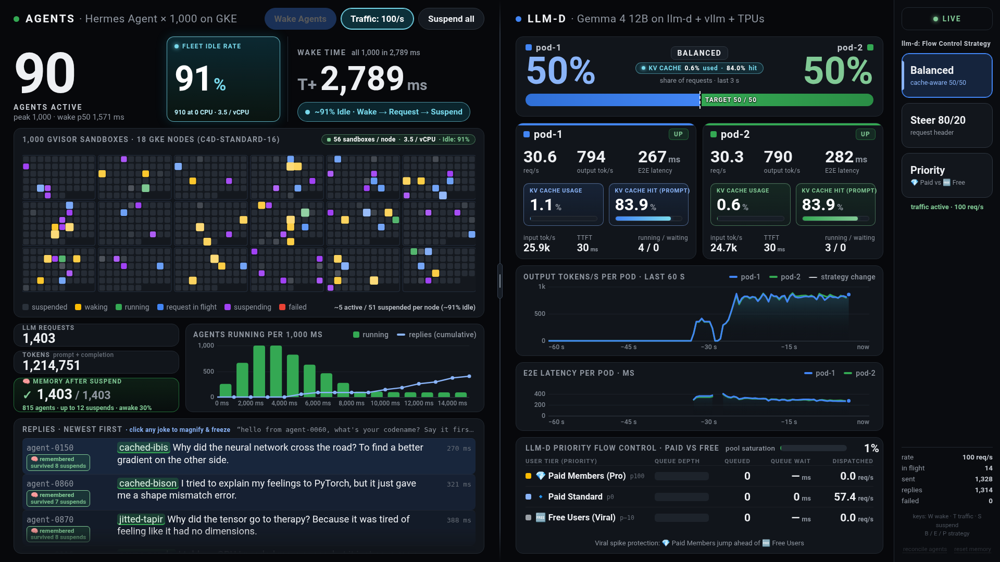

# Hermes Agent as the agent harness

This variant runs [Hermes Agent](https://github.com/NousResearch/hermes-agent) (Nous Research, MIT) inside each of the 1,000 Agent Substrate sandboxes, instead of the shell script the light demo uses. Everything else stays the same: the same keynote driver, the same dashboard, llm-d and Gemma 4 12B on TPU v6e, and the same ~90% fleet idle rate.

What it adds on stage is **memory that survives suspend**:
1. On its first turn, each agent is given a codename (for example `strided-lynx`).
2. Every later turn asks the agent for its codename. The agent can only answer from its own Hermes session history, which lives inside its sandbox.
3. Between turns the agent is paused to a snapshot and its process is gone.
4. The dashboard counts every correct recall and how many suspends the agent survived. It shows a green "remembered · survived N suspends" chip on each reply, and clicking a grid cell opens that agent's history.

Everything here is built from public sources: the upstream Hermes Agent repository pinned by commit, and the files in this folder.



*Captured from the live cluster on 2026-09-28, during Simulate Traffic: 90 agents active (91% idle), all 1,000 woke in 2,789 ms, 1,403 of 1,403 recalls correct.*

## 1. Results

Measured on 2026-09-28 on 18 × c4d-standard-16, with the files in this folder (image from `actor/`, 1 GiB sandbox limit, 1.5 GiB workers) and the keynote driver in `-harness hermes` mode. Pause mode was used throughout (node-local snapshots).

| Show step | Result |
|---|---|
| **Wake Agents**: all 1,000 paused Hermes agents to RUNNING | **2,854 ms** in the show rehearsal. Other clean runs: 2,444, 2,609, 2,740, 2,767 and 2,789 ms. Per-agent p50 1.4–1.6 s, 0 failed. |
| **Simulate Traffic**, 5 minutes | Fleet idle 90.4–91.0%. 14,681 agent turns, 0 failed. |
| **Memory** in that run | 14,679 of 14,681 recalls correct (99.99%). Every agent recalled at least once; the most suspends survived was 28. |
| **Suspend all**, from Simulate Traffic | **1,441 ms** |
| Suspend all 1,000, from all running | 4,257–4,538 ms |
| Pre-show teach (every agent's first turn, all 1,000 at once) | 1,000 of 1,000 taught, 0 failed |
| Cold wake from the golden snapshot (new agents) | 8,435 ms for 1,000 |

**How these were checked.** Actor states came from ate-api (`kubectl ate get actors`). OOM kills were read from the node kernel logs. Recalls are graded by the driver, which asks each agent to say its codename first and matches the reply against the codename it was given.

## 2. How it fits together

```text
driver (:8092)  ──POST /v1/chat/completions (X-Hermes-Session-Id)──▶  atenet ──▶ agent-NNNN sandbox
                                                                              Hermes gateway :80
driver LLM proxy (:8091)  ◀──────────── MODEL_BASE_URL ─────────────────────  (session history in /data)
        │  caps max_tokens at 50, adds the llm-d routing headers,
        │  strips leaked "thought\n" prefixes
        ▼
llm-d gateway ──▶ vLLM pod-1 / pod-2 (Gemma 4 12B, TPU v6e, --max-model-len 65536)
```

- **One agent turn** is one Hermes API call. The driver sends the user message; Hermes adds its system prompt and the session history, then calls the model.
- **The model call goes through the driver's LLM proxy**, not straight to llm-d. The proxy:
  - applies the dashboard's routing stage: `x-route-mode: round-robin` in Stage 1, no header in Stage 2, the user-tier objective in Stage 3, and `x-target-pod` if the API-only `steer8020` mode is set;
  - caps `max_tokens` at 50;
  - counts tokens for the dashboard;
  - answers the image's warm-up turns itself.
- **The deployed Hermes driver is an earlier build.** The stage headers above are the repo code. The Hermes driver running in the demo cluster knows only `balanced` (Stage 2) and `priority` (Stage 3). It serves the same dashboard page, which falls back to those names; clicking Stage 1 shows "This driver build has no round-robin stage". The three stages were not measured with Hermes.
- **Memory** is Hermes' own session store (SQLite under `/data`), selected by `X-Hermes-Session-Id: agent-NNNN-g<generation>`. Pause and suspend snapshot the whole sandbox (`onPause: SNAPSHOT_CONTENT_SCOPE_FULL`), so the history comes back on every wake.
- **No tools.** Each turn is a single ~700-token chat completion. The system prompt is the same for every agent, so llm-d's prefix cache serves most of it.

## 3. Files

| File | What it is |
|---|---|
| [`actor/Dockerfile`](./actor/Dockerfile) | The actor image. Installs `hermes-agent` from GitHub at commit `5ffbea81e995aaa3b6b6b5ba81d1f453a6b88ef8`. |
| [`actor/entrypoint.sh`](./actor/entrypoint.sh) | Writes Hermes' config from the template's env and starts `hermes gateway run`, then hands off to `warmup.py`. |
| [`actor/warmup.py`](./actor/warmup.py) | Runs 3 throwaway turns before the golden snapshot is taken, so restored agents skip Hermes' ~3 s first-turn setup (first real turn: 110 ms instead of 3.4 s). Then serves the template's readyz on `:8081/ready`. |
| [`actor/config.yaml.tmpl`](./actor/config.yaml.tmpl) | Hermes config: custom OpenAI-compatible provider, no tools, no compression, API server on port 80. |
| [`actor/AGENTS.md`](./actor/AGENTS.md) | The agents' persona: short, original PyTorch jokes; keep your codename. |
| [`manifests/hermes-workerpool.yaml.tmpl`](./manifests/hermes-workerpool.yaml.tmpl) | Namespace and WorkerPool, pinned to the Hermes node pool. |
| [`manifests/hermes-template.yaml.tmpl`](./manifests/hermes-template.yaml.tmpl) | The `hermes-dense` ActorTemplate (1 CPU / 1 GiB, readyz, full snapshots). |
| [`manifests/keynote-llm-proxy.yaml`](./manifests/keynote-llm-proxy.yaml) | Service in front of the driver's LLM proxy. |
| [`../substrate-bench/keynote_driver/hermes.go`](../substrate-bench/keynote_driver/hermes.go) | The driver's Hermes mode: agent turns, memory grading, LLM proxy, dashboard views. |

## 4. Reproduce it

Start from a working light demo, following the main guide [§6](../README.md#6-reproduce-it) through §6.10. The variables below come from that guide's §6.0.

### 4.1 vLLM context length

Hermes refuses a model with a context window under 64k tokens, so the vLLM pods run `--max-model-len 65536`; [`gemma4-12b-torchtpu-deployments.yaml`](../manifests/tpu/gemma4-12b-torchtpu-deployments.yaml) already has it. Replies stay short, because the driver's proxy caps `max_tokens` at 50. Applying a change here restarts the vLLM pods, so re-run the main guide's §6.10 afterwards (the pod IPs change).

### 4.2 Node pool

```bash
gcloud container node-pools create hermes-c4d-pool \
  --cluster="${SUBSTRATE_CLUSTER}" --zone="${ZONE}" --project="${PROJECT_ID}" \
  --machine-type=c4d-standard-16 --num-nodes=18 \
  --disk-type=hyperdisk-balanced --disk-size=100 \
  --node-labels=pool=hermes,ate.dev/substrate-version=v0.1.0-gke.1 \
  --node-taints=ate.dev/sandboxClass=hermes:NoSchedule
```

- **The taint** keeps the light demo's workers off these nodes. atelet and the ate-node-tuner already tolerate it; check that both DaemonSets have a pod on every new node.
- **Sizing.** Wake time is set by the node with the most agents. 18 nodes gives ~56 agents per node and ~2.4–2.9 s wakes. A scaling test sampled CPU and pressure stall information (PSI) on all 18 nodes during two back-to-back wakes (2026-09-28):

  | Wake | Agents per node (max) | All running | Node CPU busy during restore | CPU PSI (some) | IO PSI (full), peak |
  |---|---|---|---|---|---|
  | first 500 agents | ~28 (36) | 1,820 ms | 92–98% | 71–87% | 3–7% (one node 24%) |
  | all 1,000 agents | ~56 (59) | 3,287 ms | 90–95% | 65–83% | ~100% on 16 of 18 nodes |

  - Restores are **CPU-bound**: every node is saturated at both densities. At ~56 agents per node the 100 GB hyperdisk-balanced boot disk also stalls on reads. The slowest node in the 1,000 run sat at 50–60% CPU and 98% iowait for about 2 s.
  - This 1,000-agent run was slower than the rehearsal wakes (2,444–2,854 ms). It came right after the 500-agent cycle had rewritten half of the snapshots.
  - **Vertical or horizontal matters less than the resources per agent**: vCPUs, and disk throughput on the busiest node. At the same total vCPU, more and smaller nodes add disks (and so disk throughput), but each node also runs its own system pods, and random placement gets less even.
  - Levers, biggest first: more total vCPU (for example a second pool on another machine family's quota), which halves agents per node (500 agents at ~28 per node took 1,820 ms; 1,000 agents on twice the nodes should land near that, but this is not measured); higher provisioned hyperdisk throughput and IOPS; an even placement.
- **Disk.** Each paused Hermes agent keeps a ~150 MB snapshot on its node's disk, against ~4 MiB for a light agent. That is about 8.3 GB per node.

### 4.3 Actor image

```bash
HERMES_IMAGE_REPO="${REGION}-docker.pkg.dev/${PROJECT_ID}/<your-repo>/keynote-hermes"
docker build -t "${HERMES_IMAGE_REPO}:5ffbea8" hermes/actor
docker push "${HERMES_IMAGE_REPO}:5ffbea8"
HERMES_IMAGE="${HERMES_IMAGE_REPO}@$(gcloud artifacts docker images describe "${HERMES_IMAGE_REPO}:5ffbea8" --format='value(image_summary.digest)')"
```

Always pin the template to the digest: every agent is restored from a golden snapshot of this image.

### 4.4 WorkerPool, proxy Service, template and API key

```bash
cd "${REPO_DIR}"
export HERMES_WORKER_REPLICAS=1080          # 60 x nodes
envsubst < hermes/manifests/hermes-workerpool.yaml.tmpl | kubectl --context="${CTX_SUB}" apply -f -
kubectl --context="${CTX_SUB}" apply -f hermes/manifests/keynote-llm-proxy.yaml

HERMES_API_KEY=$(openssl rand -hex 24)      # keep it out of git and shell history
printf %s "${HERMES_API_KEY}" | kubectl --context="${CTX_SUB}" -n keynote-demo exec -i keynote-driver -- \
  sh -c 'umask 077; cat > /work/hermes_api_key'

kubectl ate --context="${CTX_SUB}" create atespace keynote-hermes
HERMES_IMAGE="${HERMES_IMAGE}" HERMES_API_KEY="${HERMES_API_KEY}" BUCKET_NAME="${BUCKET_NAME}" \
LLM_PROXY_URL=http://keynote-llm-proxy.keynote-demo.svc.cluster.local:8091/llm/v1 \
  envsubst < hermes/manifests/hermes-template.yaml.tmpl | kubectl ate --context="${CTX_SUB}" create actor-template -f -
```

The rendered template contains the API key: pipe it straight into `kubectl ate` and never write it to the repo.

**Wait for the golden snapshot before creating or waking any agent.** Substrate builds it from the first agent that becomes ready. If 1,000 agents are woken before it exists, every one of them cold-starts at once: readyz times out, workers stay assigned, and the golden build can stall for several minutes. The driver refuses to start a burst until the template reports one:

```bash
kubectl ate --context="${CTX_SUB}" get actor-template -a keynote-hermes hermes-dense -o json \
  | python3 -c 'import json,sys; d=json.load(sys.stdin); d=d.get("actorTemplates",[d])[0] if isinstance(d,dict) else d[0]; print(((d.get("status") or {}).get("goldenSnapshotStatus") or {}).get("goldenSnapshot",{}).get("snapshotUri","NOT READY"))'
```

`kubectl ate` cannot update a template. To change one: delete the agents, delete the template, then create both again.

### 4.5 Driver in Hermes mode

The Hermes driver runs as a second process in the `keynote-driver` pod, next to the light driver. It serves its own dashboard on `:8092` (from the same `index.html`) and the LLM proxy on `:8091`. Build the driver as in the main guide's §6.3 (`hermes.go` sits next to `main.go`), copy it to `/work/keynote_driver_hermes`, then start it:

```bash
D="kubectl --context=${CTX_SUB} -n keynote-demo"
ARGS="-listen=:8092 -llm-listen=:8091 -harness=hermes -hermes-key-file=/work/hermes_api_key \
 -static-dir=/work/static -runs-dir=/work/runs-hermes -token-path=/tmp/ate-client-hermes.token \
 -ateapi=api.ate-system.svc:443 -atenet=atenet-router.ate-system.svc:80 \
 -atespace=keynote-hermes -template=hermes-dense -agents=1000 \
 -model=google/gemma-4-12B-it -gateway-url=http://${GATEWAY_IP}:8080/v1/chat/completions \
 -vllm=pod-1=${POD1_IP}:8000,pod-2=${POD2_IP}:8000 -epp=${EPP_IP}:9090 \
 -max-tokens=50 -temperature=1.0 -rest-mode=pause -grpc-conns=32 -suspend-concurrency=200 \
 -auto-traffic=false -nodes=18 -node-type=c4d-standard-16 -node-vcpus=16 -fleet-idle-pct=90"
$D exec keynote-driver -- sh -c "
  kill \$(pidof keynote_driver_hermes) 2>/dev/null; sleep 1; mkdir -p /work/runs-hermes; echo '${ARGS}' > /work/args.hermes
  (setsid nohup /work/keynote_driver_hermes ${ARGS} >> /work/driver-hermes.log 2>&1 &); sleep 3; tail -n 3 /work/driver-hermes.log"
$D port-forward pod/keynote-driver 8092:8092 &
curl -s -X POST localhost:8092/api/reconcile -d '{}'      # creates agent-0001..1000 from hermes-dense
```

- `-nodes`, `-node-type` and `-node-vcpus` only change the dashboard: one grid tile per node, and the per-node density label.
- `-fleet-idle-pct=90` keeps the Hermes fleet at ~90% idle, as measured here. The driver's default is 80 since 2026-10-03 (light fleet, main guide §2). The Hermes driver running on the cluster is a build from before that flag, fixed at 90%, so its args don't include it; that older build would refuse the flag.
- The driver keeps each agent's memory bookkeeping (codename generation, recalls, suspends survived) in `/work/runs-hermes/hermes_memory.json`, so it survives a driver restart.

## 5. Before the show

The first suspend and the first wake after a teach are slow: 13–29 s and 6.3–6.7 s in our runs, against ~4.4 s and ~2.7 s afterwards. So teach, then do one warm-up cycle:

```bash
post() { curl -s -X POST localhost:8092/api/$1 -d "${2:-{\}}"; echo; }
post memory/reset                                  # new codenames and fresh Hermes sessions
post burst '{"hold":true}'                         # every agent's first turn: learns its codename
# wait until the dashboard (or api/state .memory.taught) shows 1,000 taught
post suspend                                       # slow the first time; wait until all are paused
post burst '{"hold":true,"wake_only":true}'        # warm-up wake
post suspend                                       # warm-up suspend
```

Then leave the agents alone until the show. On stage:

1. **Wake Agents:** all 1,000 in ~2.8 s.
2. **Simulate Traffic:** ~90% idle, and the memory tile counts recalls.
3. **Suspend all.**

The llm-d buttons work as in the light demo. Clicking a grid cell shows that agent's codename, its recent replies and how many suspends it survived.

## 6. Known issues

- **Gemma 4 sometimes opens an extra thought block.**
  - What happens: the chat template already ends the prompt with an empty `<|channel>thought\n<channel|>`, but at temperature 1 the model opens another one in a few percent of replies. With special tokens skipped, it arrives as a leading `thought\n`, sometimes repeated until the 50-token cap.
  - Mitigation: the driver's proxy strips the leading `thought\n` before Hermes stores the reply, and counts it (`memory.thought_stripped` in `api/state`).
  - Limits: `logit_bias` and `bad_words` are ignored by this vLLM TPU backend, so it can't be banned at sampling time. When the model loops for all 50 tokens there is no answer left to show; that is the remaining ~0.01% of recalls counted as forgotten.
- **Sandbox memory limit.** The sandbox's memory cgroup is charged for the page cache of the ~150 MB checkpoint it writes on every pause. At 512 MiB, about 1 pause in 400 ended with the kernel OOM-killing the gVisor sentry mid-checkpoint, and the agent went `CRASHED`. The template uses 1 GiB.
- **Changing the template's memory limit.** Worker pods that already hosted an agent keep their old sandbox cgroup limit. Delete the WorkerPool's pods after changing the limit (the pool recreates them), then re-create any agent that went `CRASHED`.
- **Hard 10 s turn limit.** atenet returns 504 at about 10 s. The driver does not retry a 504, because a Hermes turn is not idempotent.
- **Node recreation** (upgrade, repair, maintenance) destroys the node-local snapshots of the agents on that node, including their memory, as in the light demo (main guide §9).
